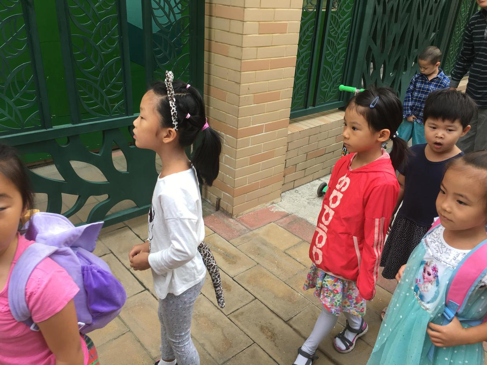
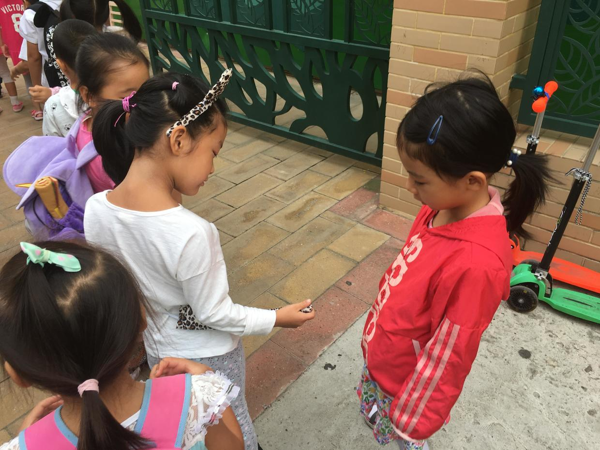
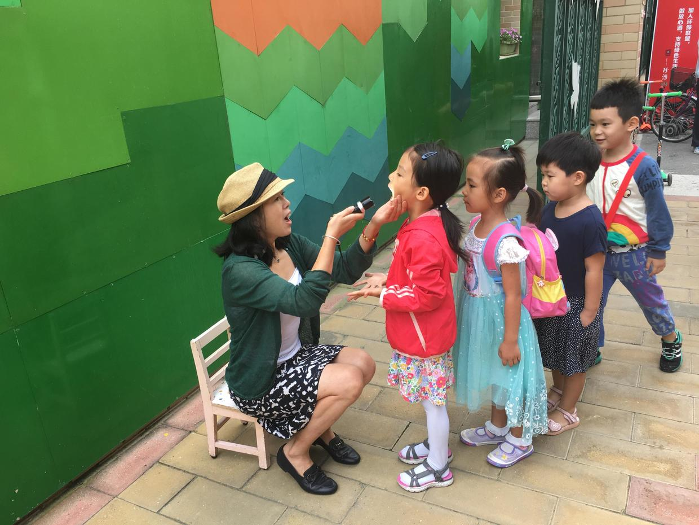
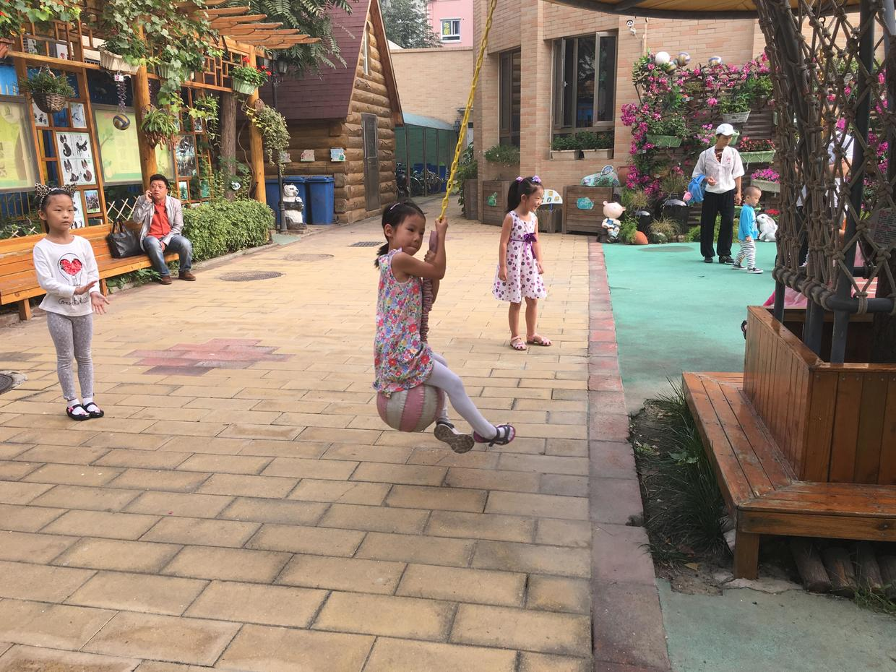

          
            
**2017.09.06**

又到了一年的开学季。

一早送喵去幼儿园，路上并没有堵车很厉害。

到了幼儿园门口，同学们排队进校门，现在已经是大班学生了。

和自己的同学一起聊天。

老师给每个同学检查身体。

在操场上大家轮着玩儿。

路上看朋友圈的照片，当年的小学老师，今天带着她们班的学生去天坛活动。

中午吃饭，同事们也都说起放假和开学。

不禁想起了当年上中学时，开学发现好多作业忘了做，疯狂的补作业。

而交上去的假期作业，其实大部分老师都不会看，这在当时还是对我打击很大。

第一次领悟了社会规则。

这几年，有时候做梦突然惊醒，也经常会梦到没有写假期作业。

醒了之后要很久，才想明白，现在已经不用写假期作业了。

因为再也没有寒暑假了。

**个人微信公众号，请搜索：摹喵居士（momiaojushi）**

          
        