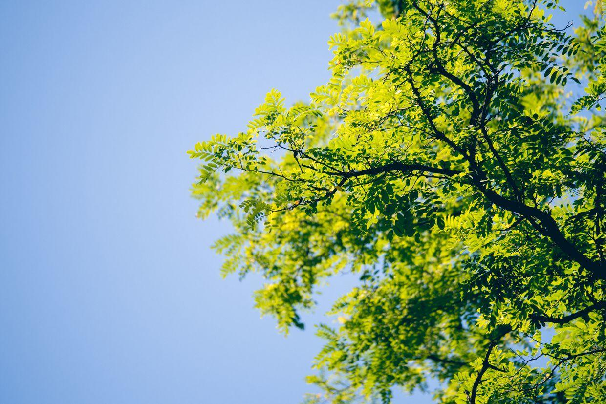

          
            
**2017.09.17**

周日啦，北京马拉松的日子，天气格外的好。

蓝天上万里无云，西山尽收眼底。

和开心弟弟约好了，一起去动物园。

到了动物园门口。

从北门进去，海洋馆。

下台阶，太阳很毒。

开门很早，人还不多。

随时随地学认字，有图有字。

大象妈妈和小象宝宝。

巨大的泡桐树。

来喂长劲鹿啦，去年还哭了一鼻子，今年很勇敢。

收集掉在底上的叶子。

妈妈喂得很开心。

斑马zoe一家。

巨大的树，全是林荫道。

树已经大到难以想象了。

开心弟弟来啦，还带来了礼物。

一起吃爆米花。

墙边也爬满了植物。

两位母亲在边上看着。

封面

吃得出了神。

太阳还是这么毒。

吃够了，跑起来。

一起走平衡木。

开心弟弟和一个小朋友玩儿了起来。

一起合影。

笑起来真开心。

突然很庄重。

墙头的植物们。

两人研究墙上的洞。

笑得很开心。

发现了新东西。

墙后面昏暗处的植物。

刚长起来的小草。

小魔仙的七色魔法。

中午一起吃鸡肉。

一起吃意面。

一上午，晒足了太阳，跑了一大圈，吃了一打顿饭。

中午回家好好休息吧。

**个人微信公众号，请搜索：摹喵居士（momiaojushi）**

          
        