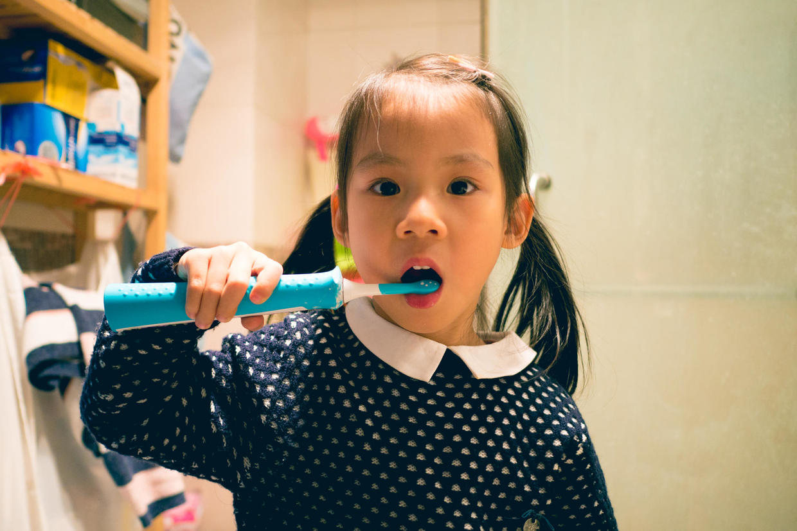

          
            
**2017.09.18**

**拍摄时间：2016.11.28**

**拍摄地点：家里**

这张照片是2016年，晚上在家里刷牙的时候拍的。

天气很冷了，在家里也还要穿挺多衣服。

头上梳着两个大辫子，开始用新买的儿童电动牙刷刷牙了。

蓝色的电动牙刷，还送了几张小贴纸。

喵还开心地自己贴上，虽然有些歪歪扭扭，但也是有模有样。

电动牙刷放到嘴里，嗡嗡嗡地刷起来。

每隔一会儿，会顿一下，提示要换一边了。

大概2分钟左右，就会放一小段音乐，停下来。

之前用小牙刷的时候，真是经过了无数次的激烈斗争，才养成了刷牙的习惯。

但是牙齿检查的时候，发现已经有不少蛀牙。

大夫也建议了可以试用电动牙刷，效果会更好，同时也要结合用牙线。

都说刷牙要刷够一首生日歌的时间。

于是每天晚上就是唱着生日歌，刷牙，然后用牙线。

保护好牙齿，真是一件很重要的事。

**个人微信公众号，请搜索：摹喵居士（momiaojushi）**

          
        