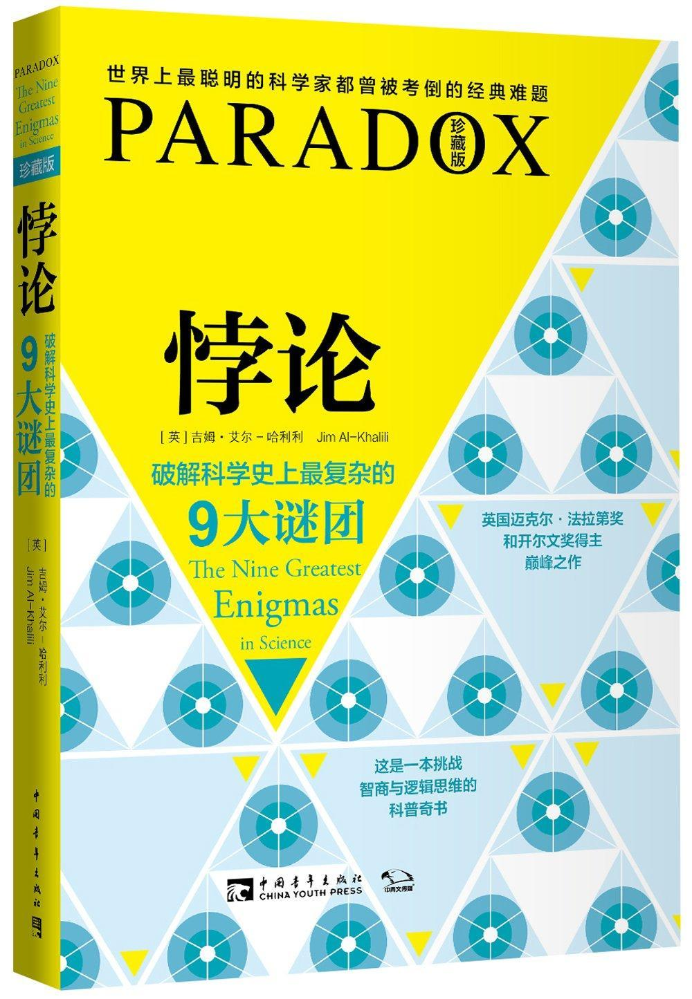

          
            
**2017.09.28**

很精彩的讲解，仔细读，不会有什么障碍。
>前言

悖论（paradox，亦可译为诡论、谬论、诡局、佯谬、吊诡或矛盾）以各种不同的形式和难度出现。

“真悖论”指的是自相矛盾或循环论证的陈述，或者某种逻辑上不可能发生的情况。

真悖论是逻辑上不可能发生的
>你瞧，“这句话是假的”是想告诉你，在宣称这句话是假的同时，它本身必然也是假的，所以它就不是假的——也就是它是真的，所以这句话真的是假的，也就是真的……诸如此类，陷入一个无穷尽的循环。有很多类似这样的悖论存在，但本书并不打算讨论它们。

我们将要探讨的许多谜团，乍看之下似乎是货真价实的真悖论，不仅仅是认知悖论而已。这就是有趣的地方。以著名的“时光旅行悖论”简化版为例：如果你搭乘一部时光机回到过去，杀掉幼年的自己，你这位杀手会发生什么事？你会因为阻止自己成长，倏然之间不再存在吗？如果是这样的话，你从未长大成为一名时光旅行杀手，那是谁杀死了幼年的你？年长的你拥有完美的不在场证明——你甚至不曾存在过！假如你并未存在、无法回到过去杀死年幼的自己，年幼的自己就未被杀害，所以可以长大成人，接着回到过去并杀死年幼的自己，于是你又消失了，依此类推。这似乎是个完美的逻辑悖论，而且物理学家也尚未在理论上排除时光旅行的可能性。那么，我们如何才能摆脱这种矛盾的循环呢？我将在第七章探讨这个问题。

下面这个简单的统计悖论，如果从某个基本的关联性来思考就可能得出错误的结论：我们都知道，有较多教堂的城镇普遍犯罪率较高。这似乎说不太通，除非你相信教堂是孕育不法犯罪的温床。无论你的宗教和道德观为何，这都是不可能的。解答非常直截了当：为数较多的教堂和较高的犯罪率，都是较多人口自然产生的结果。A导致B与A导致C，并不意味着B导致C，反之亦然。

统计悖论
>接下来还有另一个简单的动脑谜题，乍听自相矛盾，一旦妥善解释，它的矛盾特性就消失无踪。它是由我的同事兼挚友，一位苏格兰裔的物理学教授，在多年前向我讲述的。他声称“每一位南下到英格兰的苏格兰人，都提高了两个国家的平均智商”。关键在于：由于所有苏格兰人都声称自己比任何英格兰人更聪明，只要他们其中任何一位住到英格兰去，都会提高英格兰的平均智商；然而离开苏格兰是愚蠢的行为，只有那些不怎么聪明的人才会这么做，所以他们离开后，剩余苏格兰人的平均智商就提高了些。

动脑谜题
>另外一则或许读者没那么熟悉、但有些人仍然听过的悖论，则是“麦克斯韦精灵”，这个神秘的存在管辖另一个密闭的箱子，而且貌似能够违反最神圣的科学定律（也就是热力学第二定律），迫使箱子中的混合物分离并呈现秩序。

爱因斯坦对于空间和时间的观点，为逻辑难题提供了丰富的素材，例子包括竿与谷仓悖论、孪生子悖论和祖父悖论。

科学上的悖论
>第一章综艺秀里的悖论

本章所探讨的只是一些逻辑方面的益智游戏而已，不需任何科学背景即可解答。其中最后一个也是最有趣的一个，称为蒙提霍尔悖论（MontyHallParadox），由于它特别令人困惑，我将使用较多的篇幅以数种不同方法来分析这个问题，让读者自行选择最容易接受的答案。

消失的一块钱之谜这是我几年前在名为《心灵游戏》的电视猜谜节目中担任来宾时，用过的一个精采难题

三位旅客到某家旅馆投宿。年轻的柜台接待员给他们一间有三张床的房间，收费30元。他们协议平分住宿费用，每人支付10元之后，便拿了钥匙进房间安置行李。几分钟之后，柜台接待员发现自己弄错了，旅馆这一个礼拜正好有特价促销活动，他应该只收他们25元。为了避免被旅馆经理找麻烦，他立刻从收款机中取出5块钱，并且赶紧上楼去弥补他所犯的过错。在前往旅客房间的路上，他想到5元无法由三个人平分，于是决定退给每位旅客一元，自己留下两块钱。他自认为这是个让每个人都满意的好办法。以下是我们要解决的问题：每位旅客为他们的住宿各付出9元，总计占了原本旅馆收费30元当中的27元，另外两元被接待员拿走，那么30元里的

最后一元哪里去了呢？

是因为叙述上的误导才使得这个问题听起来自相矛盾。推理过程出错之处在于：将客人付的27元与接待员拿走的两元加总在一起——这样算根本毫无道理，因为总金额已经不再是30元。接待员拿走的两元要从旅客支付的27元当中扣掉，所以收款机里的总金额应该是25元才对。

总金额变了，接待员的钱要从旅客的27里面减去
>贝特朗箱子悖论“似是而非的悖论”的第二个例子由19世纪法国数学家约瑟夫·贝特朗提出。

有三个箱子，每个箱子里各有两枚硬币，放置方式如下：每个箱子都隔成两半；每一半各放一枚硬币，而且盖子可以单独打开来查看里头的硬币种类（但不允许查看另一枚）。第一个箱子里放了两枚金币（代号GG），第二个箱子里放了两枚银币（代号SS），第三个箱子则有金币和银币各一枚（代号GS）。请问你选到内有金币跟银币的箱子概率有多少？答案的确很简单：三分之一。这一点都不难。接着，随机挑选一个箱子。如果打开半边的盖子发现里面是金币，这个箱子是GS箱的概率有多少？在发现一枚金币的当下，你已经知道这个箱子不可能是SS箱，排除之后只剩两种可能性：GG箱或GS箱。因此它是GS箱的概率是二分之一，对吧？假如打开盖子出现的是银币，我们就可以排除GG箱的选项，剩下的只有SS箱或GS箱两种可能，所以选到GS箱的机会依然是二分之一。

由于打开选定的盖子出现的不是金币就是银币，而且每种硬币各有三枚，若两者出现的概率相同，那么不论出现何种硬币，你都有一半的概率选中GS箱。也就是说，往某个箱子的其中半边瞧了一眼之后，选中GS箱的整体概率竟然从一开始的三分之一变成二分之一。可是，只不过才瞧了某个硬币一眼，怎么会使概率产生这么大的变化？如果随机选出一个箱子，打开其中一个盖子之前，你知道选出的箱子有三分之一概率是GS箱；仅仅凭着看到其中一枚硬币，究竟是怎么使得概率从三分之一突然变成二分之一的？毕竟这个动作并不会带来新的信息，你心里明白，出现的不是金币就是银币。究竟哪里出问题了呢？

正确答案是，不论是否查看其中一枚硬币，选到GS箱的概率一直都是三分之一，而非二分之一。

概率不会因为观察其中一个而变化
>生日悖论这是最著名的“似非而是的悖论”之一。

你认为房间里至少要有多少人，才能让其中任意两人同一天生日的概率超过一半——也就是说，任意两人生日相同的概率比不同来得高？

房间里只需要57个人，就可以让任意两人同一天生日的概率超过99％。

也就是说，只要57个人，就几乎能确定其中有两个人同一天生日！

这个答案听起真是令人难以置信。

若只针对问题来回答，任意两人生日相同的可能性比不同还高（也就是概率超过一半）所需的人数则远低于57。事实上，只要23个人就足够了！

反常识
>蒙提霍尔悖论这个难题可追根溯源至贝特朗箱子悖论，它同时也是阐释“条件概率”的典型范例之一。

蒙提·霍尔：这里有三个标记为A、B、C的盒子，其中一个里面有1975年出厂、全新的林肯·大陆汽车的钥匙，另外两个是空的。如果你选中的盒子里有钥匙，就能赢得这部汽车！参赛者：（倒吸一口气）！蒙提·霍尔：请挑选一个盒子。参赛者：我选盒子B。

蒙提·霍尔：现在桌上有盒子A和C，然后这是盒子B（被参赛者紧紧抓住），汽车钥匙有可能就在这个盒子里！我出一百美元换你的盒子。参赛者：不要，谢谢。蒙提·霍尔：两百美元如何？参赛者：不行！观众：不要！蒙提·霍尔：别忘了钥匙在你盒子里的概率是三分之一，盒子是空的概率则是三分之二。我出五百美元跟你换。观众：不要！！参赛者：不，我想保留这个盒子。

蒙提·霍尔：我来帮你打开桌上其中一个盒子（打开盒子A）。这盒子是空的！（观众鼓掌）。现在，车钥匙不是在盒子C、就是在你手上的盒子B里。既然只剩两个盒子，钥匙在你选的盒子里概率就变成二分之一了。我愿意出一千美元换你的盒子。

参赛者：我想用我的盒子B跟你交换桌上的盒子C。蒙提·霍尔：这就怪了！！提示：参赛者知道自己在做什么

不过平心而论，他确实引述了蒙提所说的：“我来帮你打开桌上其中一个盒子。”我把这句话解释成：蒙提·霍尔完全知道他即将打开的盒子是空的。果真如此的话，那么这就是我所熟悉的问题了。稍后我们将会明白，问题的解答系建立在“蒙提·霍尔知道钥匙在哪里”的前提上，虽然这个前提看似无关紧要——毕竟对参赛者来说，这怎么可能会影响猜中的概率呢？

一试便知莎凡特在她最后一次探讨这个悖论的专栏里，公开了1000多所学校对此问题进行实作验证的结果。几乎所有结果都显示，换门才是正确的选择。这种“一试便知”的解答方式，也是我在几年前向朋友解释这个悖论时不得不采用的方法。

看起来策略是要改变选择
>第二章阿基里斯与龟

这个谜题名为“阿基里斯悖论”（theParadoxofAchilles），又称为“阿基里斯与龟的问题”，它其实是希腊哲学家芝诺（Zeno）所提出的一系列问题之一。

在一场与身手矫健的阿基里斯的赛跑中，乌龟被允许率先出发；当阿基里斯起跑时，乌龟已经抵达路途中的某处（姑且称为A点）。由于阿基里斯跑得比乌龟要快许多，他很快就抵达A点。然而，当他跑抵该处时，乌龟已经移动到更远的地方，我们把它称做B点。当阿基里斯跑抵B点，这时乌龟已经爬到更远的C点；这个过程不断重复。尽管阿基里斯不断追近乌龟，每个阶段两者之间的差距也不断缩小，前者却永远不可能超越后者。

微积分的观点了
>尽管如此，活跃于芝诺之后100年的亚里士多德依然将他视为“辩证法”这个论证方式的创始人。

芝诺是辩证法创始人
>辩证法是古希腊人（尤其是柏拉图与亚里士多德等哲学家）擅长的一种开放式讨论，透过逻辑与推理在讨论中解决想法意见上的歧异。

芝诺的所有悖论都围绕着一个中心思想：一切都是亘古不变的；运动状态只是一种假象，而时间本身并未真正存在。

其中最著名的4个悖论分别被亚里士多德命名为：阿基里斯（theAchilles）、二分法（theDichotomy）、运动场（theStadium）与飞矢不动（theArrow）悖论。

“阿基里斯永远无法超越乌龟”的叙述显然不对。在以上所述的每一阶段里（A点与B点之间，接着是B点与C点之间，依序下去），逐步递减的距离同时意味着着逐步递减的时间间隔，因此无穷多个步骤并不等于无限长的时间。事实上，所有步骤加总起来得到的时间是有限的，也就是阿基里斯追上乌龟所耗的时间！

这个悖论的矛盾症结在于，多数人无法接受将一串无穷长的数列累加之后，总和却不见得无穷大。

这个矛盾的破解有赖于数学家所称的“几何级数”。考虑以下级数的例子：1+1/2+1/4+1/8+1/16+1/32……读者当然可以试着将愈来愈小的分数不断累加上去，使得总和愈来愈接近2。

我们应当考虑每阶段阿基里斯与乌龟之间逐渐递减的距离，而非两者的个别位置。

芝诺的问题字阿语，穷多个相加，并不见得就无穷大
>二分法悖论

在到达目的地之前，你必须先走完一半的路程。在走完一半路程之前，你必须先走完四分之一。在走完四分之一路程之前，你必须先走完八分之一路程，以此类推。

如果将路程一直减半，你永远抵达不了第一个里程碑，你的旅程永远无法开始。

路程一直减半，所以旅程永远无法开始
>运动场悖论

设想三列火车，每列火车有一节火车头与两节车厢。第一列火车停靠在火车站。第二列与第三列火车以相同的速率反向等速过站，但不停靠；B列车从西侧进站，C列车从东侧进站。在某个瞬间，三列火车的位置如图2.2（a）所示。接着，在一秒之后，它们恰好并列，如图2.2（b）。

芝诺悖论的问题在于B列车的运动：在这一秒之内，它通过A列车一节车厢的距离，但却通过C列车两节车厢。此悖论指出，在这段时间内，B列车同时前进了一倍与两倍的距离。

这个悖论很容易解决，因为推理过程的错误显而易见。有种叫做相对速率的物理量；B列车相对于逆向驶来的C列车与静止的A列车，速率当然是不同的。

相对速度
>飞矢不动悖论

亚里士多德是这么描述它的：“当物体静止时，其所占空间大小保持不变；若其移动时的任一瞬间也总是占据相同大小的空间，则飞矢不动。”

要让这个悖论完全尘埃落定，有赖于物理学与数学的后续发展。更明确地说，17世纪牛顿及其他数学家所发展出来的微积分，帮助我们理解如何加总微小的变化量来正确描述“变化”的概念，使芝诺天真的想法最终得以厘清。

朴素的微积分观点
>量子力学是描述微观世界如何运作的理论。

我必须在一开始就特别强调，量子力学的数学理论本身既不诡异也不矛盾。相反地，它严谨美妙并且符合逻辑，是一个能够完美描述自然界物理现象的理论架构。

斯拉与苏达桑发表在《数学物理期刊》的论文描述以下惊人状况：当一个放射性原子持续受到严密的观测时，它将永远不会衰变！

在量子力学领域，芝诺的悖论似乎又有新的发展。
>第三章奥伯斯佯谬

当我们抬头凝望夜空时，可能会提出一个非常深奥的问题：为什么入夜之后天色会变暗？

这个问题困惑他们好几百年。它就是“奥伯斯佯谬”。问题是这么来的：我们有足够的理由相信，即使宇宙不是无穷大（而且很可能真的不是），它也大到我们无法到达其边界。当我们从每个方向遥望天空，都应该会看到一颗星星，它让白天的天空变得更明亮——它应该一直都很亮，不管日升日落、白日黑夜。

奥波斯佯谬，为什么夜空没有被恒星点亮
>当各位读者头一次面对这个难题时，也许会从此章开头里的说明提出两个疑点。首先，你会问：遥远的星星不是因为太暗，所以我们看不到吗？第二个疑点是：星星并不是均匀分布在宇宙里的，对吧？它们不是聚集成星团，星团再聚集成星系吗？

第一个问题的回答是，虽然较远的星体显得比较近的星体暗，不过由于前者距离较远，它们其实在太空中所占的区域较大，也包含了为数较多的星星。

至于第二个疑点，星星在宇宙中的确不是均匀地分布，而是集中在各个星系里，就像秋天的落叶被扫成一堆一堆这样。然而论点并未因此改变，只要将星星换成星系即可：也就是夜空将会跟一般的星系一样亮——尽管不像恒星的表面那么亮，却依旧亮得令人睁不开眼睛。

直到1950年代，这个悖论才首度由来自德国不来梅19世纪的医生兼业余天文学家海因里希·威廉·奥伯斯正式提出，并以他的名字命名。

看来我们又回到问题的原点，开普勒的观点似乎成为唯一的合理解释：宇宙并非无穷大，否则夜晚的天空就不会是暗的。

爱因斯坦的广义相对论用一种截然不同却远为精准的方式来描述重力。它指出，重力并不全然是一种普通的“力”，也就是说，它不是一条将两个物体拉近的隐形橡皮筋，而是一切带有质量的物体周遭空间形状的某种度量。

埃德温·哈勃是第一位证明银河系外还有其他星系存在的天文学家。

他的观测显示遥远的星系正在远离地球，而且远离速率与距离地球的远近相关。不论望远镜朝向天空的哪个方向，都能观测到此一现象。他的发现证明了弗里德曼关于宇宙正在扩张的想法是正确的。

哈勃发现宇宙在扩张
>我们的宇宙有个起源已经无庸置疑。三个有力的证据包括：宇宙背景辐射（大爆炸的余晖，正好落在预测的波长上）；元素的相对比例；以及透过望远镜清晰可见的宇宙扩张。这三个证据都指向宇宙创生的那一刻。

夜空之所以幽暗，是因为宇宙是有起源的。

光本身不具质量，使它得以用宇宙所容许的极速传播。

然而，跟宇宙尺度相比，光速就没那么惊天动地了。我们与银河系内其他恒星之间的距离，已经大到光得耗时数年才能从最近的恒星抵达地球，遑论星系之间的距离了。

正是光速的有限性让我们得以解开奥伯斯佯谬的矛盾。由于宇宙年龄将近有140亿岁，只有离我们够近的星系，光线才会到达地球被我们看到。

我们所见的星空其实只是整个宇宙的一小部分，称之为“可见宇宙”。即使透过最强大的望远镜，我们也无法看得比上述太空中的“视界”更远，因为它同时也是时间上的视界。

答案就是它了。第一个正确解决奥伯斯佯谬的不是科学家，而是诗人。有历史学家辩称，爱伦·坡的论述不过个臆测，应该等到19世纪最伟大科学家之一的开尔文爵士在1901年发表完整的计算结果，这个悖论才算真正获得解决。不过开尔文基本上只是提供爱伦·坡构想的数学证明罢了。不论我们愿不愿意接受，爱伦·坡的确答对了。

所以，该怎么回答我们一开始的问题：“为何入夜之后天色会变暗？”答案是，因为宇宙源起于大爆炸。

问题的答案是，宇宙是有起源的，遥远的光还没有来到我们的地球视野
>第四章麦克斯韦精灵

如果读者巧遇一群物理学家，并且请教他们个人认为科学史上最重要的概念是什么，他们很可能不约而同选择热力学第二定律。

麦克斯韦精灵悖论是个简单的构想，却让许多伟大的科学头脑绞尽脑汁，甚至还开创出崭新的研究领域。

这全都是因为它挑战了自然界至高无上的定律——热力学第二定律。这个定律仅仅简单规范了热与能量如何传递与运用，影响却极为深远。

根据热力学第二定律，如果将一只冷冻的鸡放到热水瓶上，那么你预料鸡将开始解冻，热水瓶同时开始降温。（这是我向家人解释此一定律时，他们想到的例子。）读者绝不会观察到热能往反方向传递，使热水瓶变得更热，鸡变得更冰。

>热能必定从高温处往低温处流动，永远不会跑错边，而且在达到热平衡、温差降为零之前，都不会停止。

热力学第二定律
>热能必定从高温处往低温处流动，永远不会跑错边，而且在达到热平衡、温差降为零之前，都不会停止。

热力学第二定律
>我们接下来探讨麦克斯韦精灵的问题。原始构想概述如下：想象一个绝热的盒子，里面只有空气，中间被一道绝热的厚隔板隔成两半。隔板上有一道活门，当一个空气分子从任一侧接近时会迅速开闭，让分子通过隔板进入另一侧。箱子两侧的气压会维持相等，因为假使任何一边的压力升高，碰到活门进入另一侧的空气分子就会增多，使两侧压力恢复平衡。

这个过程会持续进行，箱子两边不会产生温度差。

麦克斯韦精灵是一种假想的微小生物，拥有绝佳的视力，能分辨单独的空气分子及其运动速度。接下来我们让精灵来控制活门的开关，而非任其自行启闭。虽然它允许同样数目的分子通过活门，但这里还需要考虑一个额外因素：精灵的知识——它只允许快速分子从左侧隔室通过活门进入右侧，慢速分子由右侧进入左侧。

随着精灵负责掌控活门的开闭，盒子右侧隔室的快速分子逐渐增加，气体温度也逐渐升高；左侧隔室不断累积慢速分子，所以温度下降。看来仅仅运用这个精灵具备的知识便能在盒子左右隔室之间建立温度差。这个现象违反了热力学第二定律。

麦克斯韦精灵，负责去让快速分子和慢速分子分别聚集
>热力学总共有四条定律，全都关于热与能量之间彼此如何转换，但四条定律之中没有任何一条的重要性比得上第二定律。想到这个物理学里最重要的定律之一竟然连热力学定律的第一条都排不上，总令我不禁莞尔。

热力学第一定律直截了当地指出，能量可以在不同形态间互相转换，但是不能凭空产生或消灭。

第二定律表明，一切物品都会逐渐耗损、冷却、松弛、衰老与退化。它解释为何糖会在热水中溶解，而非凝结成块；它也解释玻璃杯里的冰块为什么总是无可避免地融化，因为热量一定是由较温暖的水传递到较冷的冰块，绝不会颠倒过来。

热力学第一和第二定律
>为了让读者更透彻地了解第二定律，我必须介绍一个叫做“熵”的物理量。

我们发现，热力学第二定律具有统计性的本质，不管物理世界任何特定的性质为何。低熵值态演变为高熵值态的概率完全压过逆向进行的可能性

将能量转换作功的能力愈强，该系统就处于熵值越低的状态。举例而言，充饱电的电池熵值最低，而熵在放电的过程中不断升高。

热力学第二定律基本上是一个关于熵的陈述：一个系统的熵只会增加而不会减少，除非从外界输入额外的能量。在发条玩具的例子里，上紧发条降低它的熵并未违反第二定律，因为上发条时系统本身（发条玩具）与环境（我们）不再彼此隔绝。玩具的熵虽然减少，但由于我们对它“作功”把发条上紧，我们自身增加的熵比玩具减少的还多。整体而言，玩具加上我们的总熵还是增加的。

第二定律也因此决定时间流逝的方向。

熵是描述混乱程度的，熵越高，越混乱
>19世纪苏格兰数学物理学家詹姆斯·克拉克·麦克斯韦，他以发现光即是电磁波而闻名于世在1867年所发表的一场演讲里，他提出这个著名的假想实验：一个虚拟的精灵身负推翻热力学第二定律的重任，把守盒子里两个隔室之间的活门。它控制活门的方式就像一个阀，只允许高速的“热”气体分子单向通过，慢速的“冷”气体分子只能反向通过。它藉此将空气分子分类，使一边的隔室变热，另一边的隔室变冷。

当盒子一侧的空气压力较高时，隔板打开后这些高压空气将会冲向另一侧，使盒子里的压力达到平衡，同时伴随着熵的增加。这种因压力差引起的气流可用来作功，比如推动风力涡轮产生些许的电力。因此，建立这种压力差显然与储存能量的效果类似，就像将发条玩具上紧，或是将电池充电。如果这个程序自发产生，将违背热力学第二定律。

麦克斯韦提出精灵
>我想向读者介绍一位名叫利奥·西拉德的匈牙利科学家兼发明家。在1928年到1932年这段创造力的颠峰期，西拉德发明了史上最重要的几部机器，尽管当时他才30出头。这些机器目前仍用于科学研究上，它们分别是：1928年发明的线性粒子加速器，1931年的电子显微镜，以及1932年的回旋粒子加速器。

西拉德的真知灼见在于，他指出了信息在这个悖论情境里所扮演的角色。他的论点是，精灵必定将能量消耗在测量分子速度这个动作上，而非控制活门的开关。要获得信息必然得付出能量，精灵在脑海里将信息组织起来的过程便会消耗能量。

从最根本的角度来看，信息其实不过是大脑或计算机记忆库的某种有序状态，亦即某种低熵态。当我们拥有愈多信息，我们的大脑就更结构化与组织化，熵也就愈低。

头脑中的信息也是低熵态，要消耗能量
>这类机械装置主要分为两大类。第一种永动机违反的是热力学第一定律，它们不须输入能量就可以作功。

第二种永动机虽然没有违反第一定律，却因为采用某种使熵减少的方式将热能转换成机械能，而违反热力学第二定律。

永动机
>热力学第三定律说的是“当一个完美晶体的温度降到绝对零度时，其熵亦降为零”。

第零定律指出，如果两个物体各自同时与第三个物体达成热平衡（thermodynamicequilibrium，也就是温度相等的科学说法），那么两者之间必然也处于热平衡

热力学第三和第零定律
>第五章竿与谷仓悖论

有位撑竿跳选手，握着一支与地面平行的竿，以极快的速度冲刺。为了使下列描述的效应够显著，我们得假设该选手奔跑的速度接近光速！他跑进一间长度跟他手上的竿一样长的谷仓。在起跑前他已经用这支竿丈量过谷仓的长度，知道两者等长。谷仓前后门皆敞开，他一路奔跑穿过谷仓没有减速。假使我们对相对论一无所知，就会认为竿尾会在某一刻正好进入谷仓，同一时刻竿头正要穿出谷仓。

撑杆与谷仓悖论
>根据爱因斯坦相对论的预测，各种现象正是在这种速度之下才开始变得怪异而有趣起来。其中一个与本章内容息息相关的现象，就是高速移动物体的长度看起来比静止时来得短。也许有读者认为这个现象完全可以理解；毕竟物体呼啸而过的速度快到让你产生物体变短的错觉，当你测出前端的位置时，尾端已经又往前移动了一些。不不不，不是这样的，如果情况有这么简单就好了。

于是悖论出现了：对于观察到长度缩短的竿进入谷仓的读者而言，竿比谷仓还短，可想见在某段短暂的时间里谷仓的前后门能够同时关上（使用适当的触发装置的话），将整根竿子关在谷仓里。但对撑竿跳选手而言，竿子的长度超过谷仓，无法关进谷仓里。读者与选手不可能两者都是对的吧？正确答案却是：两位的确都对。

接近光速运动的物体，变短了
>想象一部正在驶来的汽车所发出的噪音。声波的速度快得多，因此能在车辆抵达之前传送到你耳里，而声波的传播速率只跟振动的空气分子能将波动传递得多快有关。声波并不会因为受到行驶中的汽车“推进”而更快传送到你身上。真正发生的情况是，当车子愈来愈靠近，你与车子之间的波纹被挤压得更密，波长变短，频率变高。这种称为“多普勒效应”（Dopplereffect）的现象对我们而言并不陌生，例如从救护车接近再远离的过程中警笛音调的变化，以及赛车在赛道上飞驰而过时引擎怒吼的声调变化都可以察觉出来。

多普勒效应，波被压缩，波长变短，频率变高
>迈克尔逊与莫雷将这个原理应用到光波上。他们设计了一个绝妙的实验装置，相信它将成为史上第一个侦测到以太并确认其存在的实验。

他们在实验室里能够测量两道光束行经两段不同的等距路径所需的时间，并达到不可思议的精确度。其中一条路径沿

着地球绕太阳公转的方向，另一条则与之垂直。他们从地面实验室观测这两个方向的光速，就好像汽车驾驶看着向前与侧向的声波以不同的速率传播一样。

因为对于移动中的地球而言，光束在两个方向上的传播速度是不同的。

他们的实验得出科学上所谓的“零结果”，相同的结果在日后一再地被更加精确的激光束实验所证实

迈克尔莫雷实验，不同方向的光
>迈克尔逊—莫雷实验结果就好像，火车座位上的你与月台上的观察者看到那位旅客的移动速度相同！这听起来荒谬至极，不是吗？正如我先前解释的，你应该看到乘客以正常的行走速度移动，而月台上的观察者看到他的速度比火车还要再快上一点、呼啸而过才对。

光速不变
>在迈克尔逊与莫雷得出令人困扰的实验结果的前8年，爱因斯坦诞生于德国乌尔姆。

他问自己，如果以光速飞行时，同时拿着一面镜子放在面前照自己，是否还能看到镜中反射出自己的影像？如果镜子本身就以光速前进，从脸上发出的光怎么会到达镜面？他多年来的思索终于在1905年发表狭义相对论时开花结果，当时爱因斯坦才二十来岁。

爱因斯坦在实验前8年出生，年少时问自己，光速前进时，照镜子会怎么样
>这一切都在1905年改观。爱因斯坦的整个理论奠基于两个构想之上，称为相对论的两大基本假设。

第一个假设来自昔日的物理知识，仅仅指出一切运动都是相对的，没有任何物体可以被视为处在真正的静止状态。这表示我们无法透过任何实验得知自己是否真的静止不动或是正在动。

第二个假设乍看之下无关紧要，却是一个革命性的假设。爱因斯坦指出，光的确有波动性，因此光速与光源的移动速度无关（正如行驶中的汽车所发出的声波一样）。然而与声音不同之处在于，它不需要透过介质便可传递。以太并不存在，而光波可以穿过完全空无一物的太空。

相对论的两个假设
>在进入下一个主题之前，我们已经可以回答爱因斯坦关于镜子的问题了。不论他飞得多快，他都能在镜中看见反射的影像。这是由于他不论在

何种速度下，看到光从脸上发出到镜子再反射回来的速度，都与静止时所见的光速相同。

光速不变，所以光速运行还是能看到镜子里的自己
>这种高速前进之下出现的性质称之为“长度收缩”。这个性质指的是，正如一个物体在高速移动时的长度变得比静止状态短，对高速移动的物体而言，要走的距离看起来也缩短了。

如果宇宙飞船能够更进一步逼近光速，比如0.999999999倍光速，那么100光年的距离只要在两天之内就可以完成了。

光速运行，长度收缩，光速旅行很快
>但是请记得，跟地球上的时间相比，你所经历的时间看起来变慢许多。对于地球上的其他人而言，你以接近光速的速率航行100光年的距离，所以需要100年的时间才能完成这段旅程（或者稍久一点，因为你前进的速度略低于光速）。

但是地面上的人，认为光速旅行的人走了100年
>请记得你站在谷仓里，看着撑竿跳选手高速朝你跑来。你知道竿在静止状态下与谷仓等长。不过由于它正相对于你进行高速运动，因此长度会变短，整根竿可以轻易进入谷仓中。

谷仓里的人，看外面的人，光速运动，长竿变短
>我们也要从选手的观点来看整个过程。在他眼里竿是不动的（相对于他不移动），而是谷仓在高速向他接近。因此他所看到的，是一个视觉上压缩变短的谷仓朝他高速冲来。在他奔跑穿过谷仓的过程中，竿尾通过谷仓入口之前，竿头就已经穿出后门之外。

光速运动的人，认为谷仓想自己光速运动，谷仓变短，自己无法穿过
>第六章孪生子悖论

鲍伯留在地面上，爱丽斯负责驾驶宇宙飞船从地球出发，进行为时1年的星际往返旅行。回到地球的那一刻，她在生理上老了1岁，也感受到1年过去了，而且宇宙飞船上的所有时钟与计时装置都显示她离开地球正好满1年。

另一方面，鲍伯持续监控她的整个旅程，并且目睹了接近光速航行时，爱因斯坦相对论预测会出现的其中一个诡异现象：鲍伯看见宇宙飞船上的时间进行得比地球慢。

如果他透过摄影机观察宇宙飞船内，就会看见一切以慢动作进行

因此，对于宇宙飞船上爱丽斯而言1年的旅程，在鲍伯看来可能会历时长达10年。事实上，爱丽斯回到地球后发现她的孪生哥哥老了10岁之多，尽管她自己的生理年龄只老了1岁。

难道爱丽斯不能说，在这1年的旅程中她一直都是静止的，是地球在移动，先是逐渐远离，之后再逐渐接近？透过摄影画面，她发现地球上逐渐远去的时钟，指针移动的速度比宇宙飞船上的钟慢，这个现象足以佐证爱丽斯所见的。

孪生子，彼此认为对方变老了
>信不信由你，正确的答案是：鲍伯是对的。爱丽斯返回地球之后，确实比他年轻了些。

但实际上，离开地球的爱丽丝年轻了
>时间是什么平心而论，至今仍然没有人能在根本层次上了解时间是什么。

时间究竟是什么？
>当我沿着光束的方向，以你在地球上所见光速的四分之三前进时，怎么会看到光依然以它从手电筒发出的速度超越我而去呢？造成这个结果的唯一可能，就是我的时间过得比你的时间慢。

因为光速是绝对的，所以接近光速的人，时间过得要慢
>假设我们的时钟完全相同，你会看见我的钟指针移动得比你的钟慢。不仅如此，火箭上的一切都变慢了，甚至连我的动作都变慢了；与你通讯时，你会听到我说话速度变慢，声调也变低沉。但我自身并未感受到任何改变，也完全不会察觉时间变慢。

不过，即便速度慢上许多，例如阿波罗登月任务宇宙飞船的飞行速度（约每小时4万公里），时间效应还是存在的。航行中的钟与地面上的任务控制时钟每秒的误差约为几奈秒

高速前进下时间变慢的现象称为“时间膨胀”，这个现象已成为物理实验必须纳入例行性考虑的要素

狭义相对论，高速时会有时间膨胀
>爱因斯坦的广义相对论提供了另外一种使时间变慢的方法，也就是重力。

阿波罗八号上的时间究竟过得比地球快或慢，与宇宙飞船距离地球多远有关。在去程的前几千公里，地球的重力还不够微弱到使时间加快的效应够明显，阿波罗宇宙飞船相对于地球的速度便成为主宰因子；

它造成时间变慢，所以航天员比地球上的人老得慢。但是当他们航行到距离地球更远之处，重力减弱使得阿波罗上的时间开始加快，意味着广义相对论带来的效应开始压过狭义相对论。整趟航程加总起来之后，时间加快的效应占优势，因此宇宙飞船经历的时间比地球上多了一些——300微秒就是这么来的。

爱因斯坦进一步指出，所有重力对空间与时间产生的效应都会出现在加速中的物体上。

广义相对论，重力减小，时间变快
>爱丽斯之所以变得比鲍伯稍微年轻，是因为承受加速与减速的人是她。无论旅程是否直线往返，根据广义相对论预测，加速与减速期间她的时间会走得比较慢。

如果爱丽斯按照自己的时钟完成1年的太空之旅回到地球，这段期间地球上已经过了10年，她不就等于进行了一趟时光之旅，进入9年后的未来吗？

爱丽丝比鲍勃年轻，是因为狭义和广义相对论共同影响，承受加速和加速都是她，这期间她的时间变慢
>第七章祖父悖论

如果你能够回到过去，并且在你的外祖父遇见外祖母之前将他杀害，你的母亲就不会出生，你也不会。但假使你从未出生，你的外祖父也不可能被杀害，他会活下去遇见你的外祖母，而你终究会出生，再回到过去杀害他，依此类推。这个论证会不断沿着自相矛盾的循环绕圈圈。看来你无法杀死外祖父，因为你一直存在。

祖父悖论
>时光机的运用违反质量与能量守恒定律。

直接回到过去的宇宙，违背质量和能量守恒
>平行宇宙最原始的构想名为量子力学的“多世界诠释论”，根据这种诠释，一旦次原子粒子面临两个或多个选项可供选择的情况，整个宇宙便会分化为与选项数目等量、数个平行存在的实体。

平行宇宙解决了难题
>第八章拉普拉斯妖

我们可以将这个精灵设想成一部庞大的超级计算机，具有强大的计算能力与不虞匮乏的内存，使它得以掌握宇宙的每一处细节，甚至包括构成计算机每一颗原子以及电路中每一颗电子的组态。利用这些信息，它能够精确计算出未来如何进展。接着，操作者对它下达一道简单的指令（它预知自己会收到）：计算机若在运算结果中的未来里存续，就进行自毁；但若在运算出的未来不再存续（表示届时已自毁），就不进行自毁动作。我再说一次：如果它在预测的未来中存续，就不会真的存在；如果它在预测的未来中消失，就会继续存在。无论哪种状况，它的预测都是错的。那么，究竟它能否存续下去呢？

是否存在一个可以无所不知的精灵？
>让我先仔细区分以下三个概念：决定论，可预测性，以及随机性。首先，我所谓的“决定论”指的是哲学家口中的因果决定论，也就是过去事件导致未来事件的概念。

从逻辑上可以得到如下的结论：每个事件的发生都是一连串事件所造成的结果，这一连串的事件可以一直回溯到宇宙诞生的那一刻。

是否一切都是决定好的？牛顿力学可以预测很多事
>来自法国的数学家亨利·庞加莱接受此一挑战。他从太阳、地球与月亮的简单问题出发，也就是所谓的三体问题。他发现，尽管只牵涉到三个物体，却不可能得出精确的数学解答。

三体问题无法预测
>第一个将这些想法带给全世界，并且协助创造出“混沌”这个新概念的人，是美国数学家兼气象学家爱德华·罗伦兹

这个深刻的理解让罗伦兹创造出“蝴蝶效应”一词。一只蝴蝶的振翅将对随后发生的事件带来涟漪般微弱却又影响深远的效应。

“混沌”（chaos）一词在日常语言中，指的是非特定型态的无序与随机性

气象学家发现了混沌，提出了蝴蝶效应
>量子力学作为次原子世界理论，描述了大自然在最小尺度下所遵循的法则。

当然，放射性原子的行为并非全然随机，我们发现当全同原子（identicalatoms）为数众多时，它们就会展现出统计平均的性质。某特定元素样品的半数原子完成放射性衰变的时间，称为该元素的半衰期，这个值是一个能够精确测量的物理量，前提是样品够大。

量子世界的不可预测性，但是为数众多时，展现出统计平均性质
>量子世界之所以不可预测，并非因为我们无法深入测量，也不是因为量子蝴蝶效应以及对于测量精度的敏感性，而是因为我们根本无法在不干扰次原子世界的情况下进行探测。光是“看”电子正在做什么，我们就已经无可避免地改变它的行为，使预测失准。

量子世界无法测量，测量会干扰
>第九章薛定谔的猫

在没有详述太多技术细节的前提下，测量电子位置的仪器确实会找出电子的位置，而另一套测量电子运动速度的仪器也会提供确切的答案，但却不可能在实验中同时测出电子的确切位置及其运动速度。这个想法即是著名的海森堡测不准原理（HeisenbergUncertaintyPrinciple），迄今仍然是科学上最重要的概念之一。

测不准原理
>第十章费米悖论

费米悖论的叙述如下：宇宙的历史如此漫长，幅员如此辽阔，光是银河系就有数千亿颗恒星之多，其中许多恒星拥有各自的行星系统。因此，除非地球具有蕴育生命的条件而独具一格，否则宇宙中应该处处可见具有高度智慧文明的类似星球，其中的许多文明可能已发展出太空技术，并且已经造访过我们。

●如果生命并不特别，那么其他外星生命究竟在哪里？

●如果生命非常特别，那么为什么宇宙微调得如此恰到好处，让生命只出现在地球上？

为什么没有找到其他外星生命

**个人微信公众号，请搜索：摹喵居士（momiaojushi）**

          
        