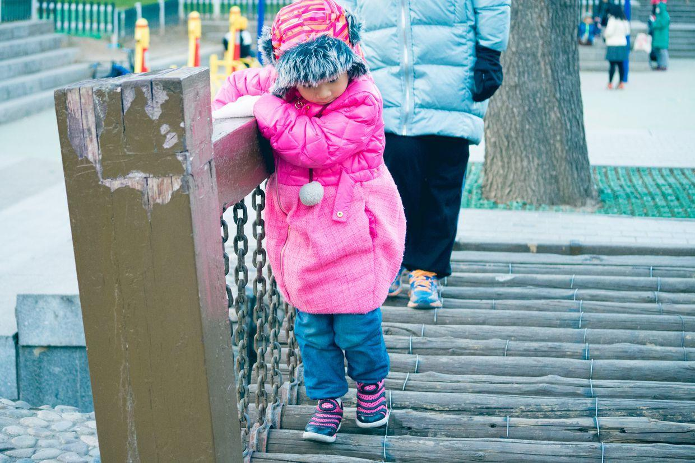
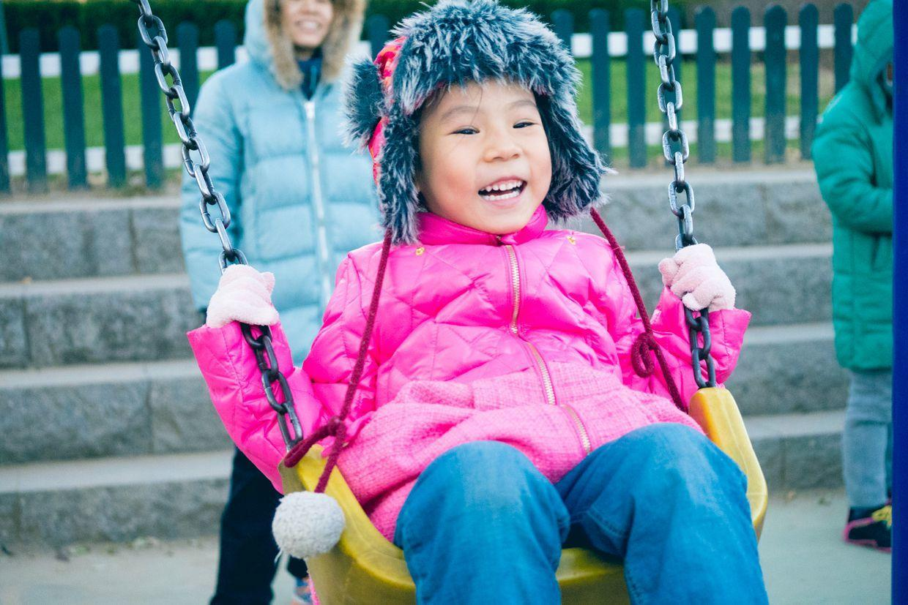

          
            
**2017.09.29**

本篇回顾一下冬季的一个周日，一起去宜家买东西。

出门时，天气寒冷，街道上人还非常少。

大风之后，天非常蓝。

非要背着自己的小书包，戴着大帽子，这个帽子太小了，现在已经送人了。

这些小店，都躲过了拆墙打洞的运动，一直到现在。

到了停车场，去开车。

到宜家了，从书包里要拿什么？

原来是米妮宝宝，早上特意装在书包里带来了。

今天来挑自己的小转椅。

吃了一大份意面。

越吃越香。

满嘴满脸都是酱了。

一个人报销一大盘。

开心地推着车。

发现了个大鞋子，自己穿起来了。

放回原位。

去货架上搬东西。

去哪里结账？

想自己搬下来？

准备走吧。

去玩儿秋千。

好久不玩儿这个小宝宝的秋千，都快坐不进去了。

过独木桥。

真神气啊。

开心地坐上大秋千。

呲着牙笑。

张开大嘴笑。

回着头笑。

游乐场上的人。

玩儿跷跷板的父女。

秋千越玩儿越起劲。

伸着手，一过来就摸一下小脑袋。

上了大滑梯。

准备要下来了。

下来啦。

**个人微信公众号，请搜索：摹喵居士（momiaojushi）**

          
        