          
            
**2017.10.01**

国庆节第一天开始啦。

5点多就起床了，开车去黄金海岸。

先去唐山姐姥姥姥爷，一路上各种事故车把高速堵了个结结实实。

4个小时的路，开了6个小时，下午快14点了才到酒店。

酒店人很少，但是房间非常大。

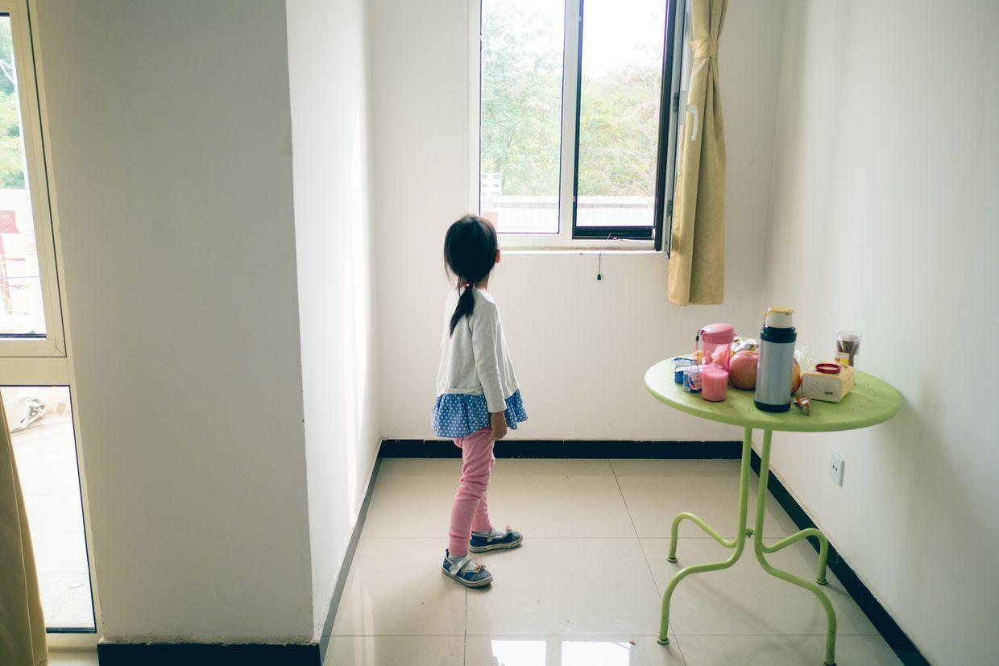

喝点酸奶，吃点东西补充一下，等着晚上好好吃晚饭了。

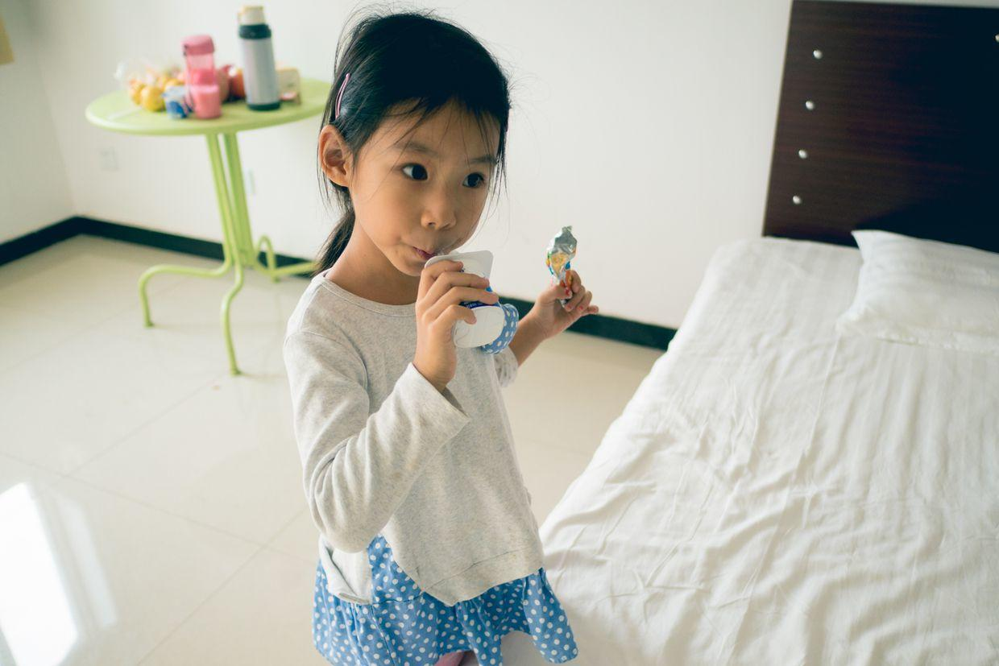

巨大的蜘蛛，还有臭大姐。

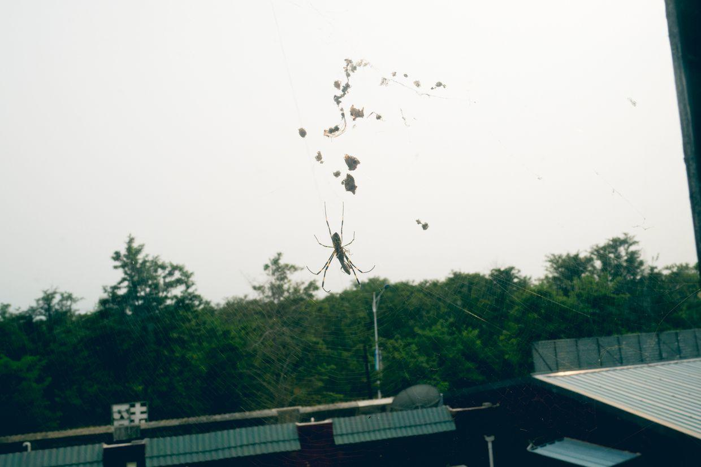

奶奶把琴和谱子都带来了。

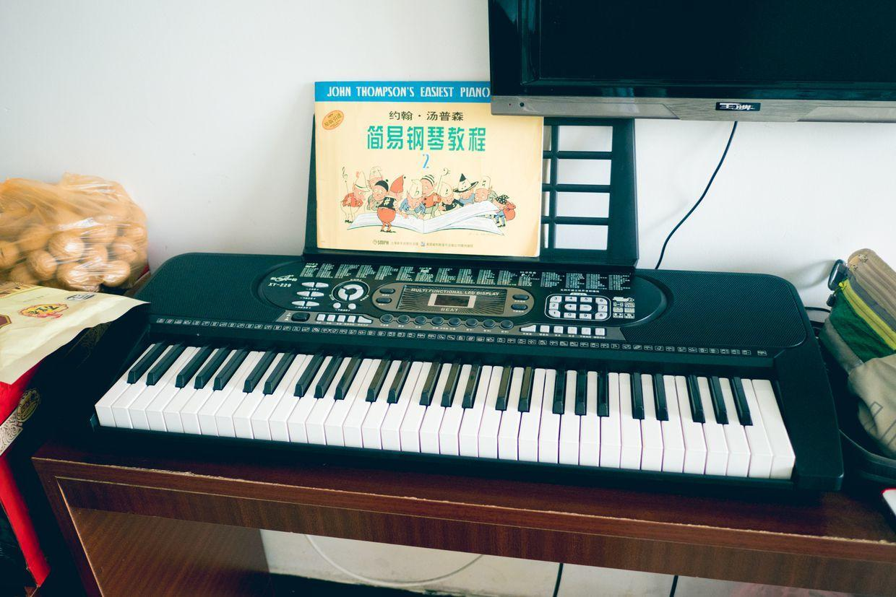

吃得开心起来了。

在两个床上蹦来蹦去。

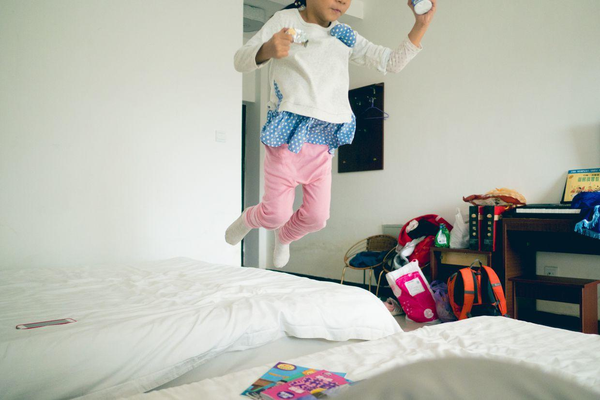

睡醒了，准备要吃晚饭啦。

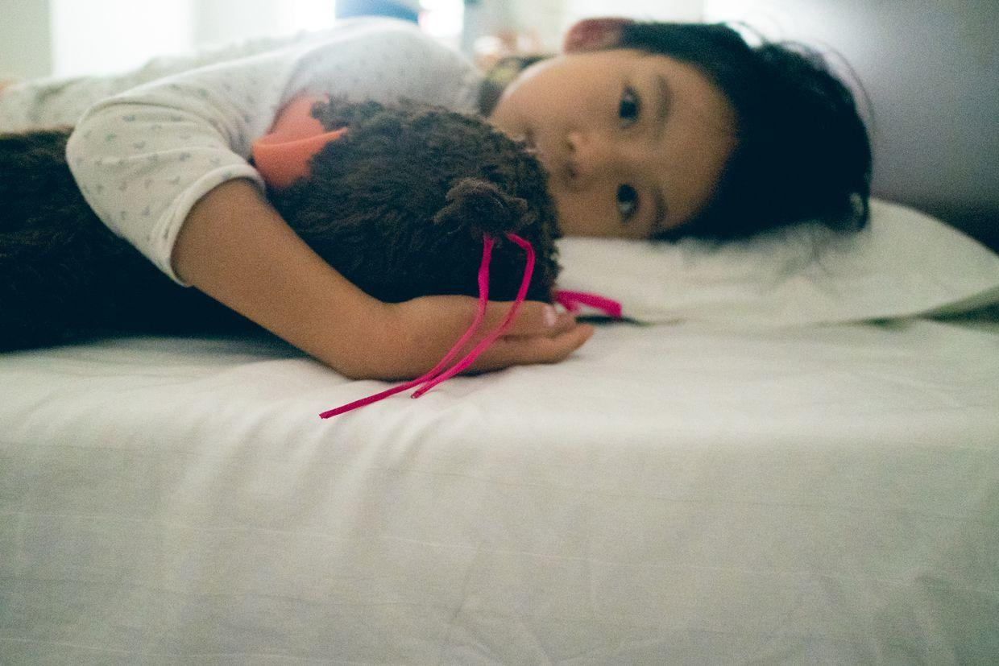

抱着大奇奇乱滚。

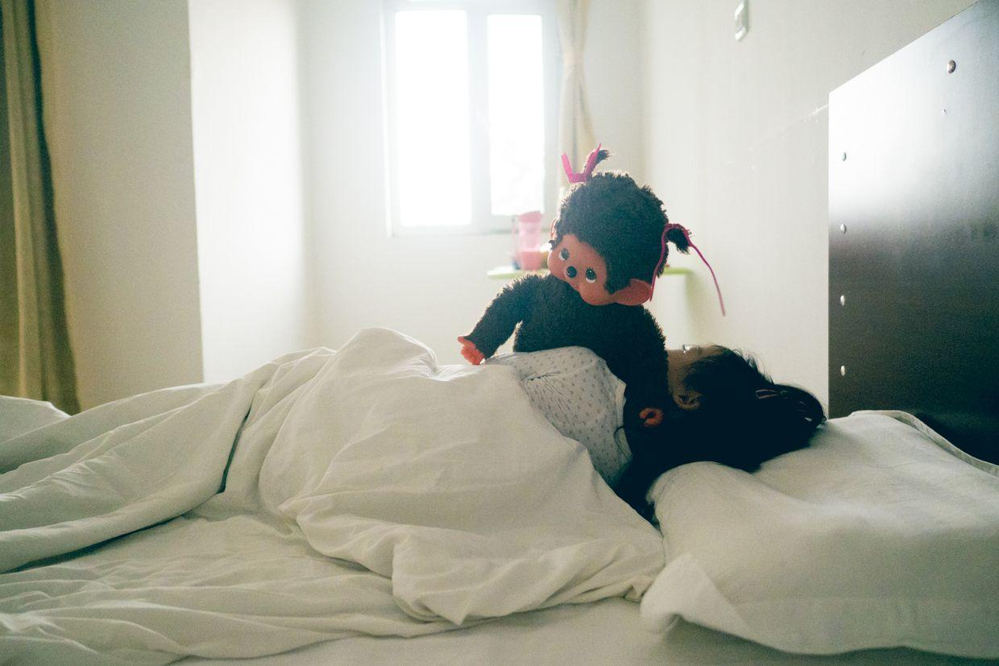

去餐厅吃饭啦。

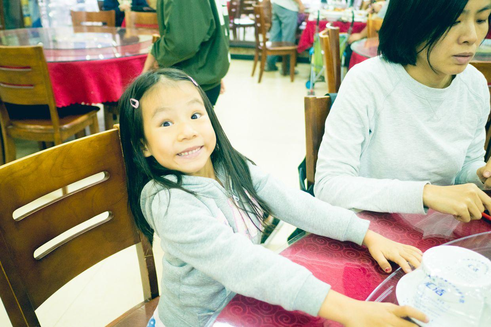

奶奶准备了海水煮的大螃蟹。

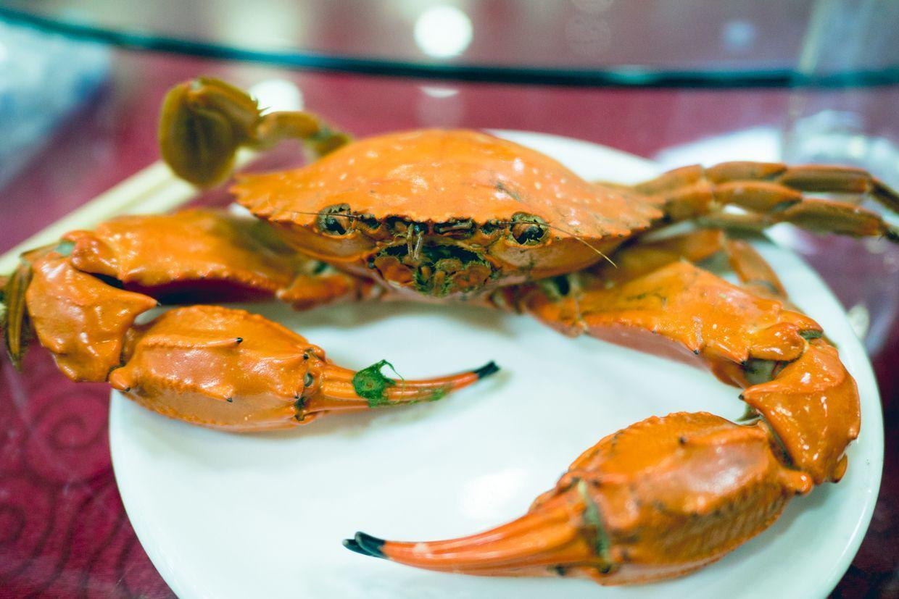

封面

喵吃完了饭，开始去大家周围转悠。

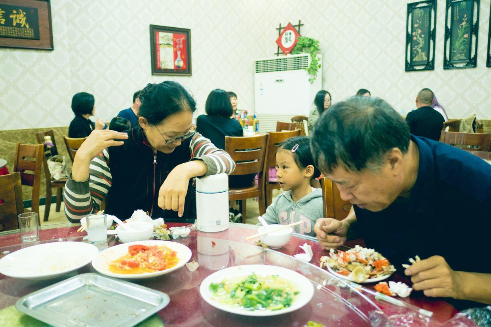

给大家看自己手里的螃蟹壳。

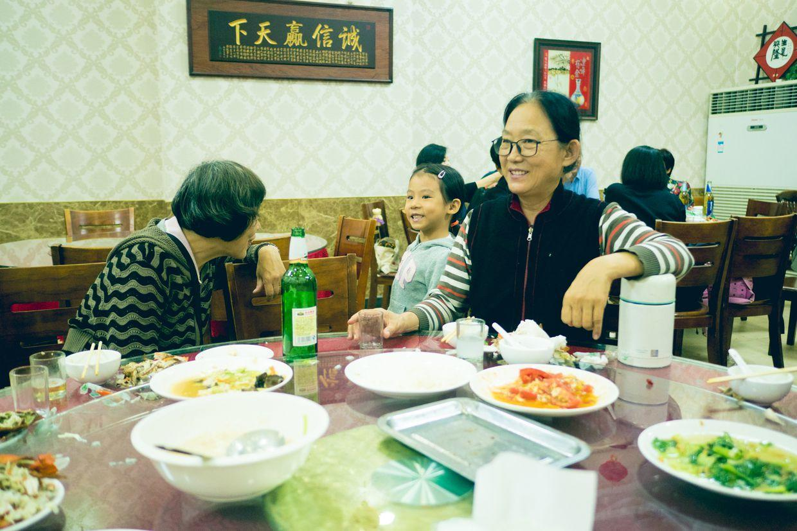

给姥爷看。

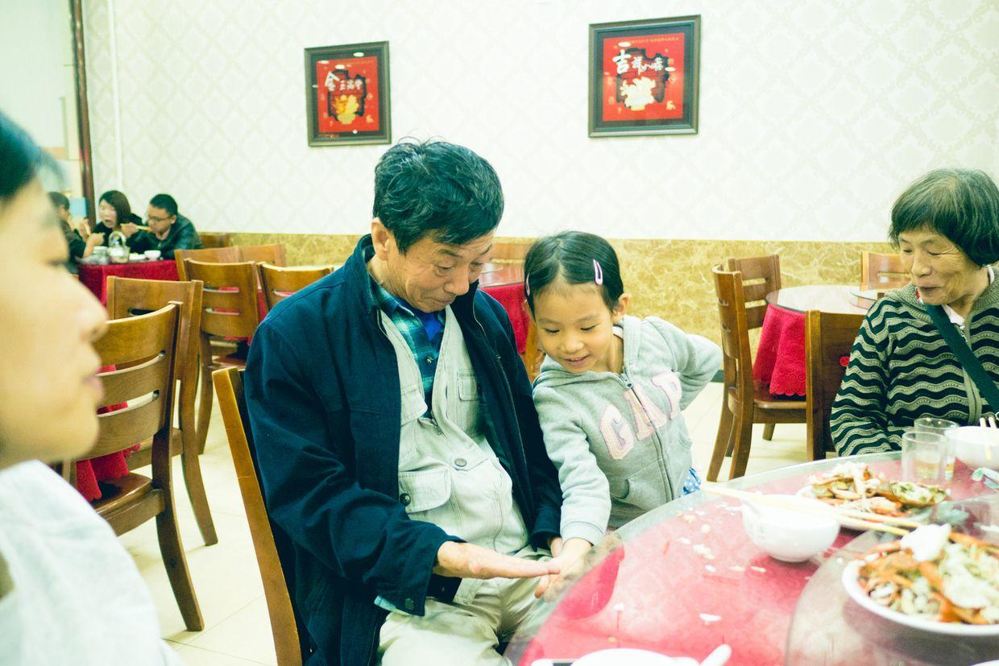

出了门，天已经彻底黑下来了。

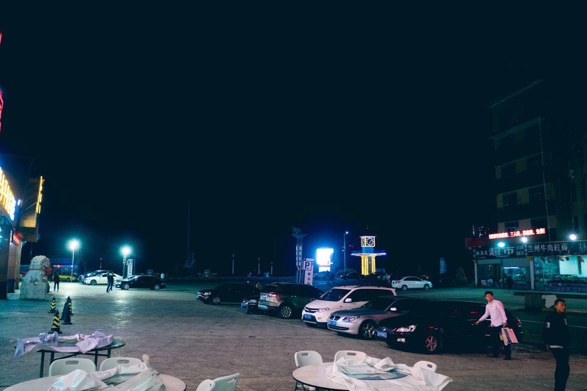

回到酒店，喵开始和姥姥姥爷、爷爷奶奶一起玩儿起来了。

开心的第一天结束啦。

**个人微信公众号，请搜索：摹喵居士（momiaojushi）**

          
        