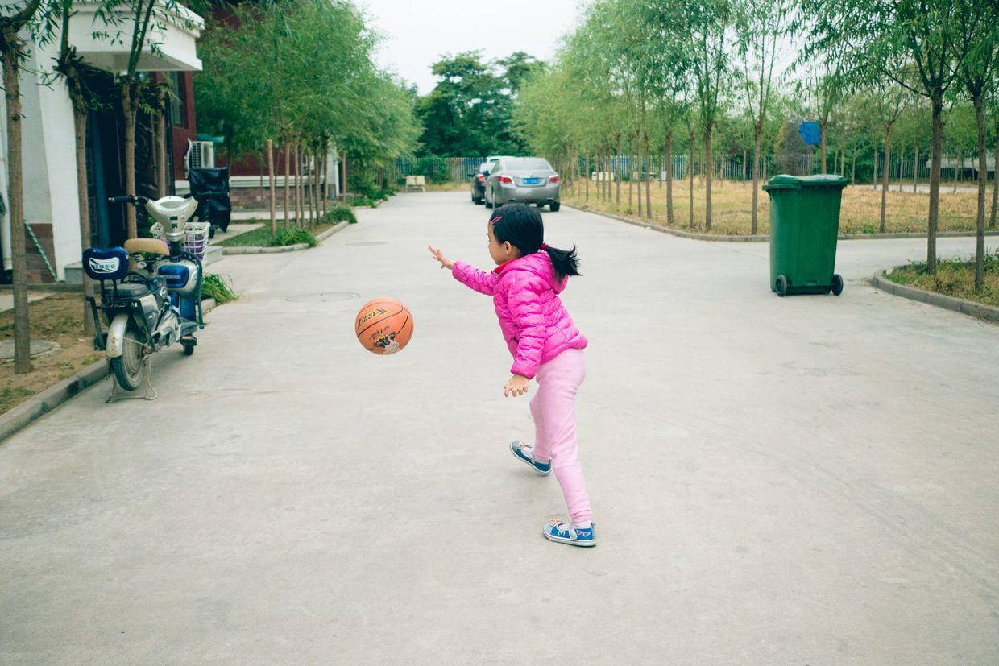

          
            
**2017.10.03**

昨天下午，睡了个大觉，起床出去吃饭。

喵在楼下跳起了绳，已经能连续跳4个了。

篮球已经能拍到无穷了。

还加入了自己的花样，转一圈接着拍。

封面

球低了，还能拍起来。

爷爷也来一起花式拍球。

去吃饭了，喵给大家发餐具。

吃差不多了，跑去让爷爷和姥爷拉手。

大家哈哈大笑。

跑来让姥姥和奶奶拉手。

拿起了想起，给每个人拍照片。

先给奶奶照。

然后是姥姥。

还有姥爷。

爷爷。

妈妈。

最后是爸爸。

今天起床很早，和大家一起去吃早点。

油饼、包子、鸡蛋、馒头、豆浆和豆腐脑，吃了个饱。

吃过早饭，太阳也出来了，开车去唐山，送姥姥姥爷回家。

一路上欢声笑语。

回北京的路上，在白鹿收费站堵了一阵子，总体上比去的时候快多了。

到家好好休息，明天继续活动。

**个人微信公众号，请搜索：摹喵居士（momiaojushi）**

          
        