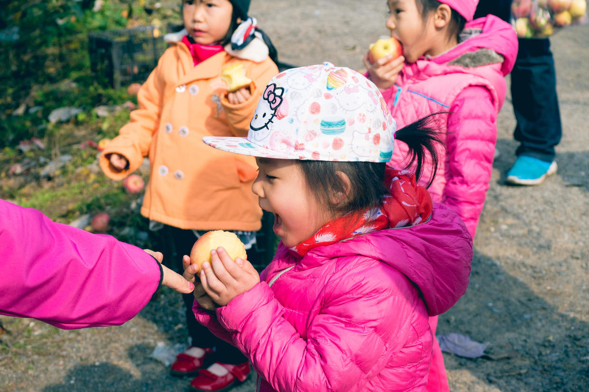

          
            
**2017.10.16**

**拍摄时间：2016.11.26**

**拍摄地点：果园**

这张照片是2016年11月底，去果园采摘苹果时拍的。

去之前很久，爷爷奶奶就去探过路，带回来了很多又大又甜的丰水梨和大苹果。

这次三个小姐妹一起去了，虽然果子不多了，但大家还是一起摘了够，吃了个够。

喵和悦妹在后面边走边啃大苹果，兜妹则是抱着大苹果，离着老远就已经张开了血盆大口。

现在回忆起当时的苹果，确实非常甜，即使是看起来有点小，颜色也不是很鲜亮的，吃起来甜度也是远超平时能买到的。

摘完了苹果，中午去吃饭，还有卖多肉植物的大棚，买了两盆多肉，养了也快一年了。

熊童子在一次事故中死了，而另一盆去坚持到现在，生命力惊人。

转眼过去一年，又到采摘的季节了。

**个人微信公众号，请搜索：摹喵居士（momiaojushi）**

          
        