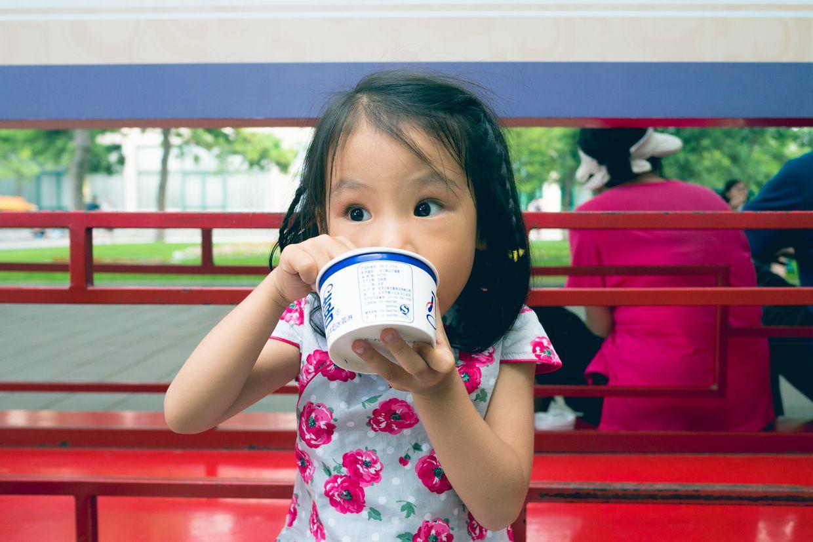
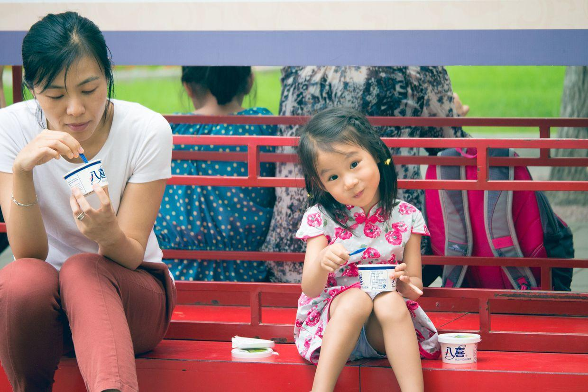

          
            
**2017.10.20**

本篇继续回顾一下，以前暑假去中山音乐堂听合唱音乐会。

下午，经过重重安检，来到了中山公园大门口。

正门处的巨大石牌坊。

随处可见的古树。

虬劲有力。

喵倒是对宣传架特别感兴趣。

八喜赞助的暑期艺术节。

自然是少不了八喜冰激凌，每人一个。

红墙内的林荫道。

开心地吃着冰激凌，看着过往的人。

抿着小嘴笑。

歪着小头。

马上就要见底了。

吃痛快了。

非常舒服的环境。

轮到我来吃了。

边吃边观察四周。

瞪大了眼睛。

又要笑起来。

一起吃。

开始入场，在音乐堂里找好自己的座位。

椅子很大，只能坐到前面一点点。

还有节目单。

人开始多了。

拿着节目单，在座位上玩儿起来。

演出开始了。

中场休息。

开心地玩儿。

下半场开始。

还挺认真。

封面

和妈妈聊起来。

很开心。

最后谢幕了。

结束了，在中山公园的环廊里坐会儿。

去吃晚饭。

一兰拉面的沙拉。

鸡块。

今年因为去南戴河，没能去听音乐会，有些遗憾。

**个人微信公众号，请搜索：摹喵居士（momiaojushi）**

          
        