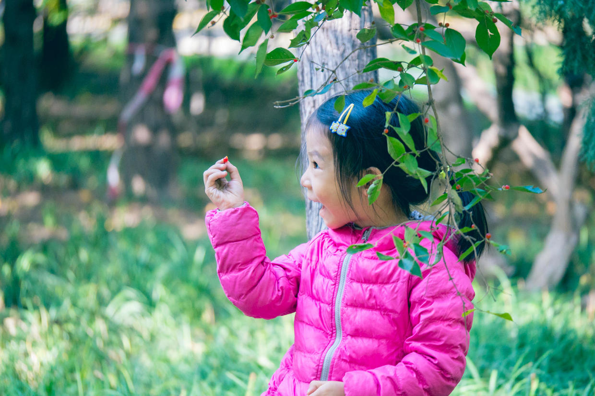

          
            
**2017.10.23**

**拍摄时间：2016.10.23**

**拍摄地点：公园**

这张照片是2016年10月底拍的，去元大都遗址公园玩儿。

天气已经很冷，走了一路之后，把外面的大羽绒服脱掉，顿时成了一只脱缰的小马，冲进了公园。

天气虽然已经很亮了，但绿色植物们，还在做最后的坚持。

喵跑着跑着，被伸到路中的树枝吸引了，原来上面结着小小的红色果实。

这好像就是金银忍冬，名副其实，快要进入冬天，结出这么诱人的小果子，帮助小鸟们过冬。

第一次这么近距离接触，喵小心翼翼地摘了一粒下来，欣喜若狂地，喊着妈妈来看。

小小的果实，帮助鸟儿们忍过冬天。

元大都遗址公园，虽说是以元大都遗址城墙命名，但实际上却是一条长长土堆上的绿色走廊。

说起来，还是土城这个名字更贴切些。

**个人微信公众号，请搜索：摹喵居士（momiaojushi）**

          
        