          
            
**2017.10.28**

周六啦，终于起风了，持续了几天的雾霾终于被吹散了。

到了舞蹈教室，和同学一起玩儿，排队准备进教室。

今天是公开课，终于可以进去拍照了。

同学们两个一组互相帮着压腿。

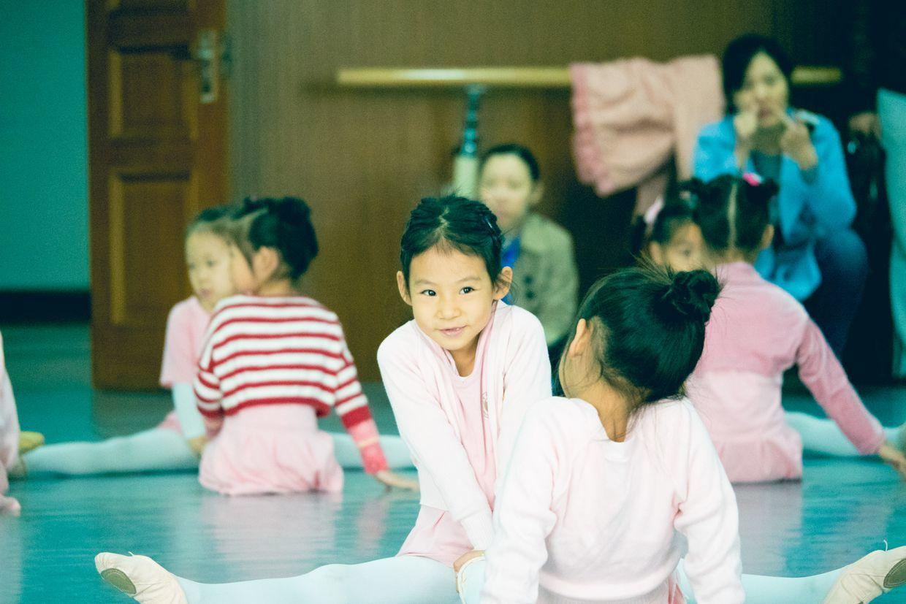

开始做准备活动了。

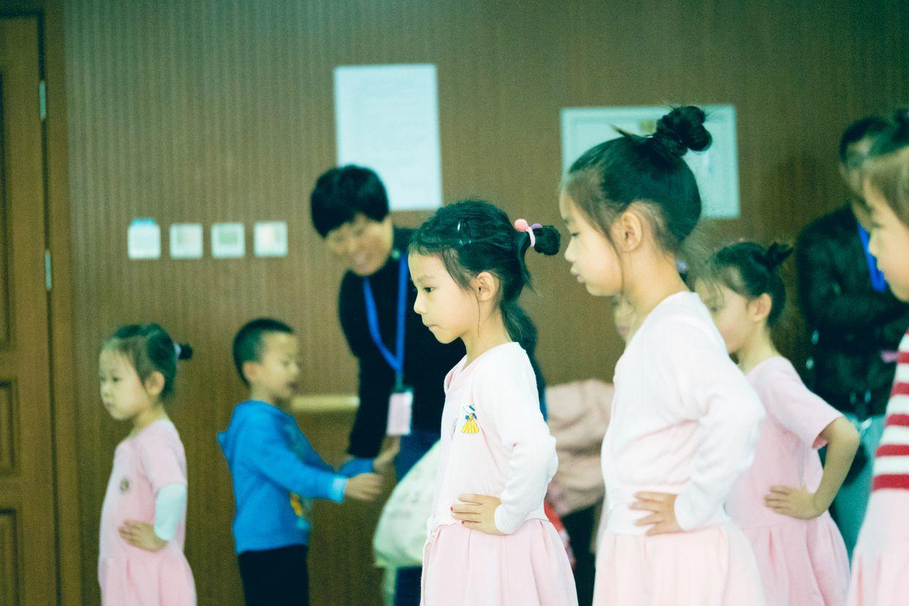

开始下腰。

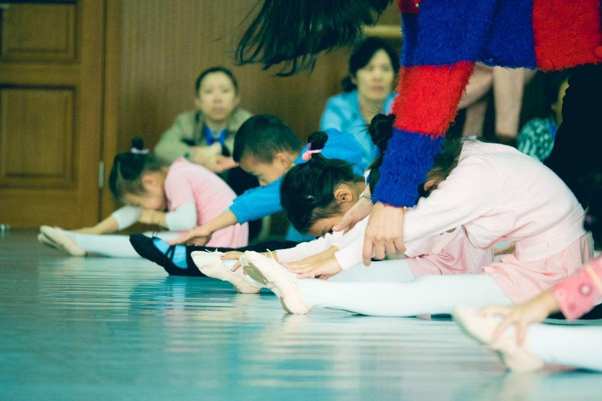

举手动作。

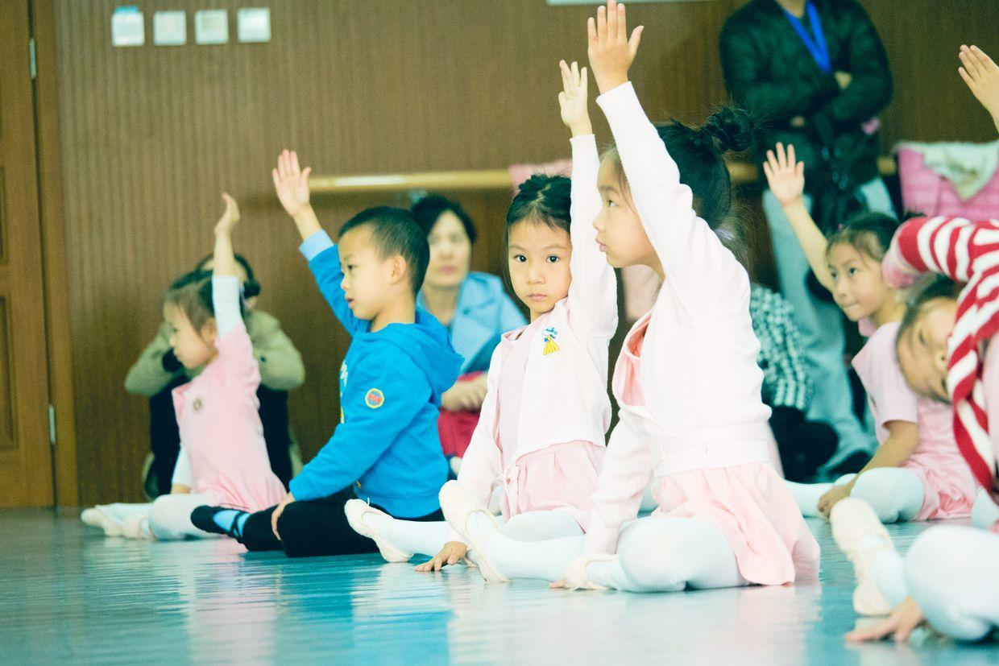

侧面下腰。

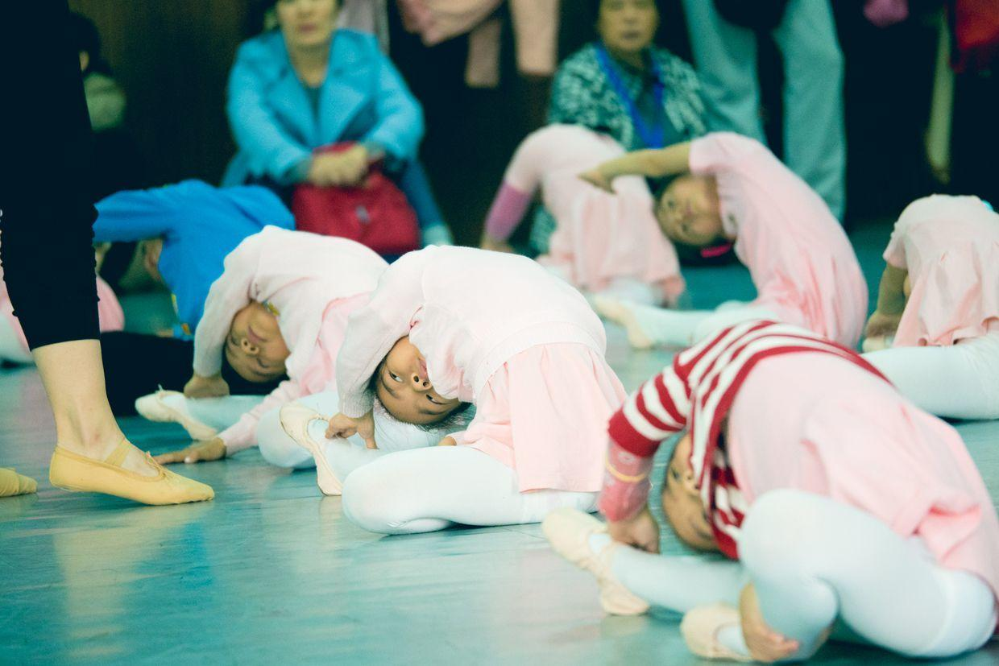

都热好身，把外面的毛衣脱掉。

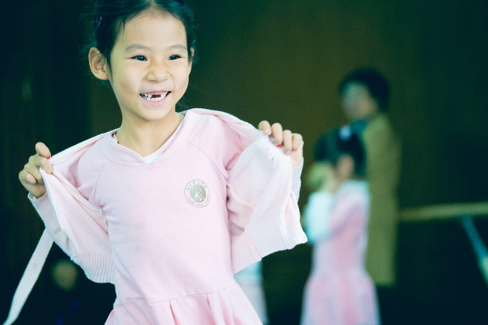

吹泡泡动作。

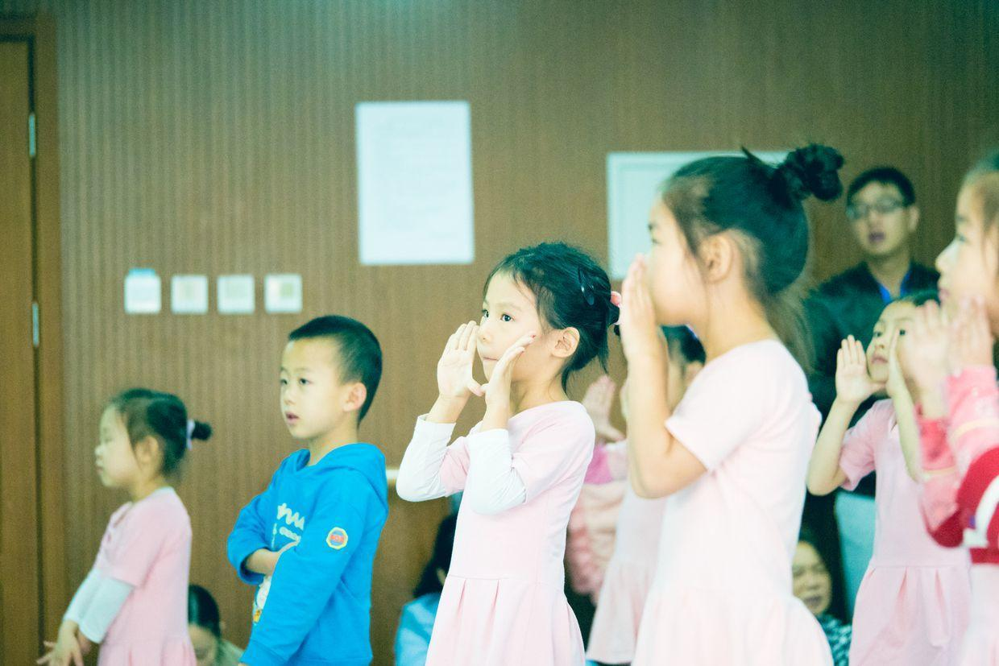

冷漠。

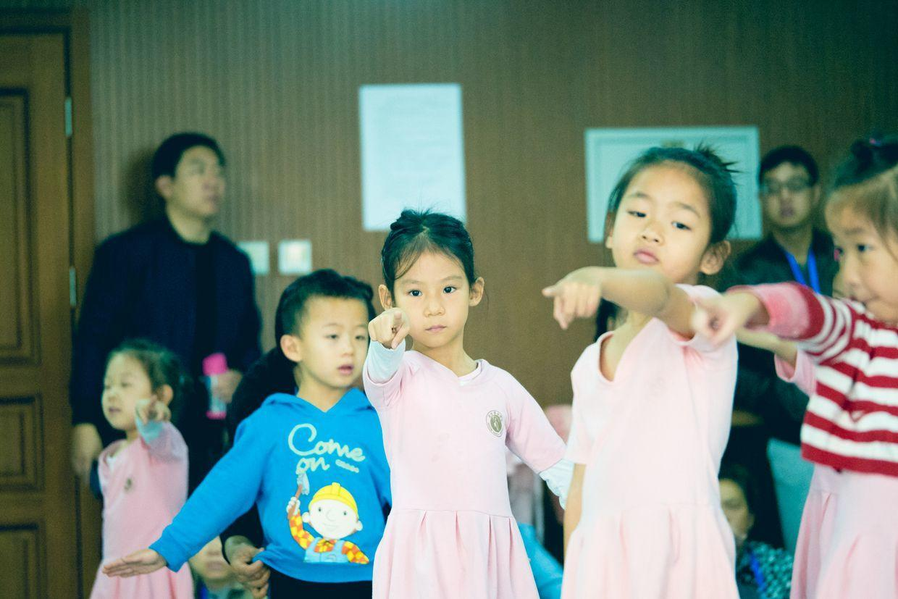

课堂气氛很活跃。

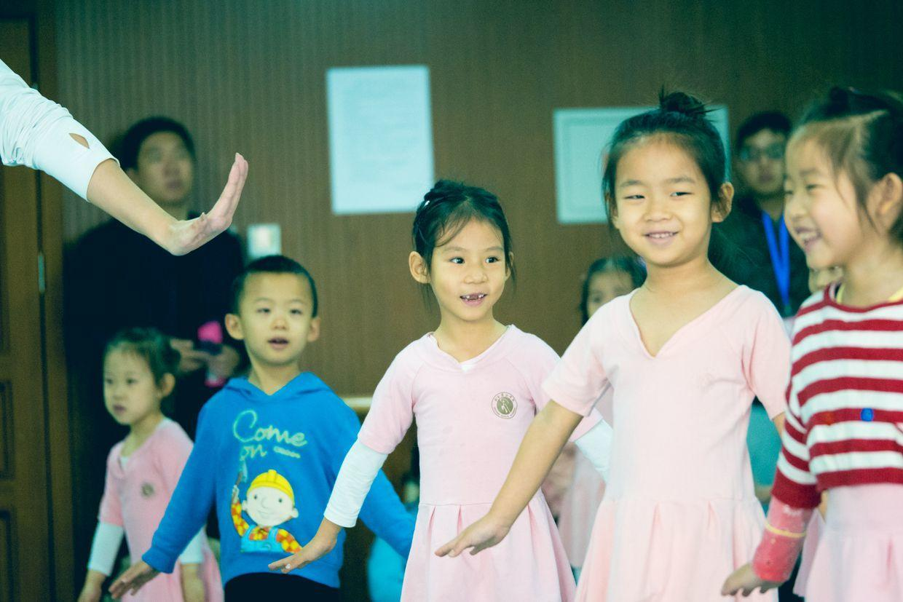

边跳边唱。

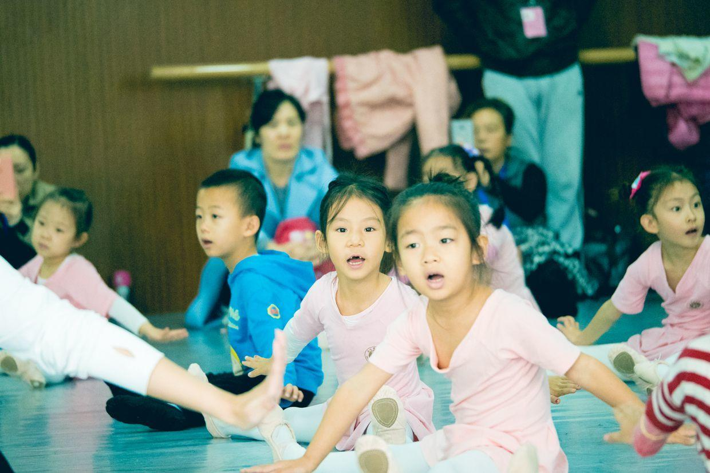

平躺，脚要绷着。

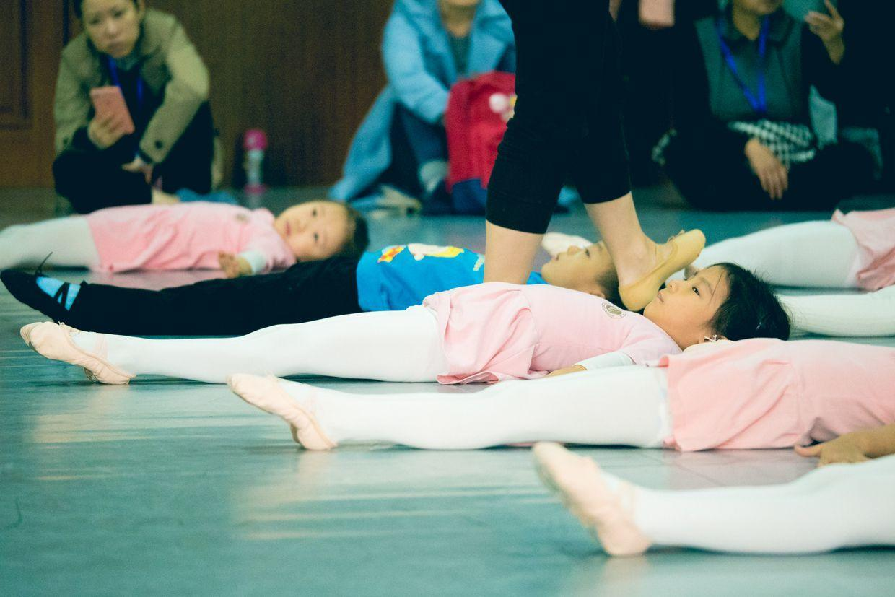

中间休息，和同学一起玩耍。

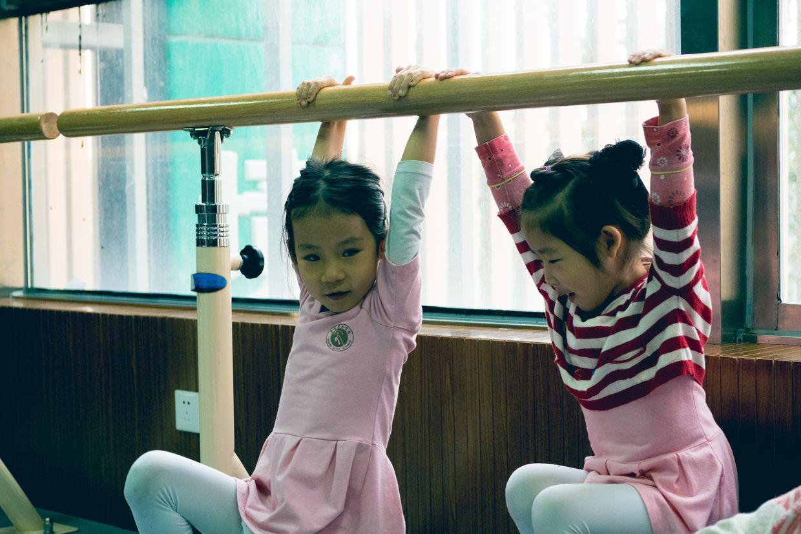

摘苹果动作。

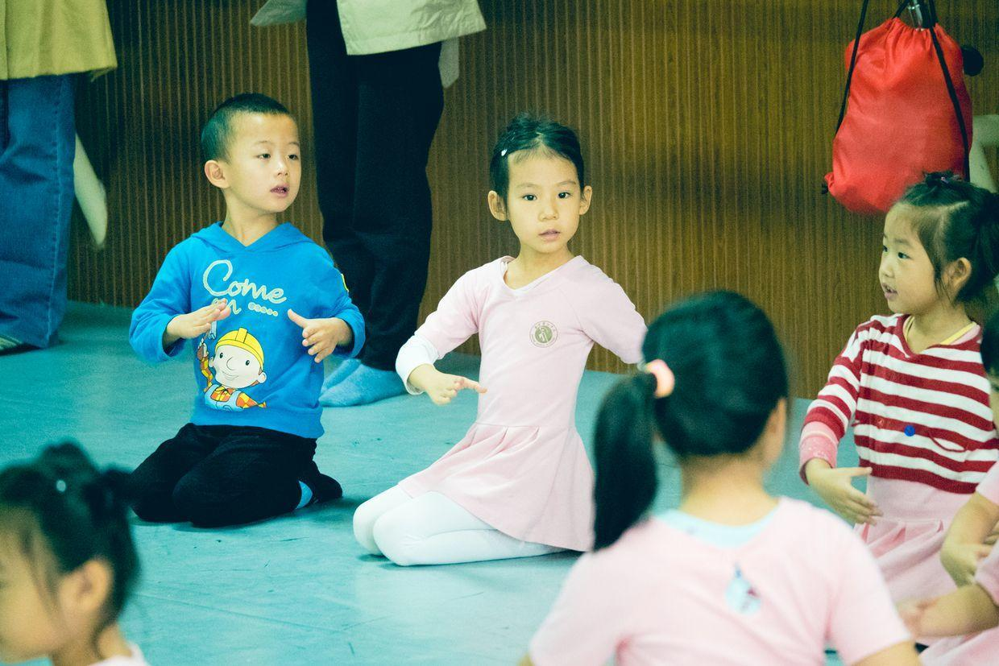

中间休息，大家一起很开心。

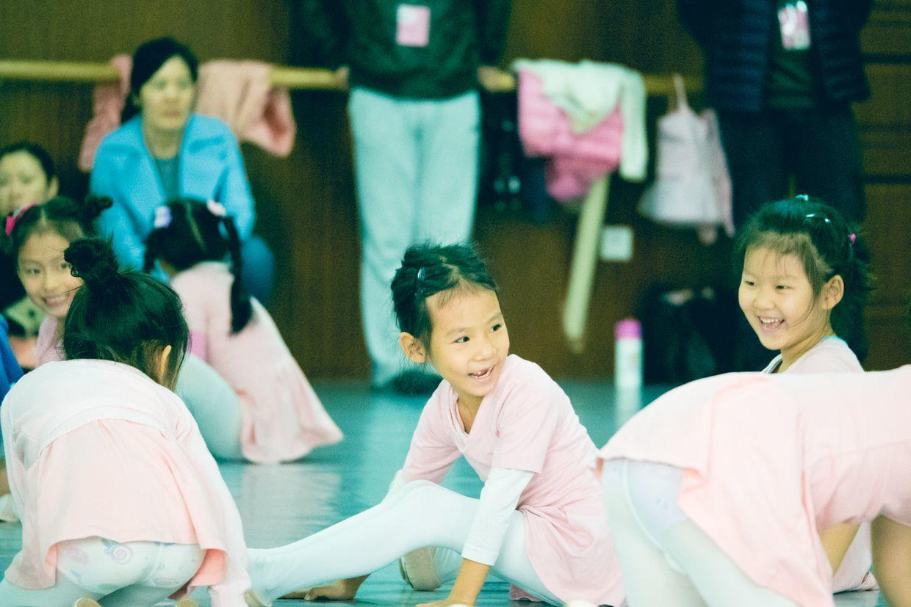

抿着嘴笑。

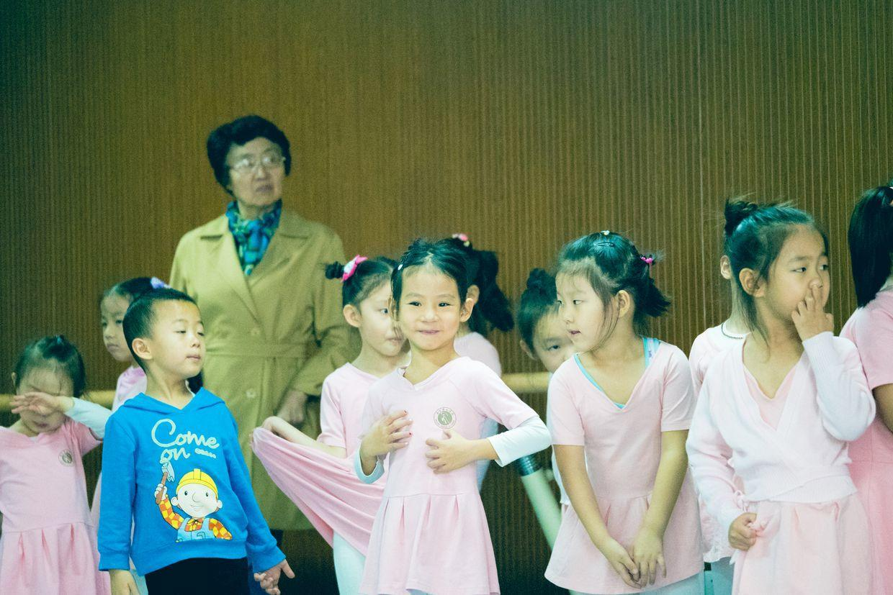

很多动作都不熟练，看来还是要每天复习一下舞蹈动作，否则只靠周末上课还是不够。

中午回家，吃披萨。

下午起床，开始大闹，不起床。

闹腾够了，到了钢琴教室。

下了课，赶紧回家，外面实在是太冷了。

晚上去超市买东西。

**个人微信公众号，请搜索：摹喵居士（momiaojushi）**

          
        