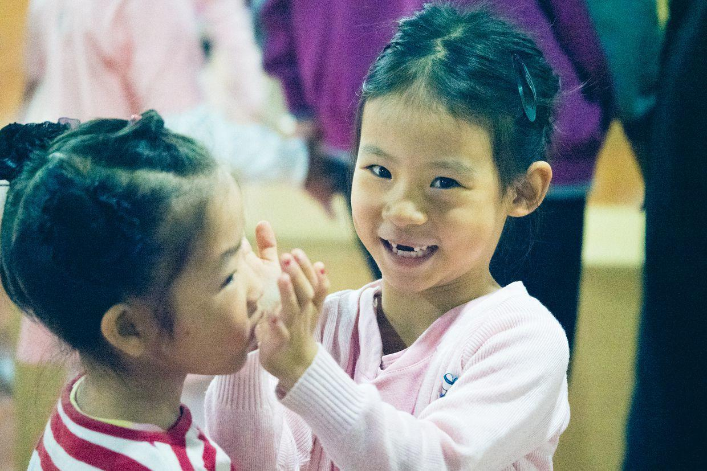

          
            
**2017.10.28**

周六啦，终于起风了，持续了几天的雾霾终于被吹散了。

到了舞蹈教室，和同学一起玩儿，排队准备进教室。

今天是公开课，终于可以进去拍照了。

同学们两个一组互相帮着压腿。

开始做准备活动了。

开始下腰。

举手动作。

侧面下腰。

都热好身，把外面的毛衣脱掉。

吹泡泡动作。

冷漠。

课堂气氛很活跃。

边跳边唱。

平躺，脚要绷着。

中间休息，和同学一起玩耍。

摘苹果动作。

中间休息，大家一起很开心。

抿着嘴笑。

很多动作都不熟练，看来还是要每天复习一下舞蹈动作，否则只靠周末上课还是不够。

中午回家，吃披萨。

下午起床，开始大闹，不起床。

闹腾够了，到了钢琴教室。

下了课，赶紧回家，外面实在是太冷了。

晚上去超市买东西。

**个人微信公众号，请搜索：摹喵居士（momiaojushi）**

          
        