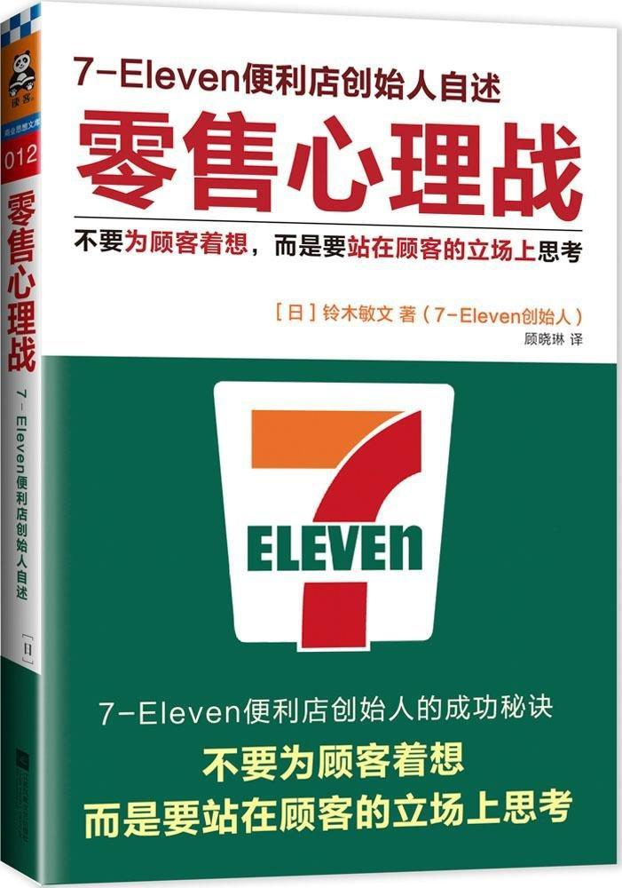

          
            
**2017.11.02**

很多小故事挺有意思，不过整体感觉还是有失偏颇。
>序

如果你有信心让顾客感到“选择从你这里购买产品真是选对了”，那你无疑已经掌握了极高的“销售力”。

销售力就是让别人选择自己的东西
>第一章创造“新兴事物”的秘诀

在创造新事物、挑战新项目的时候，如果找不到现成的方法，就需要自己研究和开拓新的道路；如果无法达成所有的必备条件，就去改变条件本身。

虽然不善聊天，但我却能以己度人，把自己的想法抛给对方，因此反而可以游刃有余地针对不同嘉宾展开访谈

只有随变化而改变，才能获得胜利

越美味的东西越容易生腻”的道理。

正如北野武等笑星让观众们百听不厌的“普遍适用型笑料”一样，经营的关键是如何在保持坚定“立场”的同时加入新的“素材”。

要变化，否则消费者会生腻
>拿到一本书时首先阅读目录，大致了解下整体内容，然后在这一基础上选择性地阅读重点章节，最后再看一看结尾部分，就能基本把握全书的脉络。

快速读书
>而言，不变的基本“立场”是坚持“站在顾客的角度”思考问题

我虽然身处零售业，却再也没有参与过任何关于销售或在柜台收银的工作。纵观整个集团，这样的人恐怕除我以外再也找不出第二个。

不过也正因如此，我才能不受制于流通行业原有的常规和商业习惯，接二连三地在业务上提出新的改革方案

不参与柜台工作，怎么站在顾客角度？
>人生的命运真是充满不可思议。

我做完促销的策划工作，又投入了人事工作，不管三七二十一地认真对待每一天

当人在饥肠辘辘的时候，有多少菜就能吃多少，所以通常会先选择不怎么喜欢的菜品填饥，把爱吃的佳肴留在最后细细品尝。与此相反，当人饱腹时则转而首选最爱的食物或是珍奇的菜肴尝鲜。在当前物质过剩的时代，消费者正处于饱腹的状态，因此，企业唯有提供具有全新价值的产品才能“适者生存”。为了让消费者感受到产品或服务的新价值，关键的问题是怎样才能做到“站在顾客的立场上”思考。

卖方市场和买方市场转变，才需要站在顾客立场上考虑
>物质匮乏的时代，柳树下的泥鳅总是不止一条。若看到别人在一处捉到了泥鳅，赶紧追随其后，在同样的地方尝试捕捉的话，也有可能取得成功。

经营者需要掌握“销售力”，依靠自身的力量去寻找第一条泥鳅。

秋元康每次一有机会就会建议别人说：“当向日葵掀起热潮的时候，应及时撒下蒲公英的种子。

不要守株待兔
>与此相反，7Eleven从2009年秋季开始，把“当今时代所追求的‘近距离便利’”作为便利店新的经营姿态，在备货方面实行了大刀阔斧的改革创新。例如增加了配菜的种类，开发了价格适中的小包装土豆色拉和土豆炖牛肉等7Premium系列产品，推出了节省时间、减少繁琐烹饪步骤的Mealsolution产品系列，成功实现了便利店的华丽转身。

不只卖便宜东西，还要做精品
>2009年，7Eleven便利店的顾客年龄结构较之过去10年出现了巨大的变化。1999年，便利店的顾客年龄层主要以20至30岁的年轻人为首，占据全体的35%，而占比最少的则是50岁以上的顾客，只有全体的14%；但到了2009年，50岁以上的顾客数却后来居上，出现了翻倍，上升至全体顾客的28%，与此相比，20至30岁的年轻顾客数则回落至22%，相比10年前减少了三分之一。

今后多口之家的比例将不断减少。2010年，由父母和孩子组成的家庭约占总体的28%，但根据推算，到了20年后这一比例可能滑落至24%左右。相反，单身家庭的占比则将由原先的32%提升至37%。那时，65岁以上的老年人家庭所占比例预计可达到近48%左右，其中三分之二以上是单身或者丁克家庭。

面向小家庭和单身，减少量，提高质
>而自2013年7月在各门店导入的现磨咖啡——Seven咖啡也不例外。Seven咖啡是自助式的滴落咖啡，每杯（150毫升）100日元的“便利性”中结合了口味醇厚的“高品质”。结果上市当月的累计销售量就轻松突破了1亿杯。

咖啡真是感觉不出什么品质
>为此我飞往美国，导入了日本7Eleven的经营方法。通过提高快餐类食品的品质和鲜度等方法，在保留“便利性”的同时，嵌入了“高品质”战略，实现了企业的重生。现在，美国7Eleven已经属于日本7Eleven的全资子公司。

被日本人买了
>因此，为了让顾客更方便地存取现金，7Eleven创立了Seven银行，把ATM装入了便利店。相比银行的ATM，我们以“可穿着凉拖”使用的附加价值，挖掘出了消费者的潜在需求。当7Eleven决定成立Seven银行之初，曾遭到金融行业内外的一致否定，或许对金融业界而言，很难理解“便利性”的想法吧。

这个很厉害，为了装ATM，自己开银行
>实际上，我曾拜托三得利控股集团的社长佐治信忠说：“请以贵公司的最高规格生产品质最佳的啤酒。7&amp;i集团保证全部买下。”佐治社长当时非常惊讶，感叹道：“我从业这么久以来，第一次听闻这样的要求。”在那次会面之后，我们双方开始共同研发高品质啤酒，推出了百分之百选用精品麦芽制造而成的7Eleven限量发售产品“农场直送麦芽・纯生啤酒”。虽然每罐（350毫升）138日元的高定价在罐装啤酒中并不常见，但我们却只花了一个月就完成了原本三个月内售罄的目标。

难道平时三得利的啤酒都是凑合的？
>・当便利店采取年中无休的经营方式后，为了在新年也能为顾客提供新鲜的食品，我向面包生产商提出了正月配货的请求，却被严词拒绝。

・为了让7Eleven便利店有资格安装ATM，我决定成立公司的自有银行。对此，以金融界为首的反对意见甚嚣尘上，外界评论说：“外行即使开了银行也注定失败。”甚至连当时主要合作银行的董事长也亲自劝我“悬崖勒马”

面对质疑，不能随便认输
>第二章顾客内心的秘密

假设在海边的某个小镇，通往钓船码头的小路上有一家7Eleven便利店。现在正是垂钓的最佳时节。第二天恰好是周末，据天气预报报道，明天天气极佳，是乘船钓鱼的好日子。所以可以想象，从明天一大早开始就会有钓鱼客顺路来便利店购买当作午餐的食物。因为中午的气温将大幅上升，所以从钓鱼客的心理考虑，应该更需要不易损坏和腐败的食物。“这样的话，梅干饭团应该很好卖吧！”根据上述条件，店员树立了这样一个假设，然后加大了对梅干饭团的采购量。

预测用户购买，不应该交给AI吗？
>建立Francfranc品牌的高岛郁夫为了丰富员工们的感受性，鼓励他们尽可能减少加班，珍惜自己的私人时间。据高岛说，在公司上班的时候，绝大部分工作都是机械化的，但作为职员最重要的并不是“机械化的劳作”，而是应该丰富自己的感受性，不断提高“创造力”，并且这一能力“需要在朝九晚五外的私人时间中培养”。

创造性工作更需要私人时间
>第三章“销售”即是“理解”

1997年，消费税税率从3%提高至5%，消费市场因此陷入低迷。当时，为了帮助伊藤洋华堂脱离萧条的经营状态，我在翌年提出开展“返还5%消费税”的促销活动。如前文所述，董事会的绝大多数成员听了我的建议就像听到了天方夜谭一样觉得不可思议。那时候，即使让营业部门为产品贴上降价10%甚至20%的促销标签，对销售情况也没有太大帮助，所以大家质疑区区5%的促销能激起多少浪花。

最后营业额同比上年增长了60%。其中销量靠前的大多是单价好几万日元的高价产品。

那住了消费者的心理
>发生雷曼事件的同年夏天，原油价格再创新高，汽油价格也随之节节攀升，针对这一情况，伊藤洋华堂适时地推出了赠送“汽油优惠券”的活动。活动期间，顾客的购物金额每达到5000日元就可以获赠一张每升优惠10日元的汽油券（最多50升）。

消费者不都是理性经济人
>假如商家唯独供应这一种牛肉，顾客肯定觉得700日元的售价有些贵，难以吸引他们购买。但如果分别向顾客提供每百克标价500日元、700日元和1000日元的牛肉，顾客就会开始进行比较：虽然500日元的牛肉价格低廉，但700日元的看上去品质更好，而且比1000日元的更划算，最终倾向于购买每百克700日元的牛肉。

要给顾客多个选择，诱使其买你希望的价格的产品
>正如我反复强调的一样，顾客的购买对象是产品的价值。虽然低廉的价格也是一种价值，但顾客并不只关注低价，他们迫切想要知道的是这一产品是否具有购买价值等令人信服的理由，其最终目的在于合理化自身的消费行为。

低价现在并不是最重要的，使用价值最重要
>在彻底贯彻这一战略的过程中，大众对Seven银行的认知度不断提高，到了开业的第三年，每台ATM的日均使用次数呈现井喷式增长，实现了收支平衡（当时每天每台的利用频次约为70人次）。

业务需要积累，不能拔苗助长
>一定区域内密集出店的优势在于能提高物流系统、广告、OFC等各方面的综合效率。

虽然7Eleven在新的地区建立门店时，平均单店日营业额的增速比较缓慢，但是随着开店数量的累加，门店密度达到一定程度后，顾客的认知度和心理上的亲近感都将直线上升，最终由量变引起质变，带领业绩曲线强势攀升。

狼群战术
>在贯彻了问候与鞠躬等基本的待客服务后，下一阶段的重点是积极向顾客传达产品与服务的价值。为了回应顾客“想要确认”的心理，我们把“与顾客沟通”作为了最重要的任务。

要和顾客聊天
>例如对于饮食类产品，如果想让顾客判断这一产品是否具有购买价值，最直接的办法就是推荐顾客试吃。

像好利来那样，主动请你试吃
>店员推荐顾客试吃时，如果客人评价“这个真好吃”，则应该回应“是吧，这个产品有这样那样的特点”。

会做人，会说话
>以便利店为例，冬天的时候，当店员发现顾客的视线落在关东煮时，就主动询问“要不要买一串，吃了会很暖和的”或“这个很好吃哦”；

如果老年人购买了本应搭配叉子的意大利面类食品时，主动问一声“用筷子是否更顺手些”并递上一次性筷子；

即使目测客人购买的东西能收入一个购物袋，但如果重量比较重时，则根据顾客的情况建议“用两个袋子放吧”，并替顾客装袋；

记住熟客常买的香烟品牌，等顾客再次购买时直接递给他对应的香烟，并微笑着说“是××牌没错吧”，这样也会令顾客感到欣喜，觉得“没想到这家店的员工还能记住我常抽的香烟，真省心呀”。

有眼力劲儿，说人家爱听的
>最近，街道上的书店数量锐减，所以便利店又扮演起了“附近书店”的角色。万一顾客来店内购买的《文艺春秋》等面向中高年龄层的杂志正好断货了，店员就会深入一步询问：“如果有需要的话，要不要每月都为您留一本？”

实体杂志的最后阵地
>“待客之道”的基础在于“沟通”。谈话越是深入，越是能从对方的话语中读取重要的信息。这才是“对话”层面的待客之道。

对话的目的是沟通
>人之所以打扮自己，主要源于两个相互之间有些矛盾的理由：

一是想要“与众不同”的心理需求；

一是在意“他人的眼光”，渴望得到别人的认同。

买衣服不只是为了御寒和遮体
>在有限的店铺空间中，我们针对便当等主力产品建立假设，精选热销产品，通过绝佳的陈列位置及醒目的宣传物吸引消费者的注意。

最优的方法是精选90种左右的饮料，把畅销产品连续排两三列，这样更能有效地提高整体销量。

不要弄太多花哨的东西，把最热销的放在最醒目位置，不要太多
>在过去对话秋元康，询问他对网络营销的看法时，他告诉我国民偶像AKB48团体正是通过“现实与网络的相辅相成”才获得了如今在娱乐界不可动摇的地位

AKB48靠网络营销
>惠方卷是一种特制的粗卷寿司，据说在立春前一天，朝着当年吉利的方位，闭上眼睛，一言不发地整条吃掉它的话，就会拥有一整年的好运与福气。

1989年，广岛县某家7Eleven的OFC听闻了惠方卷的风俗后，提议在部分门店进行试售。第二年，惠方卷的销售区域逐渐扩大，1995年扩展至关西以西的地区，而到了1998年之后，惠方卷登上了全国所有7Eleven便利店的货架，由各门店的店员向顾客传达特别的“祈福习俗”。实际上，7Eleven向全国宣传惠方卷的动力正来自于网络。

通过网络与全国实体连锁便利店的融合，小范围区域的饮食文化在短时间内成为了全国盛行的活动。

不论是原为关西民俗的惠方卷，还是在秋叶原的小型剧场拓展演艺事业的AKB48，两者都完美展现了来自网络的力量。

惠方卷同样是网络营销
>日本电气的研发团队为了满足我们的苛刻条件，每天都在门店的零售第一线，从早上7点工作至晚上11点——恰巧与7Eleven的店名相呼应。他们的想法非常积极，认为：“如果应对得了全世界要求第一严格的7Eleven，就能应对任何一家企业。”

信息系统对便利店而言是一切信息的动脉。

现在来看，信息系统有AI帮助，就不需要店员每天去预测第二天要卖什么了

**个人微信公众号，请搜索：摹喵居士（momiaojushi）**

          
        