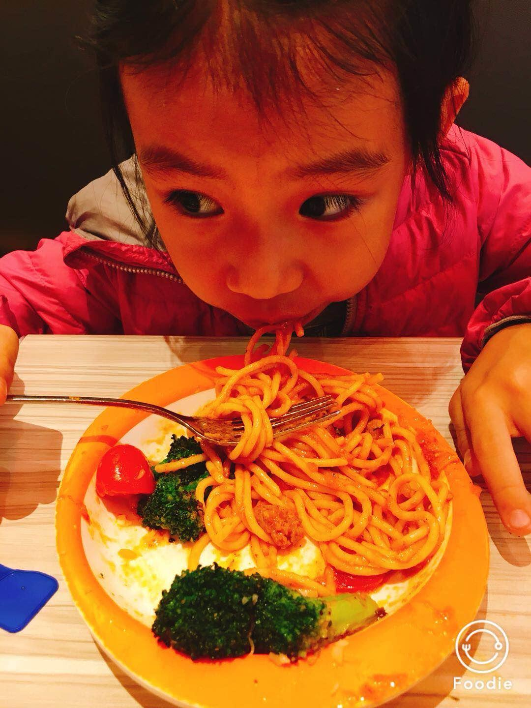

          
            
**2017.11.14**

自从看了《小猪佩奇》以后，喵就开始爱上意大利面了。

暑假时，每次游完泳，奶奶都会带喵去吃一顿萨莉亚的意面。

后来，喵带我们也去吃了一顿，萨莉亚的意面分量真是相当足。

喵竟然能一个人吃掉一整盘意面，之后还能意犹未尽地吃上几口披萨。

说起意大利面，营养实在是不均衡，主要就是面，还有很油很油的酱。

所以自己在家的时候，我们都要稍微改良一下。

炒上一些洋白菜丝，放一些不含油的番茄酱，加一点糖。

最后再加上自制的牛肉酱。

既能保持原味，也能营养均衡一些。

做意面最费劲的就是煮面，一般都要弄一大锅水，煮上10分钟。

夏天的时候实在是热，上桌以后都没有兴趣吃了。

于是我们采用了改良方法，把面提前几小时泡在冷水，放冰箱里。

用盒子装着泡过的面，水刚好没过，放到微波炉高火7分钟。

既不占用灶台的火，也不浪费水，更不会热气熏天。

生活就是一个持续改进的过程。

**个人微信公众号，请搜索：摹喵居士（momiaojushi）**

          
        