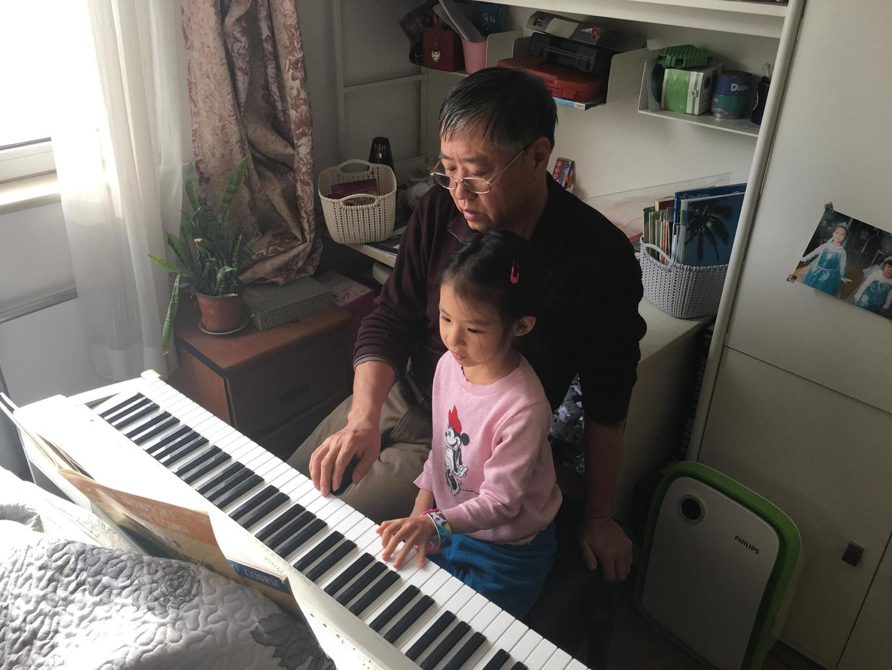

          
            
**2017.11.19**

周日啦，早上天气很不好，上午渐渐太阳出来了。

喵还在爷爷奶奶家休息。

中午吃饭的时候，检查一下最近练琴的情况。

据说喵每天亲自教爷爷弹琴，生病了好几天就中断了。

昨天又开始给爷爷补课。

自己练完了之后，和爷爷一起四手连弹了一首，弹得很熟练，看来是练了很多次。

弹完了，还要告诉爷爷哪里弹错了，拿着铅笔在铺子上标出弹错的音。

和爷爷练完了，就是和我合练。

一起弹了《问候》，《降E大调夜曲》前2行，还有《秋日私语》的第1行。

中午吃饭也不错，西红柿鸡蛋面，加上黄瓜丝和酱牛肉，吃了一大碗。

继续在奶奶家休息2天，希望下周身体能尽快恢复。

再过一周就可以回幼儿园了。

中午下楼，阳光下8只喜鹊在草地上蹦跳着觅食，希望是个好兆头。

**个人微信公众号，请搜索：摹喵居士（momiaojushi）**

          
        