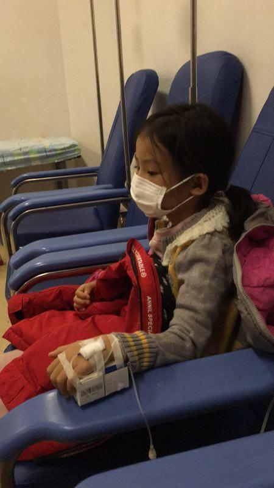
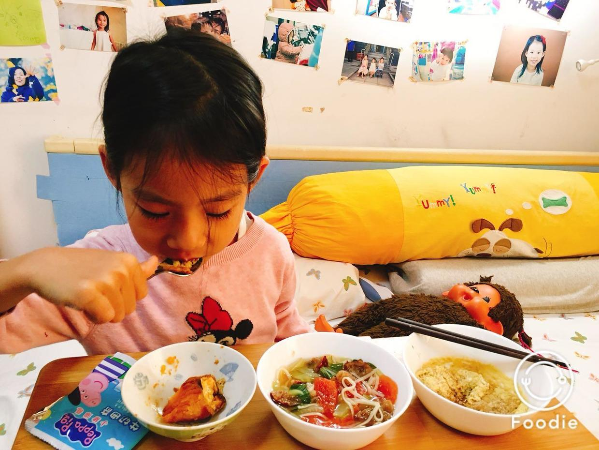

          
            
**2017.11.21**

上周是非常紧张的一周，半个班的小朋友都被传染了，喵发烧也很厉害。

周六去医院，开了消炎药，周日一天比较好，但周一早上又烧高了。

于是当天再去医院，医生就给输液了，要连输3天再去验血。

喵这次是第一回输液，扎针到是没事，护士的技术非常好，一下就找到血管。

不过输液有反应，觉得恶心不舒服。妈妈在一边放着小猪佩奇，陪着喵就会好很多。

连着输了3天，体温基本正常了，还是咳嗽，开始流鼻涕了。

封面

回到家，精神就很好，胃口也变好了，吃饭很不错。

妈妈和奶奶也是换着花样，做了很多好吃的，各种面条、粥、饺子、白薯、鸡蛋羹、水果。

吃饱了，讲书，玩儿彩泥，中午睡个大觉。

本周继续休息一周，希望能尽快恢复身体。

**个人微信公众号，请搜索：摹喵居士（momiaojushi）**

          
        