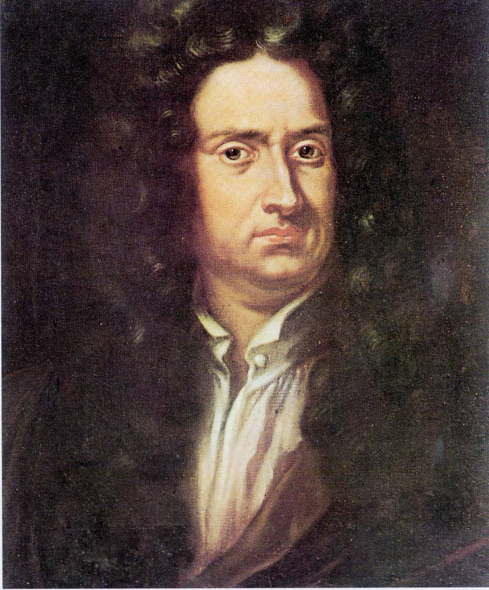

          
            
**2017.11.22**

>Nature and Nature's law lay hid in night ; God said,"Let Newton be," and all was light.
自然与自然的法则隐藏在黑暗中，上帝说"让牛顿去吧！"于是，一切被照亮。——亚历山大·波普（Alexander Pope）题写。

最近在听北京师范大学的物理课讲座录音，在讲科学史的时候提到了牛顿的生平。

小时候，父亲去世，母亲改嫁，把他扔到了姥姥姥爷家长大。

从小身体就不好，后来母亲第二任丈夫去世，家里没人干活，就把牛顿叫来干活。

可是牛顿又不会干活，这时牛顿的舅舅慧眼识珠，劝姐姐让牛顿去上学。

上学后，学习也不好，体育也不好，什么都不行。

有一天，班上的小恶霸打了牛顿的肚子，牛顿忍无可忍，痛打恶霸。

一般人可能发现自己能打架后，从此走上打架的道路。

而牛顿不一样，他认为自己这么能打架，没准也能学习好。

于是牛顿学习好了。

所以说，这个小恶霸的一拳，改变了整个物理学发展史。

**个人微信公众号，请搜索：摹喵居士（momiaojushi）**

          
        