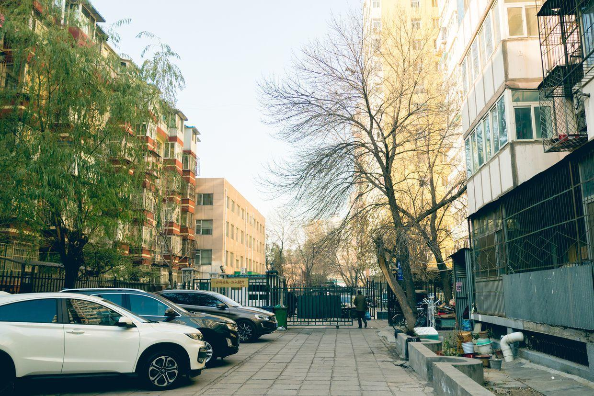
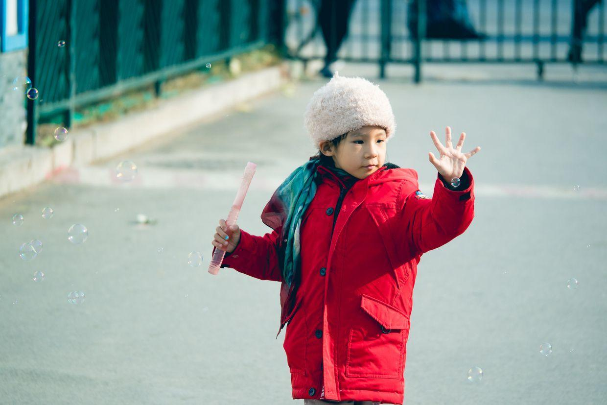
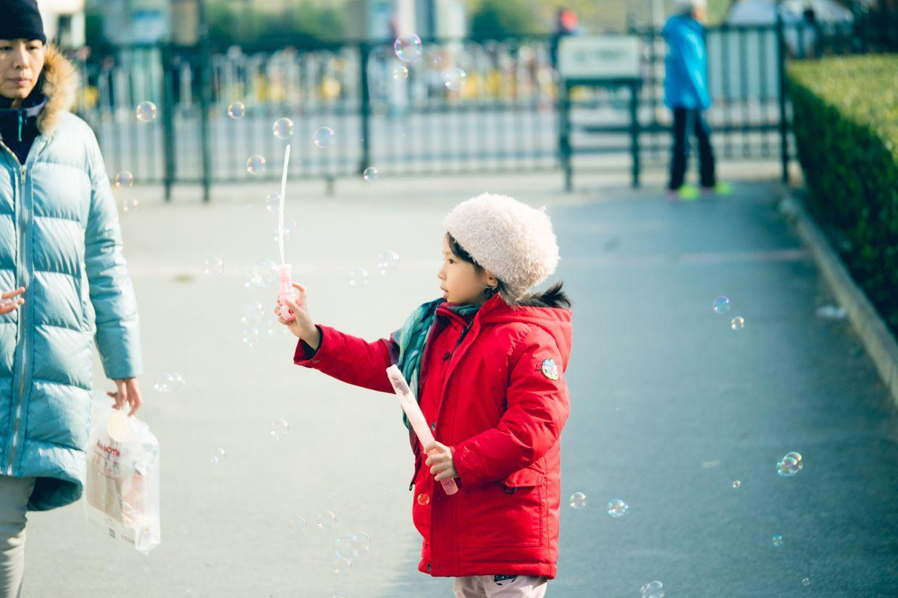

          
            
**2017.11.25**

周六啦，天气不错，发烧也终于好了。

舞蹈课还是请了假，上午出去晒晒太阳。

只有柳树现在还是绿着的，其他树都已经光秃秃了。

穿着暖暖和和下楼，带着泡泡下楼。

一会胳膊，无数的泡泡都出来。

自己吹大泡泡。

居委会门前都摆起了菜摊。

和妈妈拉着手，很高兴。

在小区里玩儿跑步机。

一边晒太阳，一边玩儿泡泡，伸手去抓泡泡。

准备要窜起来去抓泡泡。

泡泡从脑袋上飘过。

双眼都在放光。

玩儿得很熟练了。

还要把泡泡接住。

妈妈也要接个泡泡。

五彩斑斓。

笑得很开心。

封面

很认真地吹。

突然严肃起来。

呆呆的。

中午去喝粥，要把围巾系在椅背上。

中午睡个大觉，下午去上钢琴课，非常好，弹得很棒。

明天继续休息，下周就要回幼儿园啦。

**个人微信公众号，请搜索：摹喵居士（momiaojushi）**

          
        