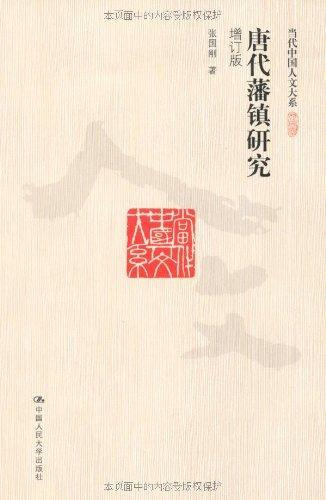

          
            
**2017.11.30**

唐代藩镇，波澜壮阔，竟然维持了100多年。

直到这种平衡被黄巢大起义打破。
>引言唐代藩镇的历史真相

正是在这种形势下，边疆节度使与内地采访使结合而成藩镇，中原内地亦屯结重兵，形成了所谓藩镇林立的格局。这个问题的关键有两个：

其一，为什么安史降将安堵河北如故；

其二，为什么中原内地亦设节度使并且在战后仍不罢去？

首先是朝廷与前线平叛将领的矛盾。肃宗在灵武建立的班子基本上是在朔方军保护下成立的，它本身十分虚弱。为了控制以朔方军为首的各地平叛军队，朝廷一方面频频更换平叛战争的领导人，如朔方军首领、讨叛主力副元帅就先后换了郭子仪、李光弼、仆固怀恩等数人，河南战场上的领导人亦更调频繁。〔5〕另一方面，又大力扶植宦官势力来与之相抗衡。

河北叛军表面投降，还需要中原藩镇去抗衡
>宦官李辅国身为元帅府行军司马，实际上掌握着战争的决策权。宦官鱼朝恩曾以观军容使的身份监领九节度使围相州之战，后来又曾亲自带兵镇陕。

当李辅国提出“大家（代宗）弟坐宫中，外事听老奴处决”时，代宗便利用另一宦官程元振除去李辅国。

不久又重用鱼朝恩而流放程元振。当鱼朝恩认为“天下事有不由我乎”时，代宗马上利用宰相元载来剪除鱼朝恩。

一旦元载专权作势，代宗又与外戚吴凑密计图之，终于在大历十二年诛之。其时离代宗死不过一年多时间。可见几乎终代宗之世，宫廷内部的权力争斗一直未已。

上述在前线、中央和边疆发生的这些矛盾究竟对藩镇局面的形成产生了什么影响呢？首先是使唐王朝与安史势力的政治斗争逐渐让位于唐朝内部皇权与军将及宦官的斗争；

一开始翘尾巴，就要出问题
>其次，由于河朔地区安史旧部的受降和西北边疆地区的防守，皆需重兵驻屯，所以中原地区的宿兵也就不能罢去。王夫之认为安史之乱的重要教训之一就是边疆宿重兵，而中原弛武备

战争后中原藩镇的宿兵正好解决了这个问题，从而维持了一种内外平衡的均势。

所以宋人尹源说：“夫弱唐者，诸侯也；唐既弱矣，而久不亡者，诸侯维之也。”

中晚唐处在一种微妙的平衡中
>安史之乱以后，直到黄巢大起义爆发以前，唐代藩镇——道，大约稳定在四五十个。这些藩镇与唐王朝究竟存在一种什么关系呢？我们认为可分成如下四种类型。

一是割据型。这些藩镇主要集中在河朔，大多是安史旧部归降者（流风余韵及于河南部分地区），其代表则是魏、镇、幽三镇。这里的藩帅不由中央任命而由本镇拥立，赋税不上供中央而由将士瓜分。

二是防遏型。这些藩镇主要集中在中原一带，以宣武、武宁、忠武、泽潞、河阳、义成、河东等为代表。这一带是安史之乱期间厮杀最激烈的战场，这些藩镇一般也由战争期间临时设置的军镇分合变化而来。它们的特点，一是平时常宿数十万重兵，“严备常若有敌”〔11〕，是重兵驻扎之地。二是这里的赋税基本上是当道自供

三是御边型。这些藩镇主要集中在西北、西南边疆，其中尤以西北地区最为典型。

四是财源型。这主要在东南地区，最典型的有浙东、浙西、淮南、福建、江西等八道。它们很大程度上相当于安史之乱前的采访使，只是管地较小。

其特点：一是兵力寡弱，二是财富丰赡。所以它们是唐王朝的“赋税之地

四中藩镇，竟然维持了100多年
>唐代藩镇权力是比较大的

一是人权，即藩镇幕府官员，本道可以自行辟署。

二是财权，即留用本道军费可以自己支配。

三是对州县的监察权，即对州县官员的任免黜陟，藩镇具有相当的权力。

藩镇的权利
>唐代完全依赖藩镇势力之间的平衡关系，才得以维持下来，一旦黄巢起义冲垮了这种平衡，唐朝的末日就来临了。

宋代地方权力过于削弱，“兵也收了，财也收了，赏罚刑政一切收了”，也是不足为训的。因为它违背了要“责其成效”，必须“专其事权”的道理。

黄巢起义，扫平了藩镇，中央也就完了
>第一章唐代藩镇形成的历史考察

当安史之乱期间节度使与观察使（采访使）合二而一时，集军政权力于一身的藩镇就最终形成了。

唐前期实行征兵制，主要有府兵和兵募。

募兵制当然也带来了新的问题。首先是军费的膨胀，开元中军费二百万，天宝时猛增至一千二百万。其次是军队素质的问题，大量的流民客户包括归附的少数民族入伍为雇佣职业兵，使军队成分变得十分复杂，以致难以驾驭。

募兵花费巨大，和拜占庭后期一样
>唐朝声威由此大振。史称：“自北殓突厥颉利，西平高昌，北逾阴山，西抵大漠。其地东极海，西至焉耆，南尽林州南境，北接薛延陀界。凡东西九千五百一十里，南北万六千九百一十八里。

真是威风八面，可是四方征战，导致募兵，导致藩镇，导致灭亡
>第二章肃代之际的政治军事形势与藩镇割据局面形成的关系

潼关失守，玄宗奔蜀，天下几危。这时在前线作战的主要有两支武装：

一是西北旧有藩镇，以郭子仪等率领的朔方军为代表，河西、陇右余部及安西、北庭赴援军队亦归其麾下，势力颇盛，是讨叛的主力。

另一支是河南地区新设的节度使，所谓“分命节帅以扼险要，其所统之增减离合，随时制宜”〔1〕，因属草创，在战争中一般只有招架之功，并无还手之力。

平定安史，依赖河朔藩镇和中原新藩镇
>历史上宦官势力总是在王权微弱的时候急剧膨胀起来，但他们又实实在在是为了加强王权的需要才应运而生的。

控制藩镇，又要靠宦官
>第四章唐代藩镇的类型分析

安史之乱以前，“东滨海，南控三齐，西阻太行，北届沙漠”〔9〕的河北地区，就是唐王朝最重要的军事基地，兵雄马壮，安禄山即恃此而起事。

河北要地，方面何所据？
>河北藩镇割据有三个最基本的特征。在政治上，节度使不由中央派遣，而由本镇拥立。如魏博、成德、卢龙三镇的节度使前后凡五十七人，唐廷所任者仅四人〔13〕，其余的都是父死子继，兄终弟及或偏裨擅立。

各种上位，兵强马壮者居之
>宋人尹源说：“夫弱唐者，诸侯也；唐既弱矣，而久不亡者，诸侯维之也。”〔130〕黄巢起义打破了这种格局。举足轻重的中原型藩镇被野心勃勃的朱温所吞并，李克用则据有河东及西北边镇之一部而与之抗衡；西北边镇之另一部则为李茂贞等所据，并且动辄称兵犯阙；东南型藩镇也不再供给唐朝的财源；“国命所能制者，河西、山南、剑南、岭南西道数十州”〔131〕——主要是西南边镇。唐朝的灭亡只待时日了。

唐的灭亡也是因为藩镇
>第五章唐代藩镇的动乱特点

表现得最突出最普遍而又最引人注目的现象，并不是地方政权因闹割据而反抗中央政府的斗争（当然也有这种斗争），而是频繁而激烈的藩镇动乱。

一般可分为以下四种情形：第一是兵士哗变。

第二，将校作乱。

第三，反叛中央。

第四，藩帅杀其部下。

可见封闭性与凌上性乃是唐代全部藩镇动乱的普遍特征。

主要是内讧，和中央尽量不打
>第六章唐代藩镇割据为什么长期存续

河北地区“东滨海，南控三齐，西阻太行，北届沙漠”，形势险要，而四邻皆非国家州县，诸镇易守，唐廷难攻，无法形成对它的包围圈

可以争天下
>河朔割据之得以长期存在，还与河朔诸镇不否定唐王朝的政治态度，或者说游离性与依附性并存的特点密切相关。这一政治态度与特点，使河朔诸镇避免了与唐廷处于势不两立的地位。

河朔藩镇有个信条，叫“礼藩邻，奉朝廷，则家业不坠”〔18〕。“礼藩邻”是为了维持各镇之间的联盟；“奉朝廷”则是为了避免与中央关系白热化而引火烧身。这样，河朔把自己的割据行动限定在唐廷能够容忍也不得不容忍的范围之内，也就“家业不坠”了。

自保家业，和日本大名很像
>第七章唐代藩镇的军事体制

其各个藩镇内部的军事体制，大体分三个层次：一是方镇治所州的牙兵（衙军），二是方镇属下各个支州（支郡）的驻兵，三是州下各县军镇

（1）衙军藩镇主帅直属番号军中担任宿卫的那一部分亲军，组成牙兵，又作衙军

（2）外军镇外军大多置于支郡州县。如卢龙节度使治幽州，有静塞军在蓟州。成德节度使治镇州，却有永宁军在深州。浙东长洲军也并不在湖州，而在苏州。

（3）支郡兵藩镇属下各州都有一些军队

（4）县镇藩镇于管内诸县置有镇兵，谓之县镇。

军事体质很完善
>唐廷政令所及的方镇，是监军使充分表演的活动舞台。在这里，它以自己独立的组织系统和独立的武装力量，构成了藩帅之外的第二政治势力。他们“俯达人情，仰喻天意”〔111〕，把皇帝的意志最忠实地贯彻到方镇中。

宦官监军就是皇帝的耳目
>宦官监军设置于开元末年，安史之乱以后推广到内地各个方镇及边防军队驻扎区。这时它已不是一种临时差遣，而是皇帝在方镇的“常驻大使”。其常设机关为监军使院，监军使为之长，置印。

开元末年设置监军，因为募兵制
>第十章唐代藩镇进奏院制度

进奏院还是本镇进京官员的联络地。诸道进京办事或奏事官员，一般寓居于进奏院，并向进奏官了解有关情况。

驻京办事处
>第十一章唐代藩镇使府辟署制度

唐代藩镇职官有两个系统，一个是州县职事官系统，一个是使府幕职系统。州县官员由中央任派；刺史及五品以上上佐权归中书门下，五品以下判司簿尉之类权归尚书吏部。使府幕职官则由府主（节度、观察等使）自行辟署。

中央的州县官还有藩镇自己的幕府
>唐德宗朝宰相赵憬说：“大凡才能之士，名位未达，多在方镇，日月在上，谁不知之。”

人才都被幕府弄走了
>第十三章唐代藩镇进奉试析

进奉在唐代又称“贡献”。“贡献”的制度古已有之，而仔细分辨起来，“贡”与“献”还有些不同：“贡”，又称土贡，一般指地方向中央进贡的方物。

献”与“贡”不同，它多半是地方官因时因事而进献珍奇异物，以表示对皇帝的孝敬之心。

贡是好的，献一般是谄媚
>河朔一类割据藩镇，是从来不向中央上供赋税的，所谓“贡赋不入朝廷”〔29〕。但是，这并不排斥它们也有进奉行动。

河朔不上交赋税，但是频繁进奉
>上供是中央政府的基本收入来源。两税法时代，它以元额的形式由诸道供给，诸道州府都有“上供库”以贮存上供钱物。供军费作为地方军费支出，各镇的具体数额当因养兵的多寡而异。

上供的供军费用作地方军费支出
>大体中原镇养兵多，上供少，江南镇养兵少，上供多，边疆镇不仅没有上供，反而要中央拨付。由此可见，养兵多寡与中央收入的多寡有关。

量入为出
>附录一唐节度使始置年代考定

《唐会要》卷七八：“永徽以后，除都督带使持节即是节度使，不带节者，不是节度使。〔4〕景云二年四月，贺拔延嗣除凉州都督，充河西节度使，此始有节度之号，遂至于今不改焉。”

高宗设节度使要带节
>附录四唐代藩镇动乱年表

同年，朔方、河北副元帅仆固怀恩反，代宗起郭子仪等讨之。怀恩引吐蕃、回纥、党项之众寇边。凡历三年，永泰三年（765）怀恩死。

仆固怀恩

**个人微信公众号，请搜索：摹喵居士（momiaojushi）**

          
        