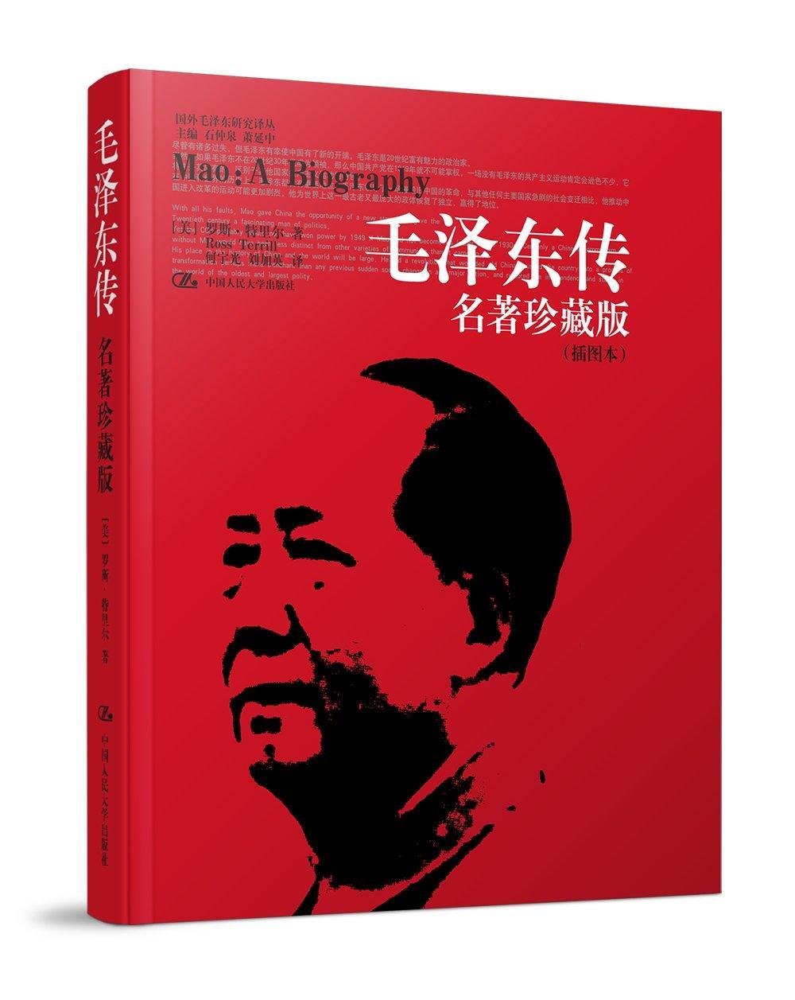

          
            
**2017.12.07**

美国人写的《毛泽东传》，引用了很多斯诺的采访记录。

很多主席年轻时的故事，以前都没有听说过。

经常要靠人接济度日。

以下是一些书摘：
>中文版序

在毛泽东的一生和他领导的时期，从他1893年出生开始，我们可以看到中国的历史变化：从清朝到苏联影响的全盛时期，从脚踏车到汽车，从农村到城市，从混乱到严格的治理，从软弱到强盛。毛泽东虽然是斯大林的信徒，但他摧垮了苏联阵营。他虽然信仰共产主义，却在1971—1972年转向资本主义的美国，并把一个二极世界变成一个三角关系世界。

一生的概括，清朝出生
>我称毛泽东是“半虎气”、“半猴气”。毛泽东身上的虎气懂得怎样从A点到达B点。他身上的猴气则怀疑到达B点的价值。

坚定又不忙从
>我还称毛泽东是半知识分子。虽然思想能吸引他，但是，行动同样能诱惑他。

知行合一
>第一章童年（1893—1910）

这个农家男孩子家里姓毛，“毛发”的“毛”。他自己的名字叫泽东，意思是“滋润东方”。

泽和润
>在长满绿树的山坡旁一处高地上，有一座有四个房间的庭院，在这里毛顺生用铁腕控制着他的家庭。那18亩农田是他的安全堡垒。

富农
>在中国的农村里，天黑后只是睡觉的时间，而泽东正在埋头阅读一本古代中国罗宾汉式的传奇小说，叫做《水浒传》。

主席最早爱看水浒
>毛家比韶山村里多数人家要富裕一些。在20世纪初毛泽东的童年时期，毛顺生的家境从贫穷上升到小康。在1904年毛泽东10岁时，他家有18亩地，三年后增加到24亩。

主席的父亲善于经营
>韶山（音乐之山）的名字来源于一个关于古代皇帝的传说。［1］据称这位皇帝曾在这里休息，坐在俯视整个山谷的山顶上弹奏音乐。因不远处有湘江流过，距韶山最近的两座城市皆以“湘”命名（湘潭和湘乡），而且“湘”字还成了湖南省的简称。

韶山和湘潭
>毛泽东从6岁起就喜欢游泳，后来他几乎是围绕着“中流击水，浪遏飞舟”这一喜好，形成了自己的世界观。

6岁游泳，培养了世界观
>在毛泽东只有三岁、路还走不稳的时候，第一批赴日本的留学生乘船出发了。

甲午战败，开始有第一批留学生
>毛泽东八岁开始上学，多年以后他冷冷地说：“我八岁时就厌恶儒学。”

上学就讨厌儒学
>有一个孩子穷得带不起午饭，他就每次把自己带的午饭分给他一半。他母亲搞不明白为什么他每天晚饭胃口会那么好。当她得知她精心准备的午饭的去向之后，这位善良的母亲从此就每天为泽东准备两份午饭，让他带到学堂去。

主席的母亲很善良
>他对埃德加·斯诺说：“回到家里以后，想不到情形有点改善。父亲稍微比过去体谅些了，先生的态度也比较温和些了。我的抗议行动的效果，给了我深刻的印象。这次‘罢课’胜利了。”

第一次罢课就胜利
>他把他后来的信念加进当初的事件中去了：他深信，没有总体政治策略的单纯暴动，是不会有成果的。

不相信单纯的土匪暴动
>天亮后不久，他徒步离开了韶山。肩上的扁担是他常用的东西，但在这个清凉而泼洒着阳光的早晨，扁担上挂着的不再是粪筐。

16岁去上学
>一头是一个包裹，里面是几件上衣、两条灰被单和一顶蚊帐。另一头是一个篮子，专门放《水浒传》和《三国演义》。到目前为止，他除了韶山之外，别的知之甚少。他将永远不会再回韶山来长期生活了。

爱看水浒和三国
>泽东不像那个时代成千上万造反者那样干脆把自己的家庭忘掉。他仍然与他的家庭成员保持联系，并从不同的亲属那里得到帮助。在说到他的家里人时，他称他们为“普通老百姓”，在面对不公平的世道时，可以和他们站在一起。

经常得到母亲家的资助
>泽东在家里采用的策略也不走极端。他常和他父亲进行妥协，他屈从了那桩令人痛苦的“婚姻”；他没有离开家去加入哥老会；在韶山的大多数年份里，他一直接受佛教的影响；而在他离开韶山时，他仍然相信君主制。

被剥接受封建婚姻
>在韶山东面不远，另一个孩子与泽东在同一时期长大。这个孩子后来也成为中国共产党的领导人。年轻的张国焘和他富有而且受过良好教育的父亲相处得相当和谐。然而他后来也变成一个造反者。

同时期张国焘家境很好
>第二章为何求知（1910—1918）

只有学习是毛泽东的真正朋友。说来可笑，童年在韶山的南岸学堂经受的煎熬，竟然使他对那些经典学得很好！他能以古体风格写出冲击力极强的文章。这样，他就积累了平衡他的弱点和冲动行为所迫切需要的资本。

主席酷爱学习，善于古体写作
>革命军的一位发言人来到毛泽东所在的学校，就新时代的前景作了讲演。毛泽东非常感动，决定“参加革命”。仔细考虑他今后的具体计划整整五天后，他加入了革命军在湖南的一支部队（称作新军）。

辛亥革命爆发，立刻从军，但是只是勤务兵
>他对萧三开玩笑地说，在湖南省立图书馆，他“像牛闯进了菜园子”。后来他认定这半年的读书生活，是他一生中的制高点之一。

在湖南省立图书馆发奋读书
>读书的热情不能用来付房租。没过多久，毛泽东又不得不重新开始浏览广告栏目。他碰巧看到一条关于教书的广告——一所师范学校的广告，“很有吸引力”。不用付学费，吃饭、住宿都很便宜，毕业以后当老师。

考取湖南第一师范
>早期的一段课堂笔记表现了他对学习的乐趣：“记下随时产生的想法，自由地表达我们想到的东西，这样可以帮助我们保持平衡。”

随时要记下产生的想法
>学校的外墙上刻写着第一师范的校训：“实事求是”。

写得好
>凡是毛泽东看不上的课程，如静物写生和自然科学，他连碰都不碰，常常得零分或接近零分。

他喜欢的课程，如写关于文学和道德主题的文章或者社会科学，他就热情投入并出色发挥，常会得到100分。

学会放弃
>杨昌济崇敬宋代儒学（理学，始于10世纪），但他也在英国和德国度过了4年时光，吸取了康德、T．H．格林和其他欧洲理想主义思想家的理论。把两者联系在一起的，是他对心灵和意志的信仰。

未来的岳父和北大教授
>毛泽东认为，组织者的天才就在于，他能够把各种人的长处结合起来。他不应暴露别人的弱点，或者反复指责别人的弱点，而应当鼓励把所有积极的因素联合起来。毛泽东的父亲未能做到这一点，而毛泽东将会做到。

认识到了组织者的重要性
>在长沙第一师范的5年半中，他在书籍或副本的页边上，写下了不下100万字的分析性、有独特观点的批注。在页边上，他常常写下“荒谬”或“不通”之类的批语。

阅读量大，同时还要用心
>毛泽东严于律己。对待自己，也如同一把尖刀。有一件事最能说明他进行自我修炼的方法：他有一个习惯，带着书到距第一师范不远的一个叫南门的最喧闹的地方去看书，为的是检验自己集中注意力的能力。

锻炼注意力
>毛泽东在晚年提到他母亲时说：“我作为儿子不够格呀，生不能尽忠，死不能尽孝。我就是这样的人。”

母亲去世很难过，没敢去见最后一面
>第三章北京和上海的广阔世界（1918—1921）

《三国演义》描写了三个豪杰，毛泽东和杨教授的另外两个学生也自称“三豪杰”。萧瑜是其中之一。再一个是蔡和森，他来自毛泽东母亲娘家那个县，是个激进的青年。

杨昌济的三个学生
>杨教授给北大图书馆馆长写了一个便条：有没有一个差事给一个参加勤工俭学运动的穷学生？

毛泽东得到一份在期刊室的工作，月薪8元。工作是很卑微的，薪水也很少。整理书架，打扫房间，登记借阅者的姓名。

杨昌济在北大给主席介绍了北大图书馆的工作
>在借阅登记簿上，他认出新文化运动的主要领导人物。“我打算去和他们攀谈政治和文化问题，”他心酸地回忆说，“可是他们都是些大忙人，没有时间听一个图书助理员说南方话。”

辛酸
>毛泽东第一次来北京时的住处：景山东街三眼井吉安东夹道8号。

北京的居住地，很挤
>胡适问提问人是谁。发现毛泽东不是一个正式在册的学生时，这位激进而时髦的教授拒绝同他对话。

真是势利眼
>发生。但毛泽东似乎只关心那些更基本的事情。“北京数不尽的树木激起了我的惊叹和赞美。”［6］一时间，这个反偶像的长沙造反者，被喜欢诗歌、朦胧的山峦和中国古代传奇的梦幻者所替代了。

主席对北京的爱
>讲到放弃坐船去马赛的机会，毛泽东说：“我觉得我对我自己的国家了解得还不够，把我的时间花在中国会更有益处。”

放弃留法的一个原因
>就在此时，在北京东南方200余华里的天津，一名叫周恩来的青年人做出了相反的决定，越洋去了欧洲。在西南方的重庆，另一名叫作邓小平的青年，也加入勤工俭学的行列，打起行装去了法国。

总理和邓小平都出发了
>1919年春，北京爆发了学生大游行，后来这被称为五四运动。这次运动把《新青年》倡导的思想推向了高峰。但是毛泽东没有参与其中。他正处于一次情绪低潮之中，所以不能果断行事。正当北京的学生们为国家大事而群情激奋时，他却在想自己的心思。他独自离开了北京，去了一个令人意想不到的地方。

毛泽东却跑到山东拜谒了孔子的墓地。

“我看到了孔子的弟子们濯足的那条小溪，”他回忆说，“看到了圣人幼年所住的小镇。”［8］在这次旅行中，他爬上了东岳泰山，考察了孟子的出生地，还去了梁山县，这里是小说《水浒传》好汉们聚义的地方。

正当北京的激进派视老传统为垃圾时，毛泽东却任由自己去探索老传统的源泉。

>在徐州，他游览了由于《三国演义》中常常提到而出名的地方。

五四运动时，主席去周游祖国名胜
>他还是像往常那样，经常靠别人接济过活。

回到长沙，还是需要接济
>现在在长沙，他却有很多话要说。他的第一个尝试是作了一次公开演讲，主题是称作马克思主义的新潮思想。

在长沙找到工作，并尝试演讲
>毛泽东、“三豪杰”之一的蔡和森和他聪明漂亮的妹妹蔡畅，三个人发誓永不结婚。〔2〕但三个人后来都没有遵守他们的诺言，而毛泽东则三次食言。

毛泽东和杨开慧的结合是按五四精神双方自由的选择，这在旧中国是罕见的。大约一年后，他们在长沙正式举行婚礼。

正式结婚
>毛泽东手头拮据，所以他为大班和富有的买办们洗衣服、熨衣服、送衣服。在这个港口城市当一名洗衣店帮手，他一个月能挣12到15元钱。其中约8元要用于乘电车把洗好的衣物送回顾客的公寓或酒店。

如果说在后来的年代中一提起上海他很少有笑容，那么他自己在上海的这段经历或许就是原因。

主席在上海洗衣店打工
>一个学生对毛泽东没有一起乘船去法国表示遗憾。毛泽东回答说：“革命不可能等到你们归来再着手。”

至理名言
>会上出现了两种路线。占主导地位的是由共产国际提出，并得到能干的张国焘（来自韶山隔山另一边的那个年轻人）支持的路线：组织城市工人；推翻资本家；建立无产阶级专政；抛弃与孙中山国民党人的任何联系。

被否定的是渐进主义路线：需要一个对公众进行教育的阶段；中国的城市工人数量还太少，不足以推翻资本家；在反帝和反军阀事业中与孙中山合作是可能的。

一个主义下，也是有路线争执的
>到南湖后又住进同一个旅馆房间。在他们打开行李时，毛泽东仍然在力劝萧瑜参加这次会议。

和萧瑜从此错过
>代表们坐在色彩艳丽的16米长游船上，一面任其漂荡，一面继续开会。他们通过了若干决议：正式建立中国共产党，参加共产国际并向其设在莫斯科的总部按月汇报工作。在最后决议之前的休息时间，他们还品尝了南湖的烧鱼。

中共一大
>毛泽东很快就回到了长沙，承担起他作为初建的共产党的湘区委员会书记的职责。从此以后，他再也没有见过萧瑜。

和萧瑜分别
>第四章组织工作（1921—1927）

决定性的人物是地主家庭出身、曾在莫斯科学习过的那位年轻人——刘少奇。刘少奇是1922年秋一次成功罢工的英雄。这次罢工使安源在中国很大一部分土地上成为红色的旗帜，而且还成立了湖南全省工团联合会，毛泽东被任命为联合会的头号领导人。刘少奇帮忙在毛泽东的帽子上增加了一个新的头衔。

刘少奇和主席在安源相遇
>参加杭州会议的共产国际代表回忆说，“有陈独秀、李大钊、张国焘……还有另外一个，一个很能干的湖南学生，他的名字我不记得了。”

能干的湖南学生
>1923年4月，毛泽东逃离长沙，以躲避被作为“过激派”而被捕。

他离开时没有带着开慧。她又怀孕了，她母亲在照顾她。此前的两年，是毛泽东跟他第一任自选的妻子在一起度过的最长的一段时间。

第二个儿子
>1923年1月，一桩政治联姻促成了。孙中山在上海和苏联使者越飞签订了一份协议。中共和国民党人要联手。中共党员将以个人身份加入国民党，而中共仍将保持独立存在。但是“国民革命”（中共的新提法）的组织领导权归国民党。

1923年夏天，他第一次到了广州。中共聚集在那里召开第三次代表大会，规划今后如何同孙中山合作。毛泽东在会议期间说：“一定要有革命的大联合，不能孤军奋战。”［17］他很快就成了和孙中山的国民党人联合的热心人。

第一次国共合作
>1924年8月，应彭湃邀请，毛泽东在农民运动讲习所给第一期学生讲课。他的热情给受训者留下很深的印象。讲习所反过来对他也很有吸引力。他的到访，是将要深深地打入中国未来的楔子的尖端。

到1926年底，很大程度上由于毛泽东的鼓动，湖南75个县中有一半有了农会，200万农民成为会员。

1925年8月，在毛泽东父母卧室上面的顶楼里，中国共产党韶山支部庄严成立了，第一批成员是32位农民。

和澎湃一起，开始探索农民运动，搞农会
>1926年3月，蒋介石对统一战线发起了攻击。“中山舰事件”给他提供了借口。他逮捕了共产党人（其中包括周恩来），对中共势力较大的工会加以限制。

蒋介石开始反共
>毛泽东的答案来自湖南。革命是为了穷人，他们绝大多数是农村人。毛泽东判断，韶山周围各县90％的人是贫农或中农，革命就是为了他们。火花将在农村燃起，因为地主的压迫比城市里的大班们更为残忍，也更为广泛。在毛泽东的心目中，这是现在的基本事实。一切政治方法问题都是次要的。

主席开始走农村路线
>1925年12月，毛泽东在广东发表了《中国社会各阶级的分析》一文。9个月之后，当他北上时，发表了《国民革命与农民运动》。“谁是我们的敌人？谁是我们的朋友？”这是毛泽东在《中国社会各阶级的分析》一文中的开头。他简略地描述了在中国的特殊情况下各群体的立场。城市工人的人数很少；帝国主义的欺凌肯定会使一部分中国资产阶级同情革命；农村的穷人会对革命有关键性的影响。

最有名文章
>毛泽东得知，李大钊被军阀张作霖的手下慢慢地绞死，十分悲惨；而且他自己在长沙的文化书社也被军阀捣毁。光明正在逝去。

首先是在南昌，领导人是周恩来，起义没有成功。但是，中共在心烦意乱的情绪下继续进行起义，这只能是没有政治逻辑的军事行动。

开始四一二
>当10月的寒气赶走了夏天的炎热时，他领着区区1000名幸存者来到湖南东部边界上一个崎岖不平的无人地带。他将用自己的方式利用枪杆子。

枪杆子里面出政权，上井冈山
>真的像个传教士，因此这幅画的复制品在1969年悬挂在梵蒂冈时，下面的说明是“年轻的中国传教士”。

主席去安源的油画
>第五章斗争（1927—1935）

粮食会短缺，战士们的薪饷会很少，因为贫瘠的山里没有几家地主可供没收其财产。他的军官中共产党员不多，其中一部分可能会离去，有一两个被军队民主的想法激怒了，在离开三湾的艰苦跋涉中，他们显然曾试图刺杀毛泽东。

三湾改编，并不是4个字这么简单
>毛泽东在一个叫做井冈山的雾蒙蒙的山峰上安顿下来。这是一个雄伟但荒芜的封闭世界，毛泽东以一个农民和政治家的精明眼光选中了它。想法很简单：他的残存部队很弱小；但是敌人肯定也有弱点，如何识别这些弱点并加以利用呢？

在井冈山，利用敌人的弱点
>罗霄山脉中段的井冈山。1927年10月，毛泽东率领起义部队在这里开创第一个农村革命根据地，点燃工农武装割据的星星之火。

毛泽东的真正创新之处，在于把三个方面结合在一起：枪杆子、农民力量、马克思主义。毛泽东在其中任何一方面都不是先锋。但是，在把这三者结合成一个统一的战略方面，他是先锋。

星星之火可以燎原
>“老表，你叫什么名字？”毛泽东在碰到羞涩或有疑心的农夫时会这样说。［6］他表现礼貌而谨慎是有道理的。井冈山上的政治比城市政治来得粗糙而色彩更加斑斓。

毛泽东在需要灵活性和智谋的挑战中如鱼得水，游刃有余。他和两名臭名昭著的土匪头子做了一笔交易，从而得到600个人和120支枪。［7］他以游民和“二流子”充实部队。不到两年，刚开始发展壮大的红军的大部分人就是这些被工人和农民都看不起的游民了。

在井冈山各个阶层间游刃有余
>中共又向井冈山派来一个代表，目的还是为了纠正毛泽东，结果却大不一样。这个代表是一个不那么完全可预料的人，他没有指责毛泽东，而是入了毛泽东的伙，与之结为伙伴关系，这改变了中国的面貌。

朱德来了
>1928年4月，朱德到达井冈山。中共的极左路线导致他在中国南部遭遇一系列失败，队伍人数很少。

毛泽东和朱德在水坑村的一条山间小溪旁会面并互相拥抱。他们把武装部队合并成一支一万人的队伍。这是朱毛红军（共产党的队伍

后来以此闻名）的真正诞生。

两支部队合编为工农革命军第四军（后改称红军第四军），朱德任军长，毛泽东任军委书记兼党代表。这年朱德42岁，毛泽东35岁，从此开始了他们密切合作的战斗生涯。

井冈山会师，一个42岁，一个35岁
>毛泽东坚持主张，每个班要有党小组，每个连队要有党支部，每个营都要有党的委员会。这就把遥远而抽象的党，化解为日常可见的东西，把党带到营地的篝火会上、带到每个持枪的人手中。

党支部到连
>军官禁止打士兵。账目是公开的，每个人都可以检查。毛泽东在每次战斗之后都召集公开会议，谁都可以发言，可以对军官点名道姓地提出批评或表扬。有时军官会因为一次晚间讨论得出的意见而被降级。这样，作为教师和道德家的毛泽东创建了一种新的军事精神。

官兵平等
>中国军队以前需要士兵的身体，从不需要士兵的心灵！虽然朱德有时对毛泽东的做法感到不舒服，但这是向民主心理学前进了一步。

民主原则
>毛泽东总结说：“根据地对于红军就像人的屁股。”［14］一个人如果没有机会坐下来休息，很快就会因筋疲力尽而垮掉。

到1928年10月，毛泽东和朱德已经夺回了他们原有的大部分山区。大概是这样的斗争打造了他们之间更紧密的关系。朱德对向南方进军的行动感到悔恨，而且对毛泽东的观点日益敬佩。

巩固根据地
>彭德怀成为中国革命的伟大人物之一。但是他带着1000人到来时，并不完全受欢迎。因为他们的到来使这个远不富饶的地区的粮食供应变得紧张。

彭德怀来了
>在枪口下，整团的敌人被押出营房，锁在一个祠堂里。“我们替他们吃完了年夜饭。”朱德大笑着回忆道。

占领瑞金
>当朱德、毛泽东的队伍占领长汀时，他们发现自己拥有了许多缝纫机。工人们用这些机器缝制了红军的第一批标准制服——灰蓝色，还有绑腿和一顶带红五星的帽子。

可以缝制军服
>古田会议绝不是胜利进军，从头至尾都是权力斗争。为了制胜，毛泽东巧妙地运用了若干拿手的方法。他转向强调秩序和纪律。

古田会议，主席当选书记
>毛泽东以独特的方式品味他在韶山的好名声。他后来沉思着向埃德加·斯诺讲到他在那里的形象。［34］提到1930年初时，他说：“当地的农民相信我不久就会回到家乡去。”看来他还有点自我陶醉。

主席家乡土地被没收
>“28个布尔什维克”是在莫斯科的一群聪颖的“左倾”中国学生，他们因为采取反托洛茨基立场而受到斯大林的青睐。

王明和博古
>毛泽东演示了他的革命的最终社会影响的讽刺性。中共取得政权改变了一切，因为它改变了中国社会中的“人”的地位，但它在一定程度上保留了中国社会中的“如何”（人的行为规范）做，所以它又几乎什么也没有改变。

改变了旧社会，但保留了行为规范

**个人微信公众号，请搜索：摹喵居士（momiaojushi）**

          
        