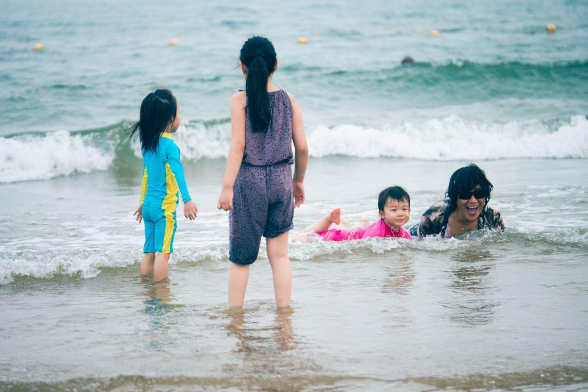
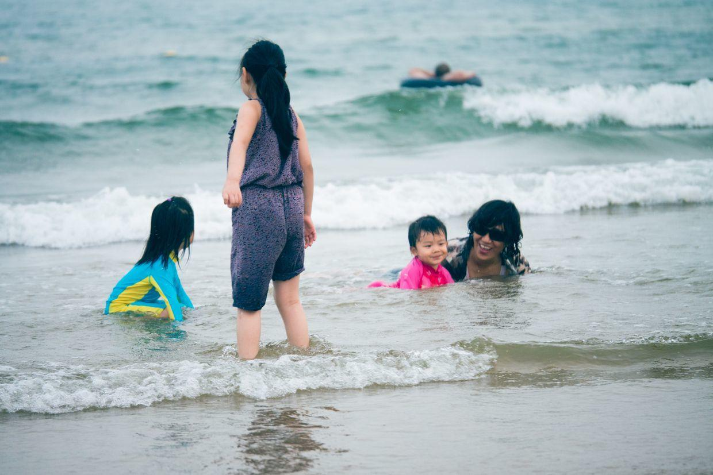

          
            
**2017.12.08**

本篇继续回顾2016年夏天去黄金海岸的照片。

婷婷姐姐带来的大龙虾，被我先拿去玩儿了。

爬上去还挺难控制的。

喵和婷婷姐姐，跟着爷爷玩儿沙子。

海风吹着还挺凉快。

姐妹两个站在大海边。

一起泼水。

接满了水往回走。

开心地叫姐姐。

走过去找爷爷。

两个人忙抢忙后地运水。

爷爷在一边巡逻。

我趁机带着大龙虾漂远了。

抱着小桶，仔细看有没有贝壳。

开始游蝶泳了。

必须要高高起来，才敢下海。

拎着手开心地跑回来。

兜妹完全不怕水。

姥姥姥爷在岸上照相。

三个小朋友一起下海。

喵跑去找兜妹。

兜妹和姥姥趴在海滩上等着大浪。

真好玩儿啊，喵看傻了。

喵不敢趴着，轻轻地蹲着等。

兜妹一头水。

悦妹和大姑父来啦。

每个人都下海了。

**个人微信公众号，请搜索：摹喵居士（momiaojushi）**

          
        