          
            
**2017.12.09**

周六啦，又到了跳舞学琴的日子。

上周开始自己开始在平衡器上跳舞。

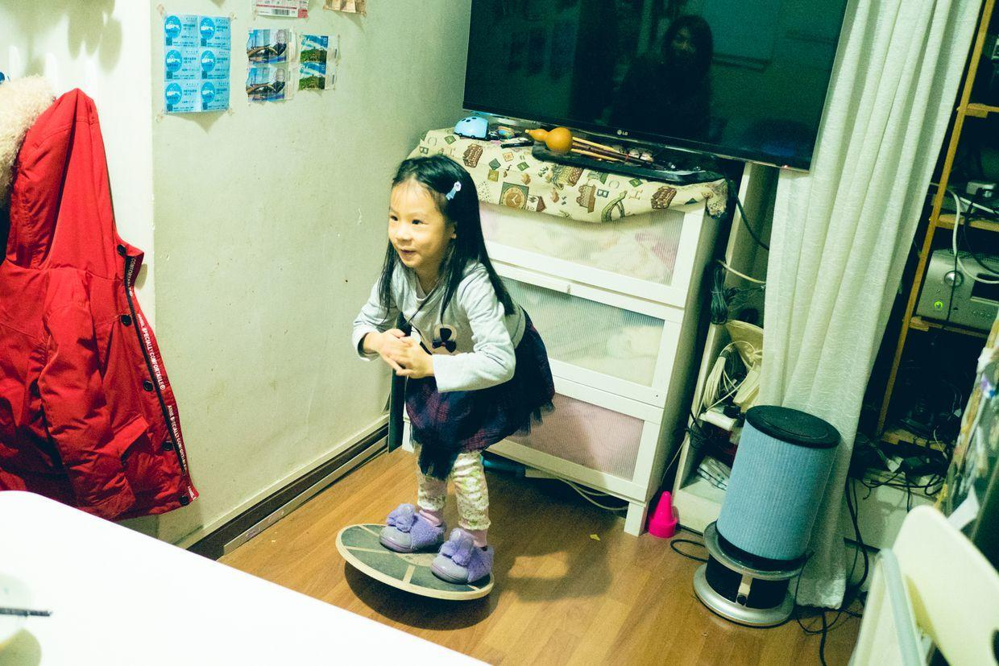

一早起床，到了舞蹈教室，开始活动起来。

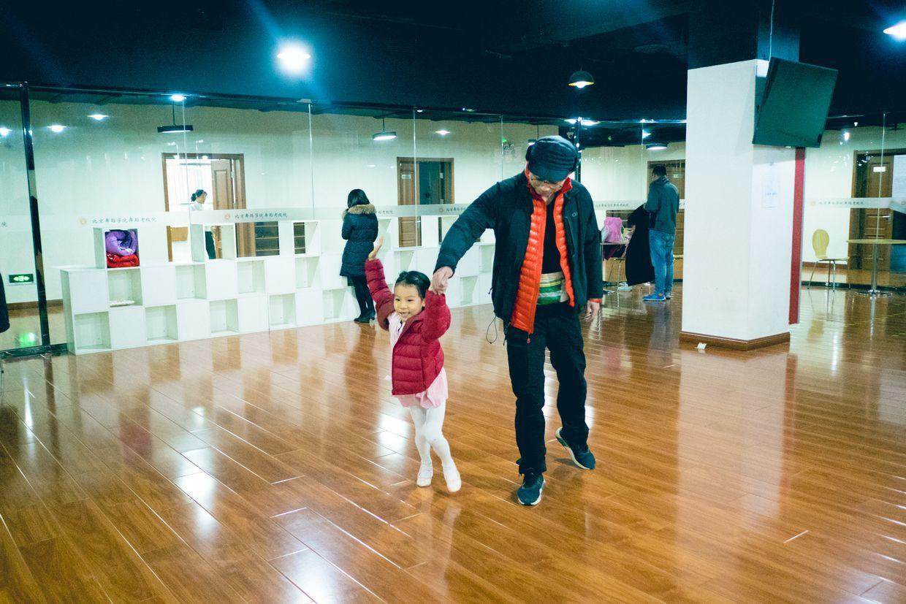

自己学着飞机，在大厅里跑来跑去。

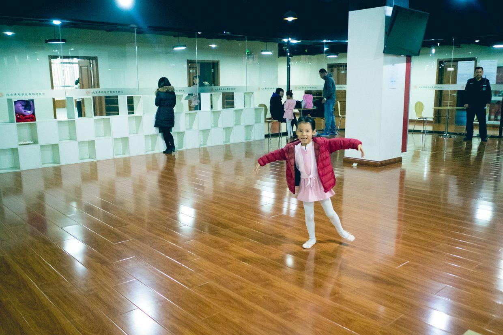

四处的飞来飞去。

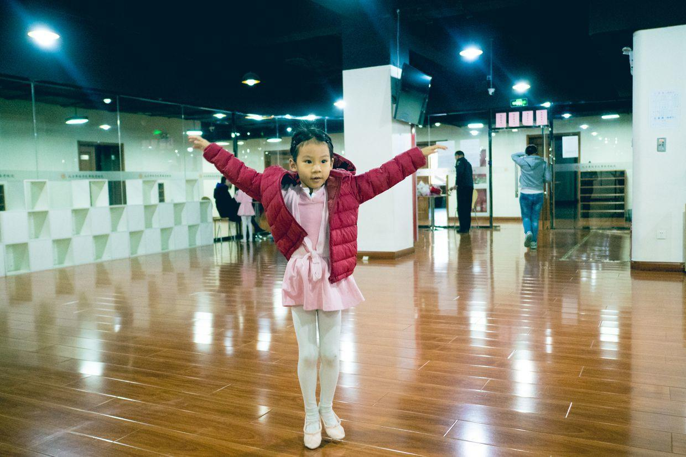

演示一下自己的柔韧性。

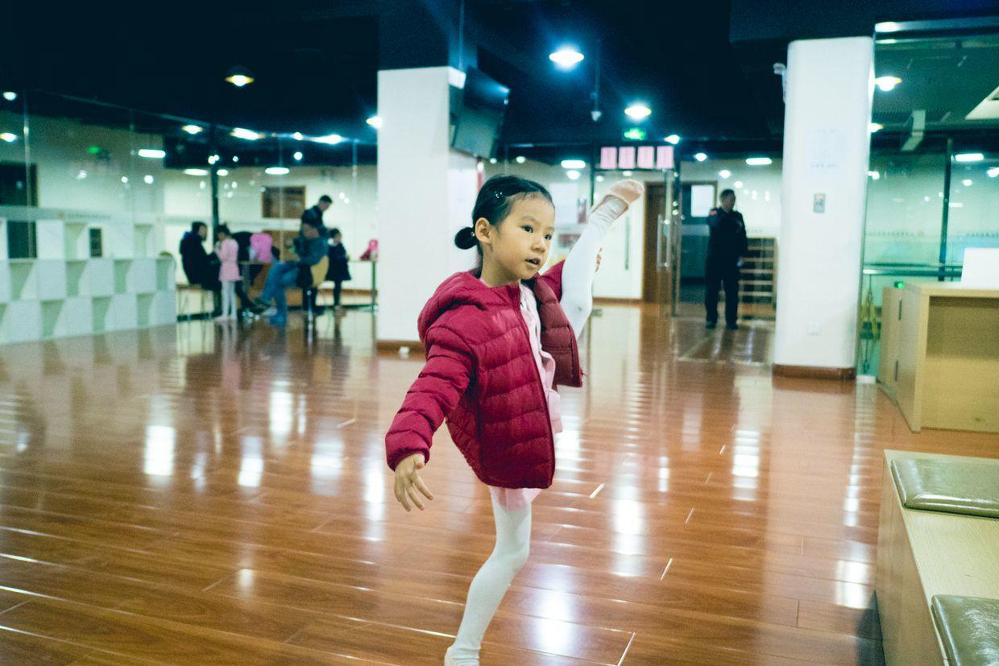

排队进教室了，还要比心。

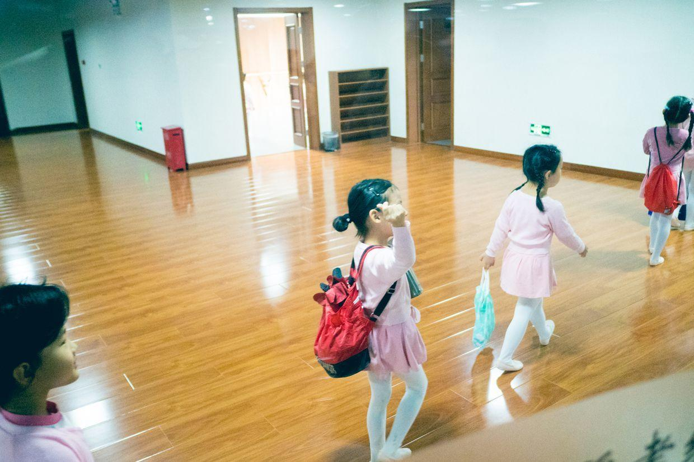

下了课了，抱着大水壶，排队出来。

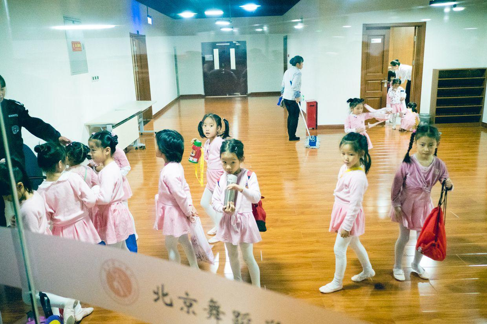

贴在玻璃墙上。

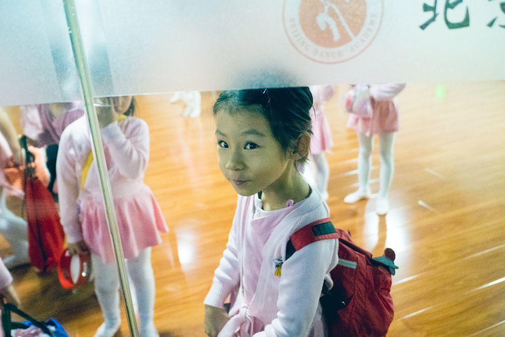

出来，带着奶奶织的大帽子。

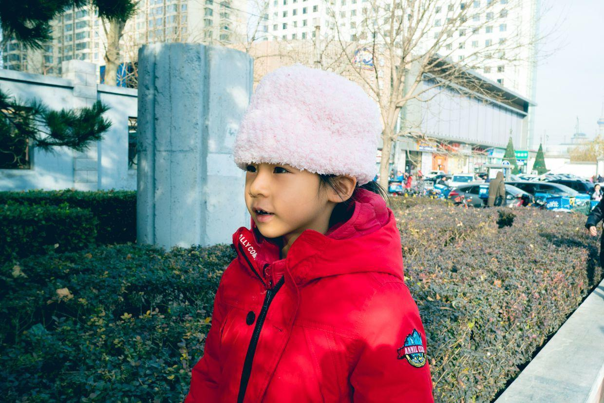

中午睡了个大觉，下午来上钢琴课。

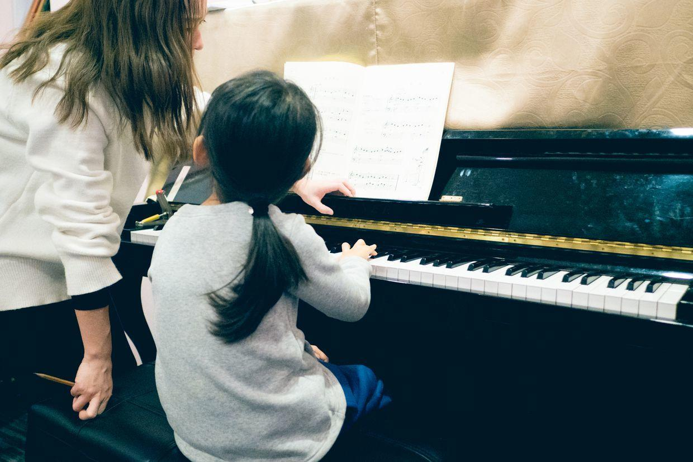

看老师留作业。

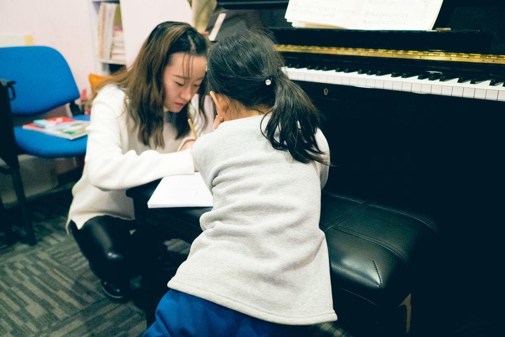

又布置了新的四手连弹的表演曲目，回家又有得练了，准备一月份的钢琴沙龙。

上完钢琴课，去吃饭。

看天气预报，大风马上就要到了。

不知道明天天气怎么样，如果风不大的话，就去出去户外活动一下。

否则就只能找个室内活动。

天气越来越冷，在外面活动的机会真是越来越少。

**个人微信公众号，请搜索：摹喵居士（momiaojushi）**

          
        