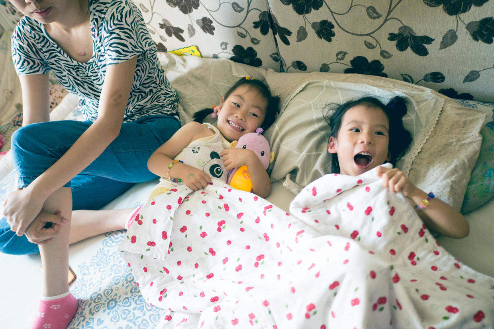

          
            
**2017.12.11**

**拍摄时间：2016.06.09**

**拍摄地点：兜妹家**

这张照片是2016年6月份端午节时拍的。

端午节那天，大家都到二爷爷和二奶奶家聚齐，一起过端午节，看望老奶奶。

喵和悦妹兜妹玩儿了一上午，中午吃过饭，准备睡个觉，下午好继续玩儿。

于是兜妹睡小屋，喵和悦妹睡在大屋。

这下两个小家伙可是开心极了。

俩人拽着一个小被子，在被子里各种乱蹬。

悦妹抱起了兜妹的小音乐海马，俩人一边玩儿一边笑，越来越兴奋。

于是我就要出马了，进屋要很严厉地说：
>该睡觉了，再出声就别一起睡了。

于是稍微安静下来，我在客厅地垫上转眼就睡着了。

后来听说，两个人也是嘎登一下就睡着了，毕竟玩儿了一上午挺累的。

一觉起床，马上三个人又凑在一起叽叽喳喳起来，真是有意思啊。

**个人微信公众号，请搜索：摹喵居士（momiaojushi）**

          
        