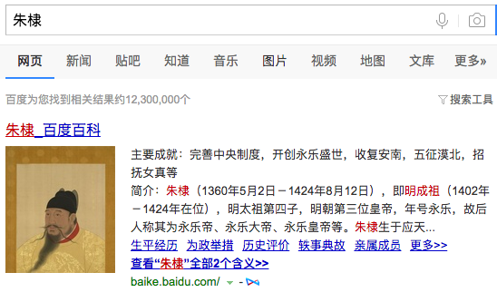

          
            
**2017.12.13**

>永乐十九年（1421年）冬，皇上将要大举远征沙漠，命夏原吉与礼部尚书吕震、兵部尚书方宾、工部尚书吴中等人一起讨论，都说不宜出兵。他们还没有上奏，正好皇上召见方宾，方宾极力说兴兵的费用不足。皇上很不高兴，召夏原吉来问边防储备情况，原吉回答说：“连年出兵，都无功而返，军马储备已损失了十分之八九，加上灾荒不断发生，现在已经内外交困了[20] 。况且您圣体欠安，还需要调养，就请遣将出征，不要劳动车驾了。”皇上大怒，立即命令夏原吉出去治理开平的粮食储备。而吴中进去所说的也和方宾一样。皇上更加愤怒，将夏原吉召回，关进内官监，并将大理寺丞邹师颜也关押起来，理由是他曾代理户部事。方宾惧而自杀。皇上于是抄原吉的家，除赐给的钞币外全部没收，只剩下布衣和坛坛罐罐。[21] 第二年（1422年）皇上北征，因粮尽而返。其后，又连年出塞，但都不见敌人。在回到榆木川时，皇上病危，对左右的人说：“夏原吉爱护我。”

>夏原吉、方宾因说北征军饷短缺而得罪，皇上以吕震兼领户部和兵部事务。吕震也自危。朱棣令十名官校跟着吕震，说：“如果吕震自尽，你们十人都得死。”

明成祖万年可以说是有点偏执狂了，反复要御驾亲征北方。

有反对意见，就把夏原吉发往军前准备粮草，方宾直接自杀，自杀后被明成祖挖出棺木，重新斩首。

吕震一个人同时兼夏原吉和方宾的户部和兵部，并且派十几个人盯着，不许他自杀。

引用《倚天屠龙记》里赵敏的话就是：
>我偏要勉强。

PS：有传说，朱棣是赵敏的儿子。

**个人微信公众号，请搜索：摹喵居士（momiaojushi）**

          
        