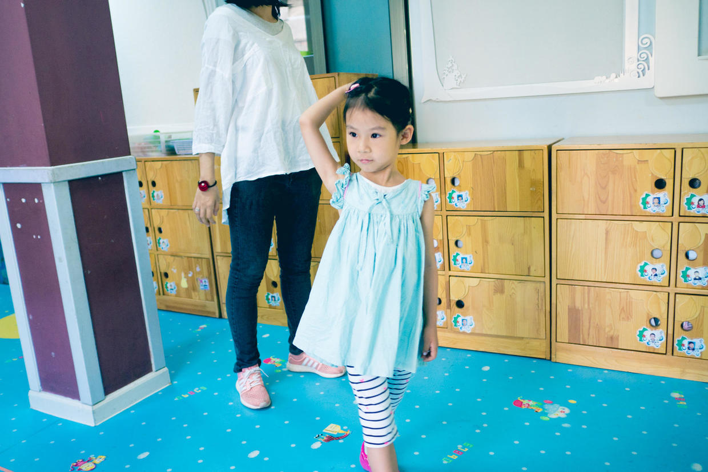

          
            
**2017.12.19**

前段时间，晚上睡觉的聊天过程中。

喵说到幼儿园有同学说她是全班第二矮的，让她应该多喝牛奶。

喵一开始说的时候很生气，觉得自己不矮。

接下来自己说着说着，越来越委屈，就开始掉眼泪了。

一边哽咽，一边说自己已经喝了很多牛奶了。

于是我们也来安慰她，帮她分析问题。

首先，她并不是全班第二矮的，应该算是中等，不过确实并不算高，这个也和年龄有关，班里很多同学年龄都比她大。

其次，她平时很牛奶很好，但是吃饭不太好，吃得少。

第三，每个人长身体的时间也不一样，有些人早，有些人晚，正常情况下，只要好好吃饭，都是可以赶上父母身高水平的。

第四，矮一点，高一点，其实差别不大，尺有所短，寸有所长。

聊到最后，喵又开心了，跟自己定下了口号。

以后如果吃饭不好，就高喊口号鼓励自己：
>想长大个，就要好好吃饭。

**个人微信公众号，请搜索：摹喵居士（momiaojushi）**

          
        