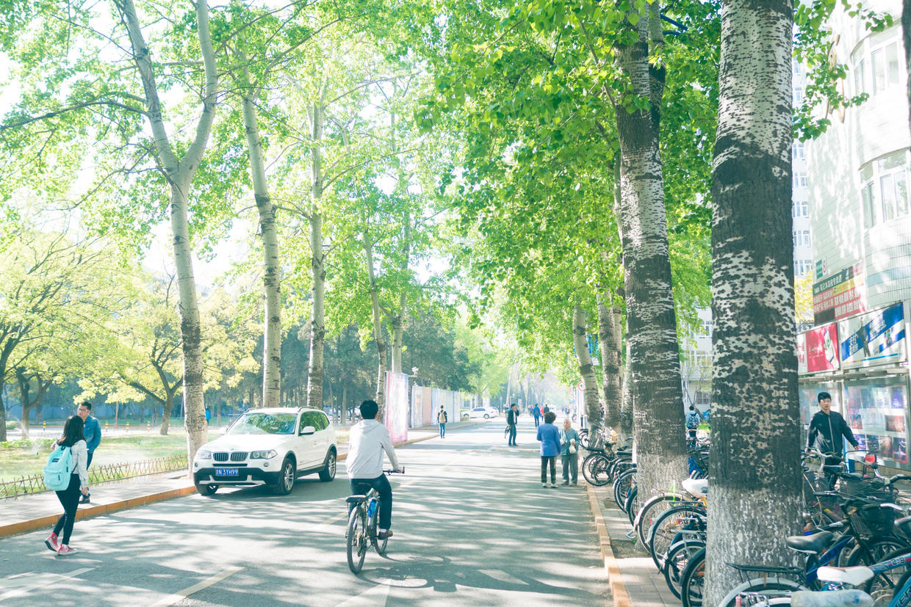

          
            
**2017.12.20**

上周同事们中午一起吃饭，说起了上大学时的情景。

我说到那时大学本科时，8人间宿舍，使用201卡电话，拨号上网。

同桌的同事们皆茫然。

于是我问了一下：
>你们听说过201卡电话吗？

众人亦茫然。

于是我简单科普了一下201卡电话是什么。

当年的一幕一幕在眼前迅速划过。

买上一张201电话卡，每次打电话前，要输入长长的密码，然后再拨号，这个过程伴随了我们很久。

那时候上网，还要去主楼11层机房，办理上机卡，每次刷卡。

管理机房的老太太，非常严厉，经常去检查有没有人在玩儿游戏。

后来校园网终于接入宿舍，大家就在学生会的FTP上下电影，竟然把学生会的硬盘都下坏了。

当时我买了第一个引动硬盘，1.5G，成了全宿舍的宝贝。

现在回想起来，真是恍如隔世。

**个人微信公众号，请搜索：摹喵居士（momiaojushi）**

          
        