          
            
**2017.12.23**

周六啦，本学期最后一节舞蹈课，还是公开课。

到了等候大厅，开始梳头，按照要求要梳两边。

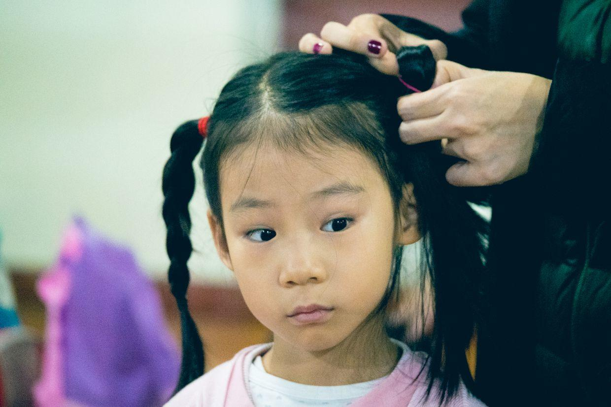

进了教室，所有同学练下叉，看着还挺惊人的。

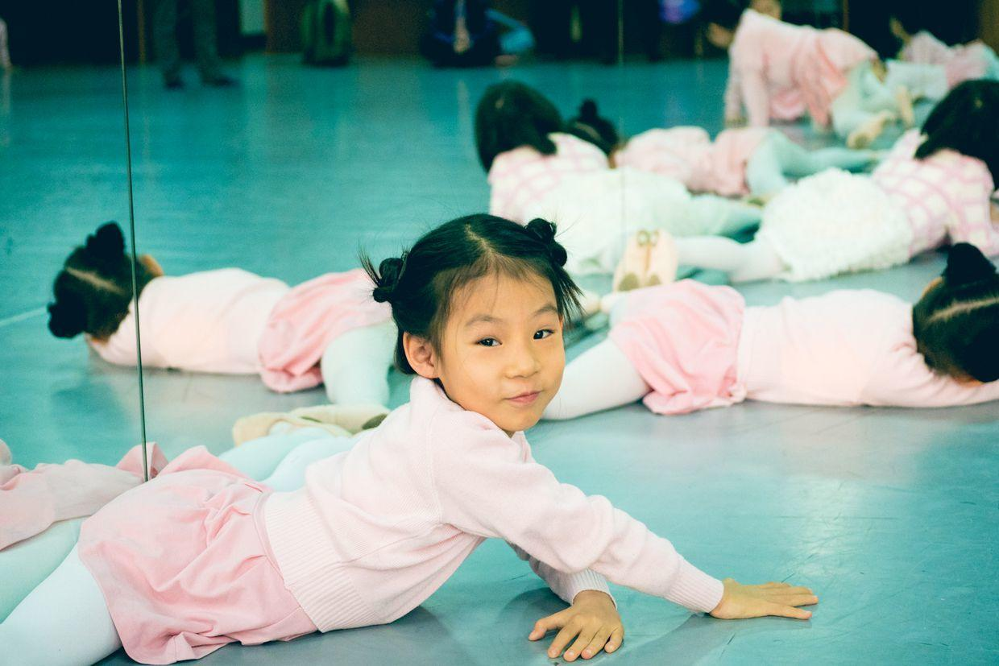

一开始都是柔韧性练习，互相压着，看着很恐怖。

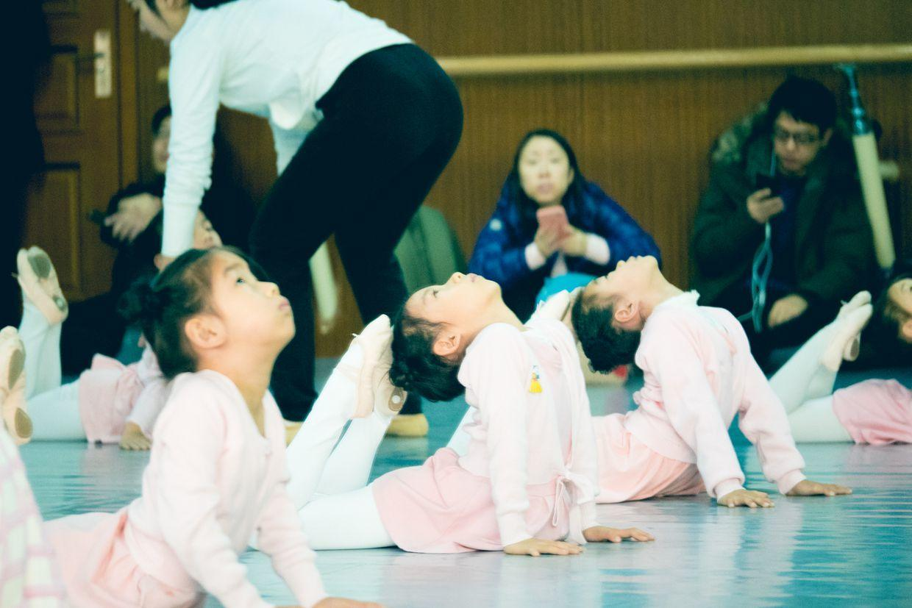

从普通动作开始。

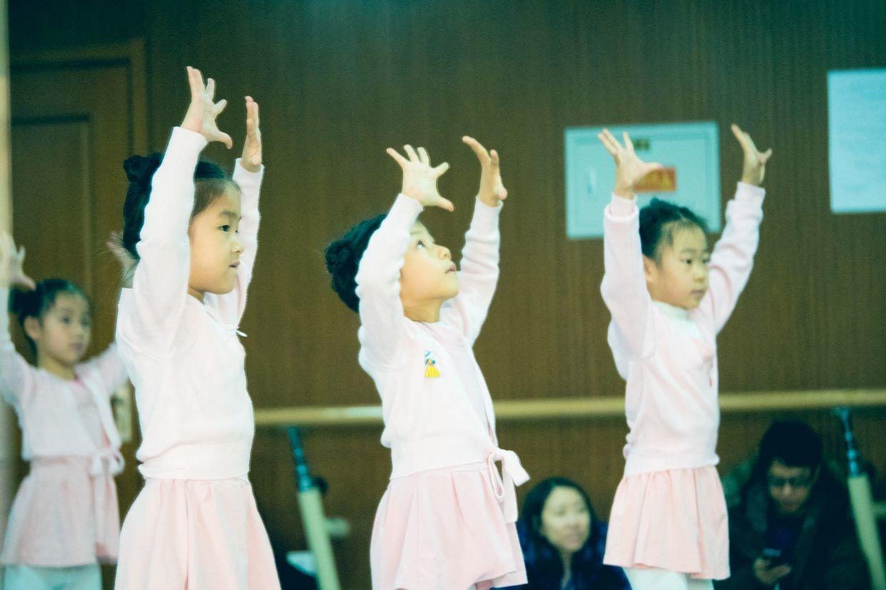

青蛙动作。

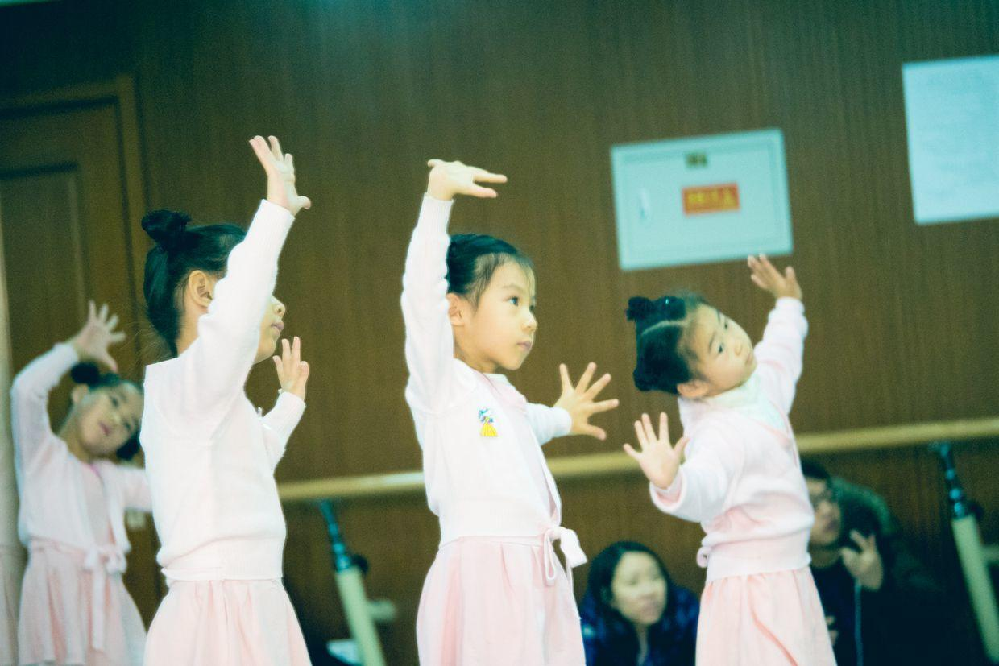

中间看了我们一次。

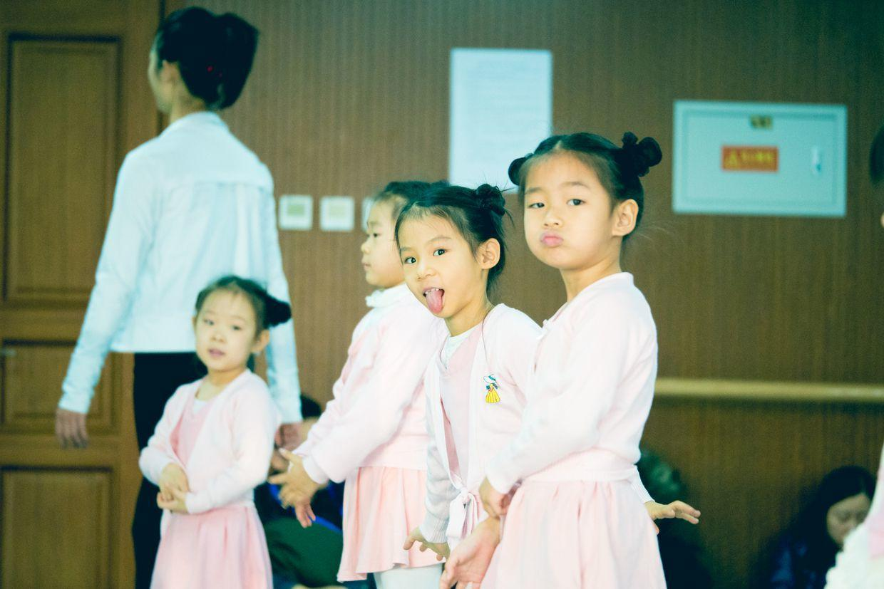

开始拿起手鼓。

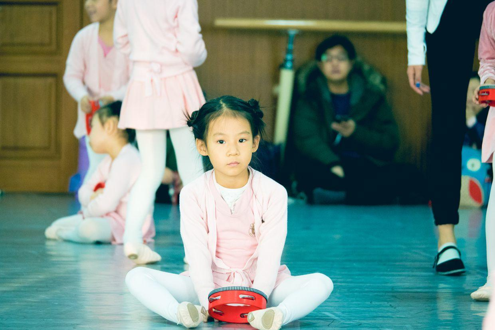

两个人一起配合，手鼓和铃铛。

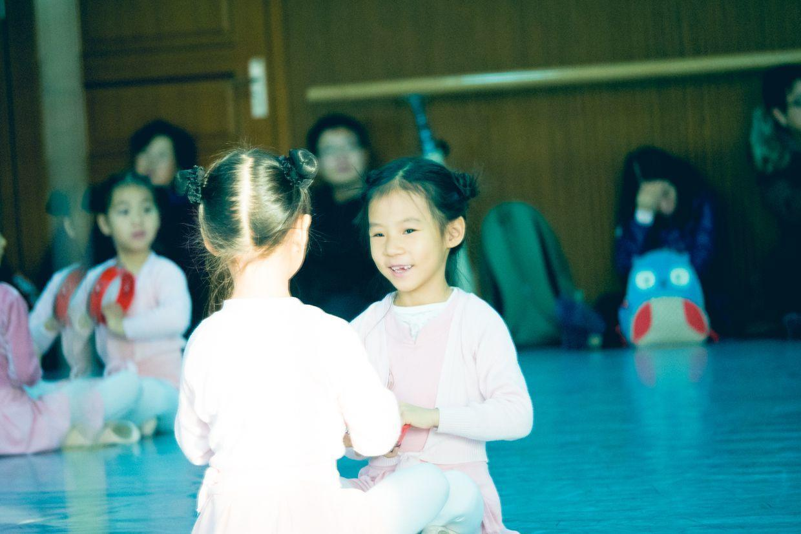

和妈妈一起配合。

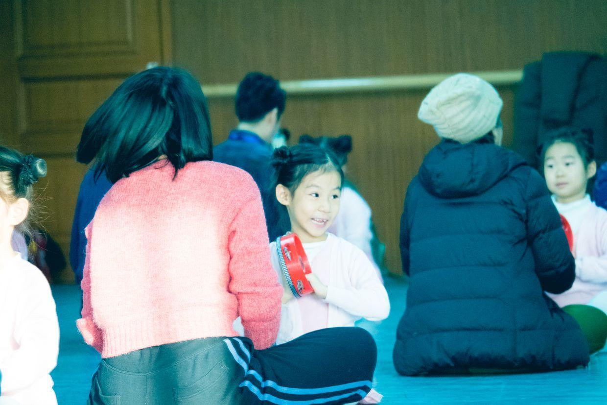

换到最后一排。

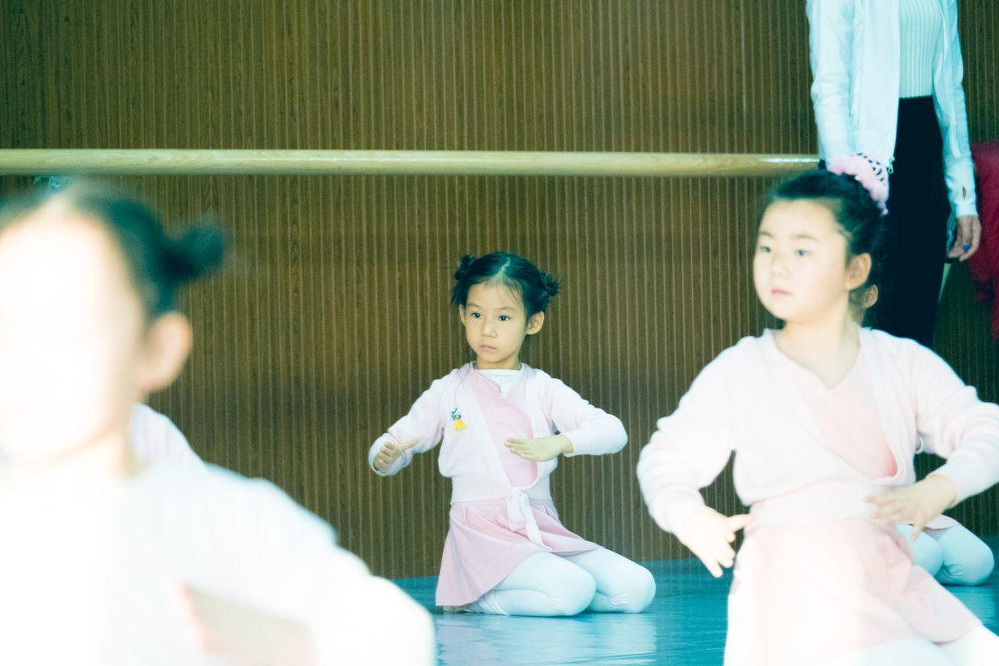

课间休息了。

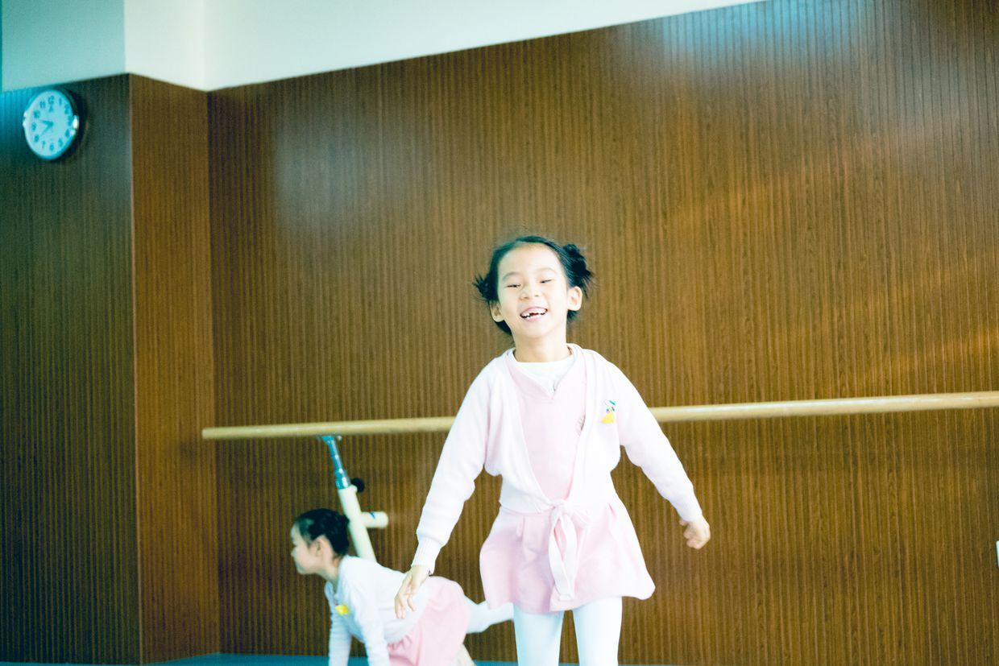

开始练习洗手绢。

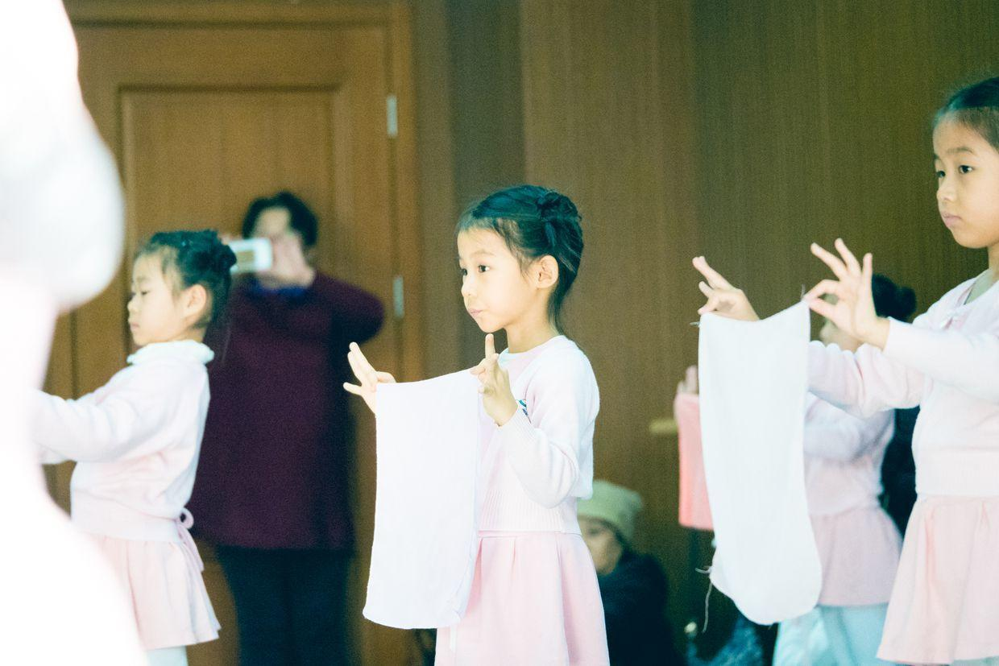

自由舞蹈。

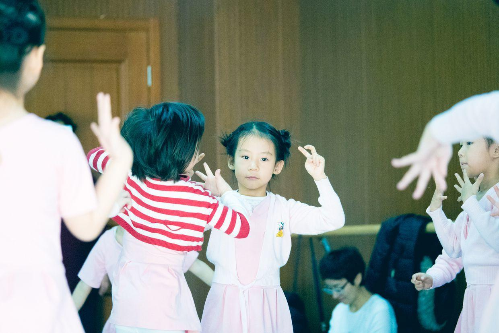

大家开始跳到了一起。

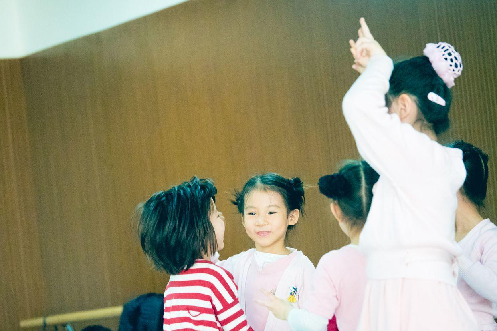

下了舞蹈课，看见一个巴啦啦魔仙的玩具，非要买，大哭大闹。

中午回家，睡一觉，下午去上钢琴课。

钢琴课上表现极差，从来没有这么差过。

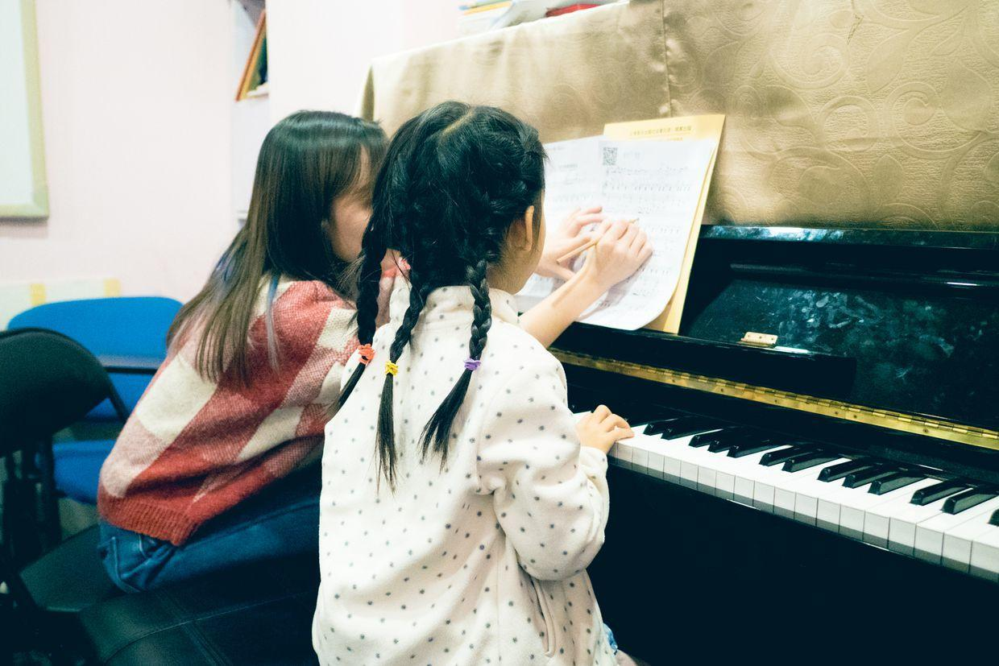

音符都是靠蒙，老师讲的时候，自己也不看谱子。

下课时发现竟然偷偷嚼了一节课的口香糖。

是可忍孰不可忍。

**个人微信公众号，请搜索：摹喵居士（momiaojushi）**

          
        