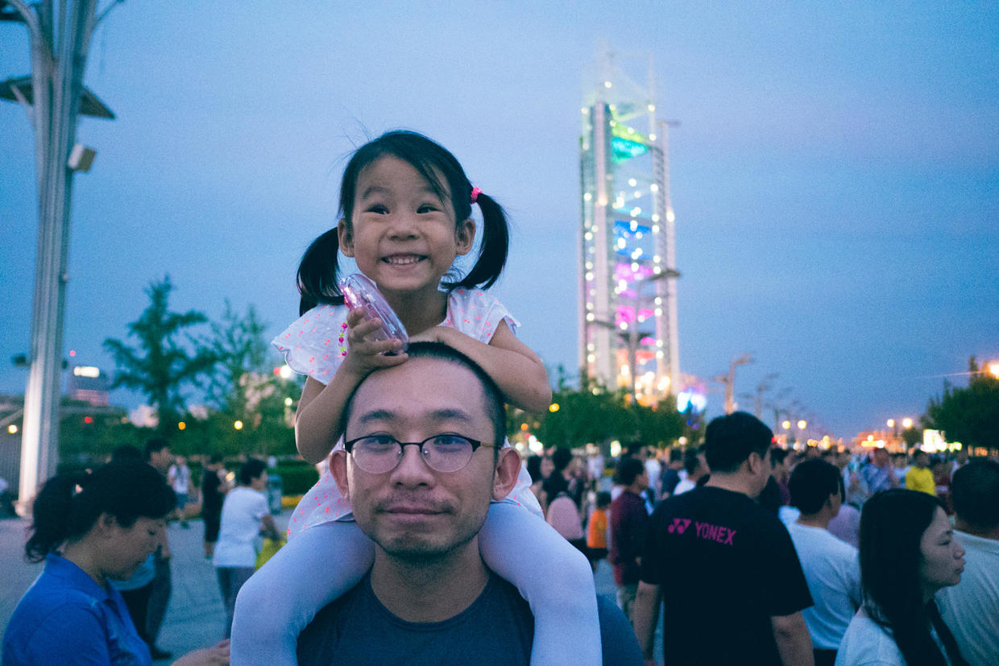

          
            
**2017.12.25**

**拍摄时间：2016.06.11**

**拍摄地点：奥林匹克公园**

这张照片是2016年6月份，晚上去奥林匹克公园散步拍的。

前面有过几张这次活动的照片。

先是坐地铁到奥林匹克森林公园，然后一路往南走。

一路上欢歌笑语，看到了无数的小团体活动。

到了20点多，天暗下来，最精彩的灯全都亮起来了。

这也是到了喵最兴奋的环节。

把她高高举起来，朝着北方，看着流光溢彩的奥运塔，真是一种享受啊。

接下来是和彩色的玲珑宝塔一起合影。

喵会很认真地等着玲珑塔颜色变化，有时是几种颜色一起变，有时是从下到上依次变化。

看过玲珑塔，再往前还有鸟巢和水立方。

这一个晚上，走了非常非常远。

夏天的夜晚，来奥林匹克大道散步，是件非常惬意的事。

**个人微信公众号，请搜索：摹喵居士（momiaojushi）**

          
        