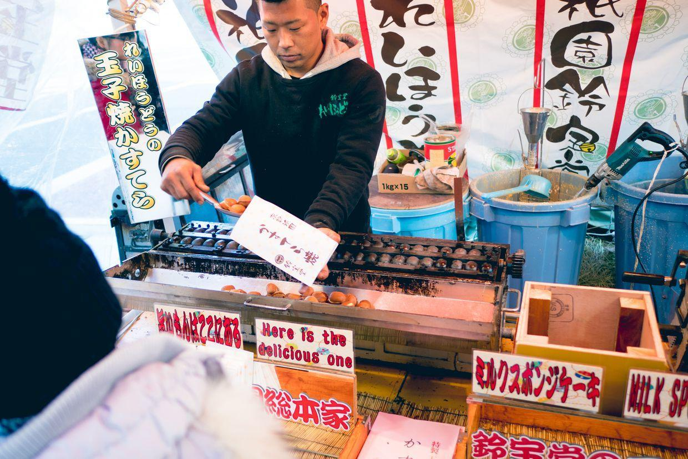
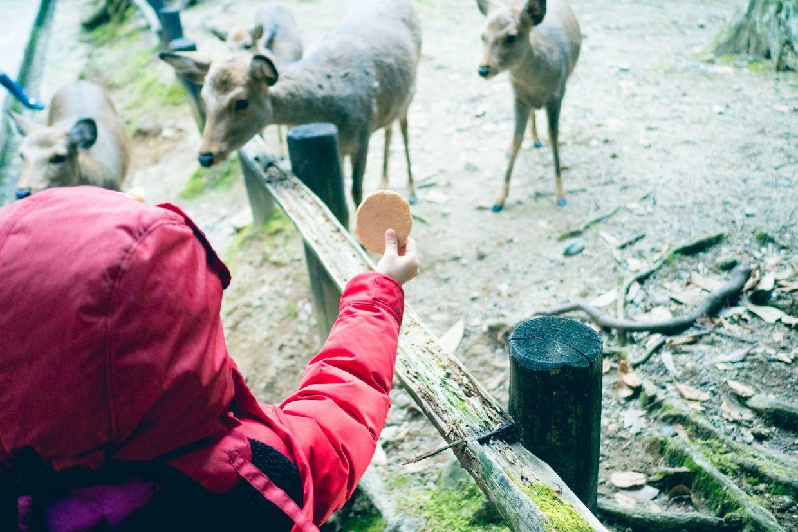

          
            
**2018.01.01**

京都第2天啦。

一早起床，吃过早饭，早早出发去奈良。

今天是元旦，是日本的春节，昨晚看了NHK的红白歌会直播，非常精彩。

满地都是醉鬼们扔的垃圾。

去祗园四条，路过鸭川，有人在堤岸上喂鸽子。

街边还有很古老的建筑。

喵也在看着河里陌生的水鸟。

上了京阪快线。

车上全是空座位。

换车。

车站上开的野花。

特急列车到了。

从丹波桥去奈良，一路的农田。

奈良站，小绿的雕像。

一出站，日本共产党在演讲。

马上买了玉子烧。

跟着大部队往奈良公园走。

一路的古树。

大鹿们冲过来了。

草坪上，人们追着鹿喂食。

喵也开始尝试喂鹿。

害怕呀。

躲到妈妈身后。

鹿都站起来了。

远处的大树下，趴着许多鹿。

完全不怕人。

想摸摸小鹿。

喂了一块饼干。

被小鹿追着乱跑。

爬满青苔的古树。

波涛汹涌的树根。

大白屁股。

看着有点像袋鼠。

捡了好多松针。

石缝间都是青苔。

走过来的小鹿。

终于敢喂饼干了。

一伸舌头就吃了。

两只鹿在吃东西。

走到奈良公园庙会了。

烤肠。

吃糖草莓。

常夜灯。

巨大的树枝伸展出去。

草坪上的两株大树。

一株枯死的大树。

树冠巨大的一株树。

真是片森林啊。

各种各样的树。

一起合影。

哈哈大笑。

爬满了青苔。

又来找小鹿。

母子一起来了。

喵专门为小鹿。

一起过来吃饼干。

手举饼干招呼小鹿。

封面

树桩。

很密的树林。

庙会上，继续走，去东大寺。

买了个小鹿的小包，很开心。

在庙会的塑料棚里吃炒面。

五湖四海来吃炒面的人。

终于到了东大寺。

第一道门，非常古。

一个小园林。

第二道门，很新。

一路上还是到处都有鹿。

开始追着摸小鹿。

大佛殿入堂口，这几个字的书法水平实在是震撼。

巨大的门栓。

东大寺正殿。

正殿的金顶特别扎眼。

正面看，真是震撼，超过了故宫太和殿，世界第一大木建筑。

进门前还是要洗手。

洗双手。

大殿和真人的对比。

巨大的铜佛，这个体量实在是丧心病狂。

各种封建迷信产品扑面而来。

帅小伙兜售抽签算卦，我们抽了个凶。

两旁的菩萨。

开始摇啊摇。

抽出来的签，拴在绳子上。

复原模型里，原来还有七重塔，可惜已经毁了。

旧的大殿拆下来的零件。

排大队，钻柱子洞的一个古怪活动，和白云观摸石猴差不多。

卖的各种纪念品。

巨大的榫卯。

旁边的博物馆。

柱子的莲花座。

鱼尾金顶。

真的是金光闪闪。

从奈良坐火车回酒店，长途跋涉，终于吃上饭了。

元旦，大部分商店都休假了，整个商业街空荡荡的。

不过喵还是买了一身日式浴衣，回到酒店和姥姥姥爷、爷爷奶奶视频。

真是爱美啊。

**个人微信公众号，请搜索：摹喵居士（momiaojushi）**

          
        