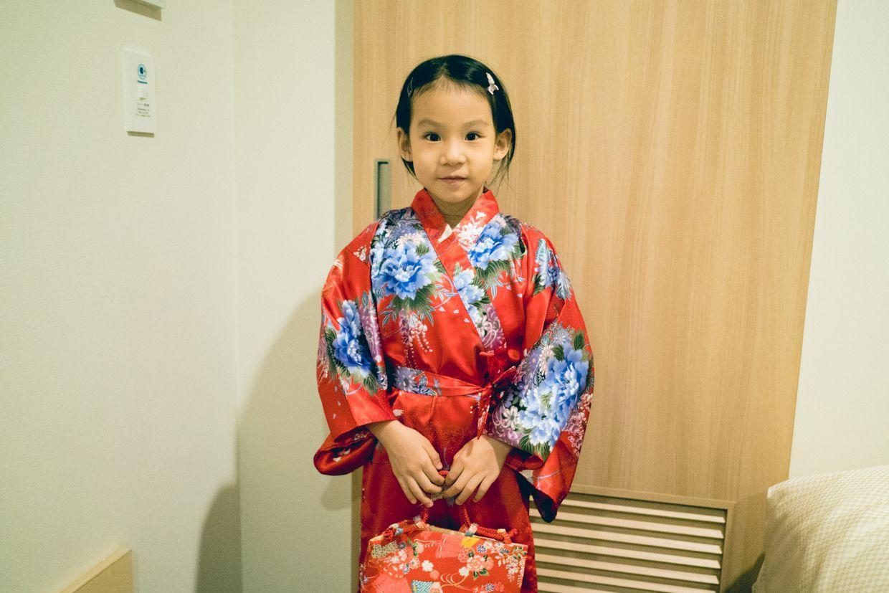
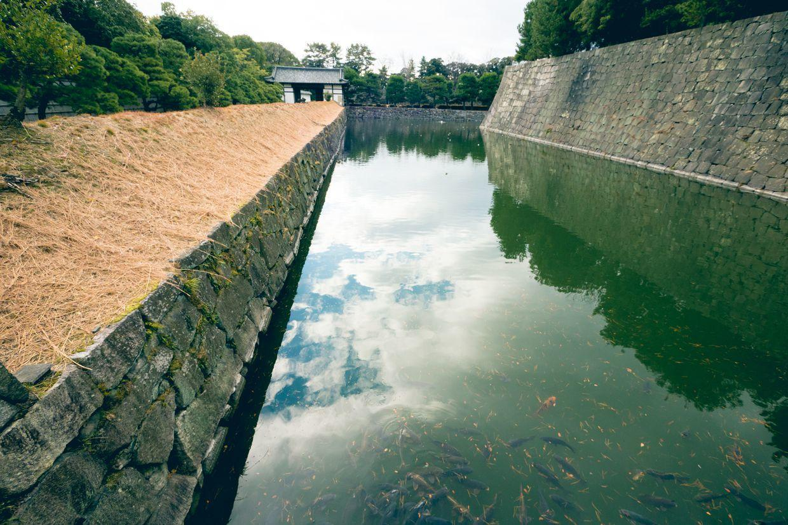
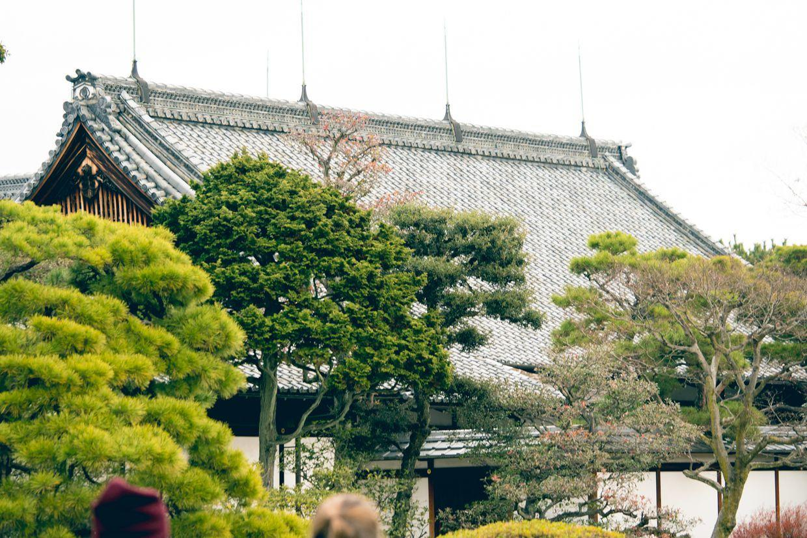

          
            
**2018.01.02**

昨晚小摊儿上买了日式浴衣，马上就在酒店里面变装了。

穿着日式浴衣，给我们表演了一段河北梆子舞蹈，真是别有风味。

今天一早出发去二条城，两站地铁就到。

二条城是当年德川家康在京都觐见天皇时的住所，也是末代幕府将军德川庆喜大政奉还的地方。

今年正好是大政奉还150周年。

一到早就很多人排队买票，一个老爷爷在队尾举着牌子，告诉大家，这是队尾。

城中的古树。

金色的装饰。

售票员开始打扫窗口。

一个老爷爷举着话筒，沿着队伍巡回告诉大家，10点开始售票。

旁边还有人疏导交通。

很多跑步爱好者围着二条城跑圈，下午我也加入了这个队伍。

城墙用巨石堆砌。

进城啦。

门口的房子是武士们住的。

二条城地图，外城和内城。

镶金边的房檐。

在石子地上写自己的名字。

继续往里走。

一个临时住所，装饰得这么繁复。

门柱下面也是这样装饰。

修饰讲究的树木。

在吊钟旁边。

树影婆娑的院落。

将军的园林。

木桩支撑。

树木中间劈开，露出了远处的城。

移步换景，湖中模拟的是蓬莱仙岛。

和妈妈合影。

继续看松柏。

扭蛋里是喂金鱼的鱼食。

进入内城。

内城护城河下有好多锦鲤。

白色的城墙，铜绿的城门。

封面

沿着小径向前走。

这里的天守阁早已焚毁，现在是登上了以前的城墙，可以看到京都的山景。

非常壮观，整个京都平原就是一个大盆地，周围全是山。

喵妈作为导游，全程介绍了二条城的悠久历史。

带着小鹿包一起合影。

屋顶上的避雷针。

继续各色的树木。

树根旁的红叶。

自动售货机买了一小瓶热饮。

长在城墙上的树木，和元大都遗址公园的土城差不多。

茂林修竹，世外桃源。

修剪的小盆景。

端庄的大门。

很突兀的古树。

满地碎尸，让刺客无处遁形。

从二条城出来，坐地铁去动漫博物馆。

地铁和北京地铁没有区别。

下了地铁过马路。

看到了动漫博物馆，可惜过年休息闭馆，只好回去了。

地铁站里的小书店里，买了几个本书过了过瘾。

中午找了无数饭馆，都要排大队，最终随便找了一家，排了10分钟，终于吃上了。

后厨疯狂忙碌地准备。

前面就一个服务员，不停地送餐，安排等位。

吃过饭，回酒店休息。

看过了二条城，真是震撼，征夷大将军为自己修建这么坚固的城堡，最后还是要大政奉还。

**个人微信公众号，请搜索：摹喵居士（momiaojushi）**

          
        