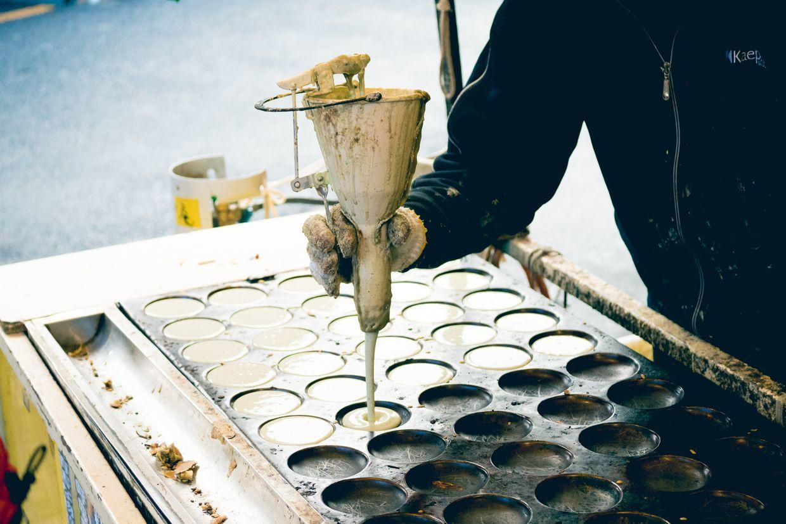
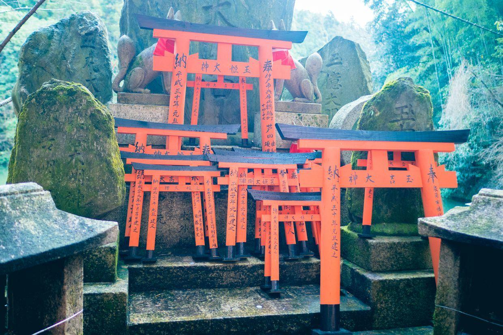

          
            
**2018.01.03**

在京都的第5天啦，一早起来突然开始下雪了。

雪越下越大。

转眼间就又阳光灿烂了，路上的出租车一尘不染。

去祗园四条，路过高濑川。

很浅的水。

远处的山阴云密布。

鸭川上有人散步。

坐京阪快线，很快就到伏见稻荷。

车站厕所里都是狐狸装饰。

站台很小。

五道口。

站台员老爷爷。

下了车，庙会小吃扑面而来。

旅行图。

停满了乌鸦的电线杆。

人山人海，好像地坛庙会。

烤鱼，特别臭。

狐狸雕像。

消防员们。

还是要洗手。

供奉了很多酱油。

叼着金色稻穗的狐狸。

巨大的鸟居。

上山的人群。

纳奉。

密密麻麻的千鸟居。

从柱子里钻出来。

换上了日式浴衣，裹在羽绒服外面。

端庄的样子。

非常漂亮。

封面

外面就是原始森林。

每个柱子上写着捐助者名字。

周围的森林。

继续往上走。

各种怪力乱神扑面而来。

许多神。

半山腰还有一个野湖。

一起合个影。

这个显得年代很久远。

准备从小路下山。

一起合影。

三人一起。

显得和鸟居一样高。

从山下网上看。

下了一阵雨，天气又好了。

许多砍伐的木材，就一直这么堆着。

满是地衣。

一条小溪。

下山看起来太壮观了，赶庙会的人群。

侧面看，依然金碧辉煌。

山下纪念品一条街。

美食一条街。

烤鹌鹑。

各种小钱包。

挑中了一个猫面具。

马上就戴上了。

远处的山已经白雪覆盖了。

在地铁上突然开始吓人。

下了车，鸭川桥上看人喂鸟。

水鸟飞上来吃面包。

从来没见过这种鸟。

中午去吃烤肉，难得不用排队。

牛排。

很大的火。

吃得非常香。

中午回去睡个觉，下午去准备买回北京要带的礼物。

明天要准备回家了。

**个人微信公众号，请搜索：摹喵居士（momiaojushi）**

          
        