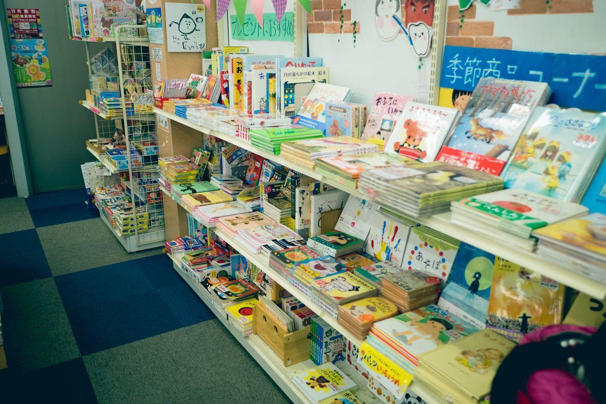

          
            
**2018.01.04**

今天是京都第6天，最后半天了。

把之前手机拍的照片做了一下拾遗。

奈良街头看到的奇特汽车。

喵下午休息时，我去二条城绕城跑步。

夕阳下金黄色的二条城角楼。

二条城路边的跑车。

路边破败的袖珍游乐场。

身穿合服的韩国游客们。

沿路跑回酒店，小超市的舞狮活动。

很有年代的老建筑。

MUJI的咖啡厅。

非常有品位。

昨天傍晚去鸭川跑步，几个小孩儿在鸭川钓鱼。

人们快捷地通过石头桥。

练习射门的老爷爷。

堤岸上弹唱的青年。

一对母子，沿着堤岸骑车，边骑边聊天，我一直跟在后面跑着。

继续向前，河道越来越窄。

很像一片沼泽地。

到了鸭川公园。

下鸭神社就在对面。

远处的山上云雾缭绕。

在这里鸭川合二为一，这里便是当年京都发源的地方。

露霞与孤鹜齐飞。

秋水共长天一色

封面

金色的夕阳。

晚霞。

昨天晚上去吃大阪烧。

味道非常棒。

喵也吃了不少。

晚上还去了书店，喵看了基本儿童画书。

环境非常好。

我去看漫画书。

机器猫全套。

七龙珠、全职猎人。

灌篮高手。

在这个书店买了好几本漫画书的第1本。

吃了好几天711，今天早上，起床去吃酒店早餐。

出门带喵也去鸭川看看。

三鸣亭。

老爷爷来亲自挂幌子。

今天阴天。

人很少。

桥底下。

跑步的人。

鸭川地图。

东野圭吾笔下的，桥下的无家可归者。

木芙蓉。

浅浅的河水。

水鸟。

层层叠叠。

鸳鸯和野鸭。

不知名的小鸟。

在桥上走。

越走越开心。

坐上HARUKA，去机场，沿途路过了之前远眺过的山。

喵带了一瓶酒店的水，留作纪念。

在车厢里跳起了舞。

大阪关西国际机场，长长的托运队伍。

案内所。

免税店的巧克力。

降落啦，回到了我们的北京。

**个人微信公众号，请搜索：摹喵居士（momiaojushi）**

          
        