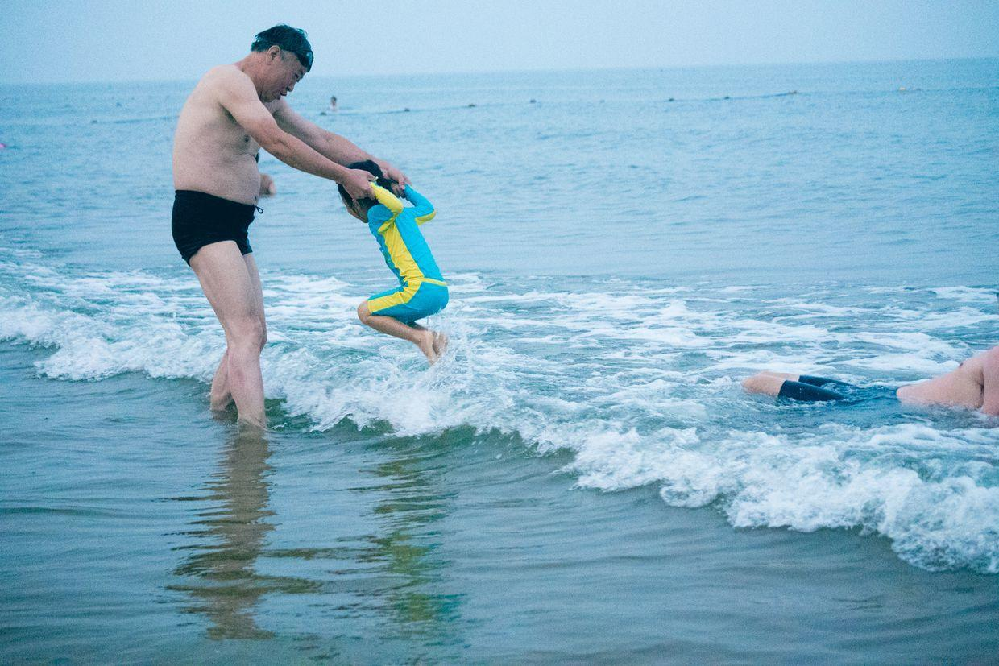

          
            
**2018.01.05**

本篇就结束2016年暑期去黄金海岸的旅程回顾了。

爷爷带着喵去海里玩儿。

这个柔韧性，真是随时随地表现。

海浪来了，就高高跳起。

拎着手，在海浪里玩儿。

坐在爷爷腿上，等着海浪。

吓得直闭眼。

等着巨大的海浪过来。

准备要回家啦。

和大海再见。

准备下一次来海边。

这一次玩儿了着实很久，人也晒得很黑。

回到家以后，一直到10月份才慢慢白回来。

转过年，2017年的暑假，喵更是跟着爷爷奶奶在黄金海岸住了很久，把各种地方都玩儿了个遍。

从最开始不敢下海，但后来随意在海里扑腾，再到最后，都已经没兴趣下海，只是在海边玩儿沙子了。

难得有离北京这么近的海，虽然比不上国外的海滩，但是几代人，在这里度过了无数的暑假，也是一种幸福。

**个人微信公众号，请搜索：摹喵居士（momiaojushi）**

          
        