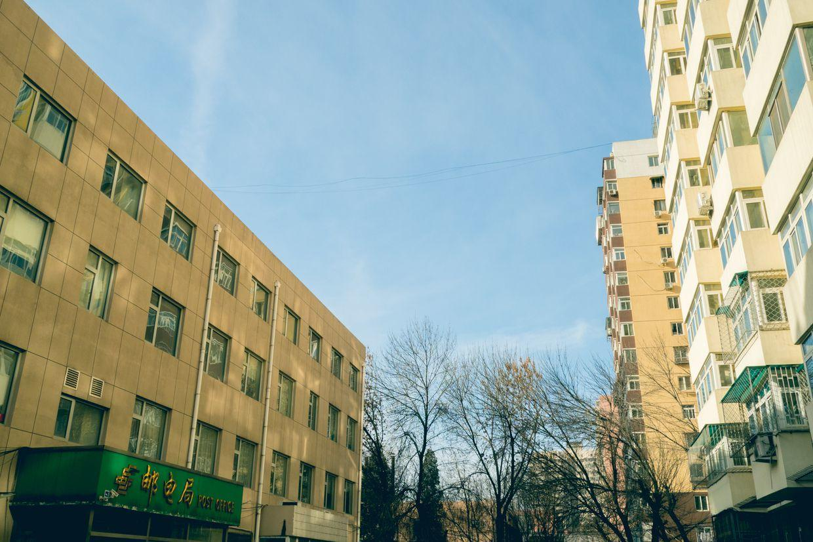
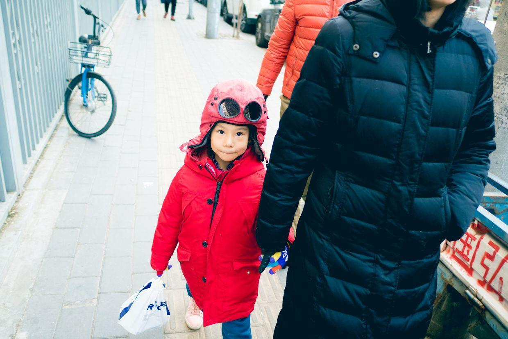
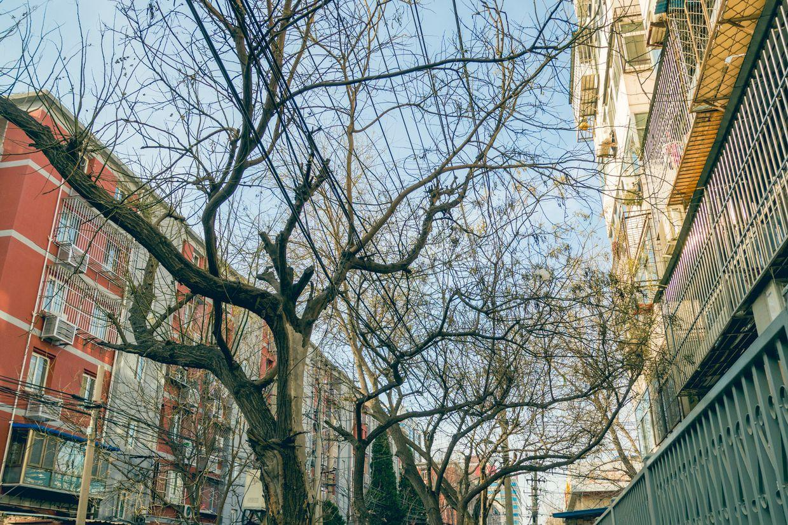
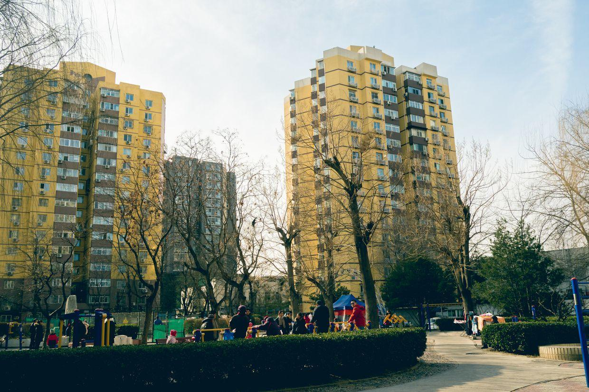
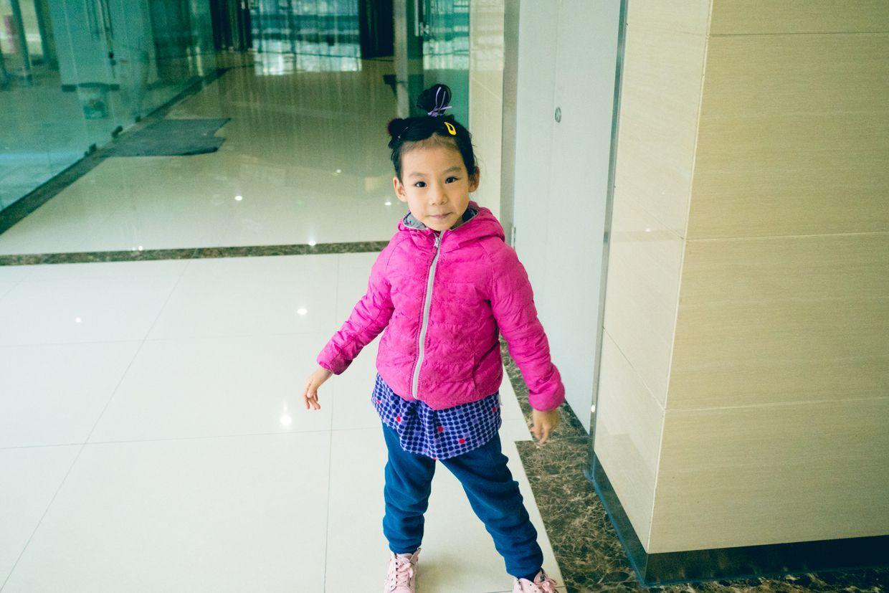
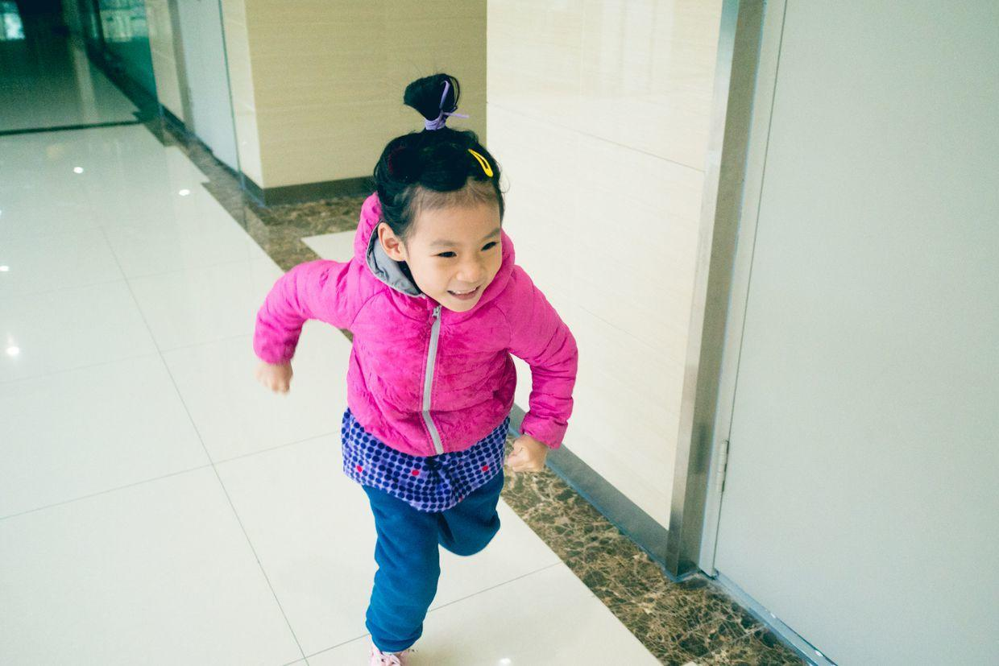
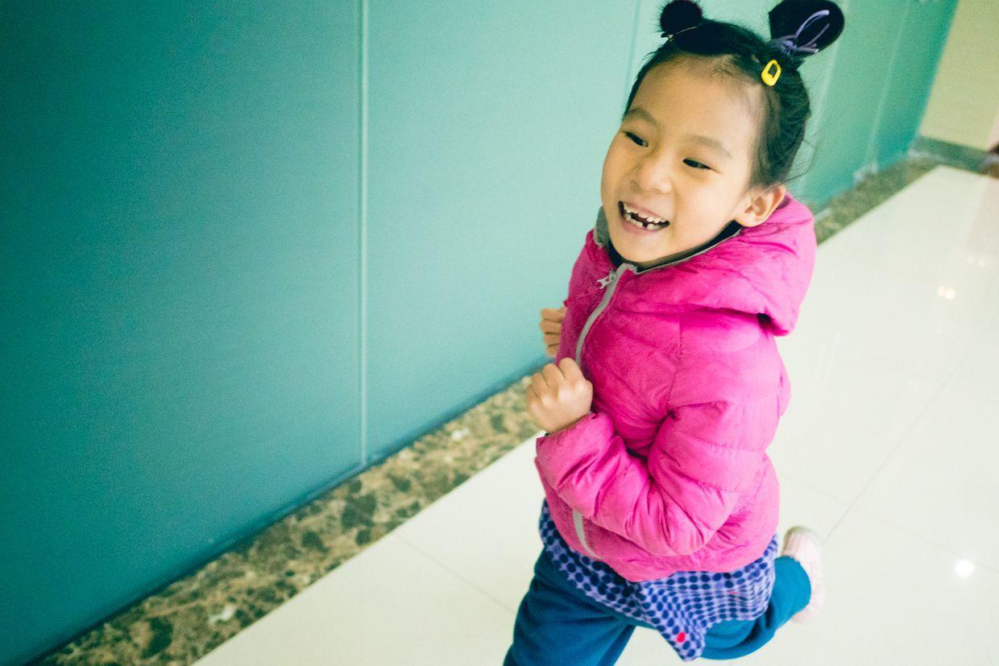
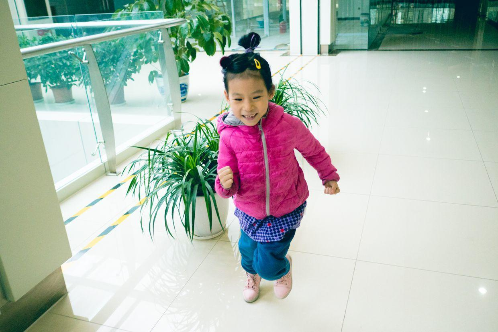
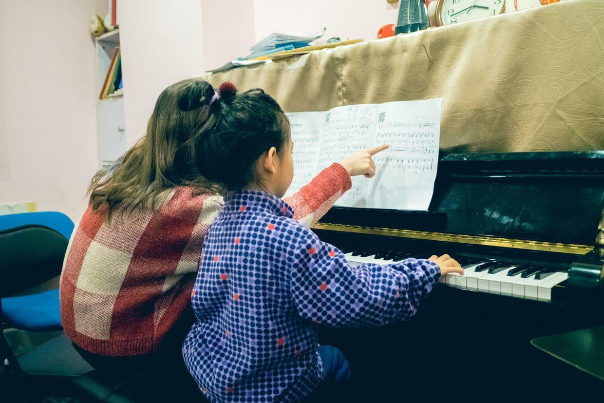

          
            
**2018.01.06**

周六啦，舞蹈课已经结束啦。

睡了个大懒觉，吃过早饭，开始练琴。

10点多，出门去晒太阳，天气很好，没有风。

拿着巧克力去送给小虎哥哥。

一路上树木光秃秃的，非常萧瑟。

广场上人们都在晒太阳活动，还有卖菜的大棚子，菜市场不让干了，就来到这里。

中午吃过饭，睡个大觉。

下午来上钢琴课。

到早了，可以在楼道里跑一会儿。

很开心地跑起来。

辫子一晃一晃的。

真是兴奋无比。

准备上课，拿出练琴记录本自己先看看。

老师指导《大王来巡山》。

和彤彤老师一起合奏了2遍，然后轮到我上场，最后一行我也不熟，不过总体上还是能互相跟上。

晚上回家跟姥姥姥爷视频，唱了歌还跳了舞。

好好休息一个晚上，明天要去参加通州区的文艺表演。

**个人微信公众号，请搜索：摹喵居士（momiaojushi）**

          
        