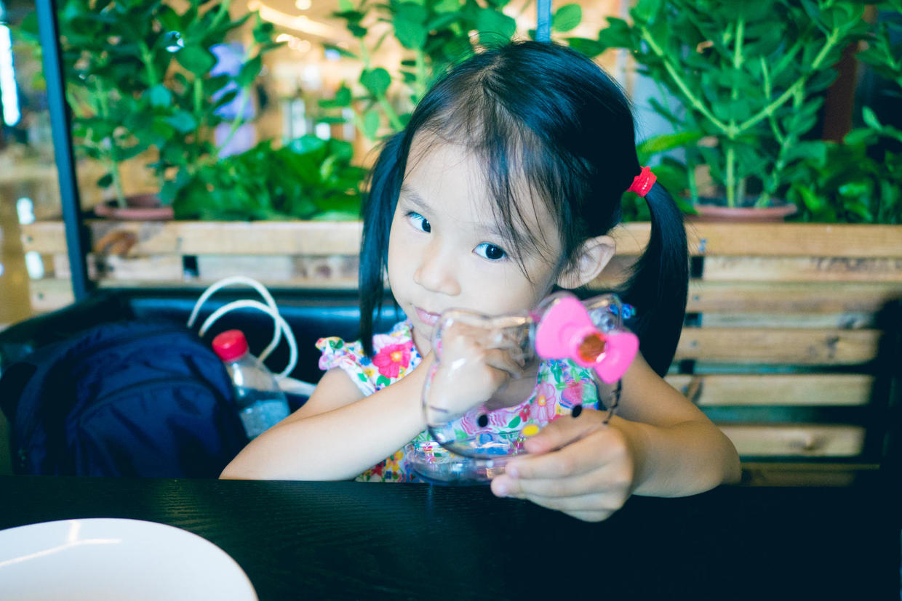

          
            
**2018.01.08**

**拍摄时间：2016.06.11**

**拍摄地点：商场**

这张照片是2016年夏天拍的。

当时正是天气很热的时候，一早起床，吃过早饭，就找了个凉快的商场去转转。

喵很喜欢这里的沙坑，可惜很晒，于是玩儿了一小会儿，热得实在不行了。

回到商场，去H&amp;M转转，喵一眼就看中了这个HelloKitty小盒子。

和我们商量了很久，保证很长时间里不再买这种小盒子了，于是顺利到手。

打开小盒子，有各种头绳和小饰品。

除了这些饰品，喵更是拿着这个小盒子玩儿起了化妆的游戏。

我们很好奇，她是什么时候学得这么惟妙惟肖的？

原来是幼儿园六一活动，老师给小朋友们化妆，喵在一边看得很认真。

还有电视上，偶尔也能看到这样的广告情节。

爱美真是人类的天性啊，从小开始。

**个人微信公众号，请搜索：摹喵居士（momiaojushi）**

          
        