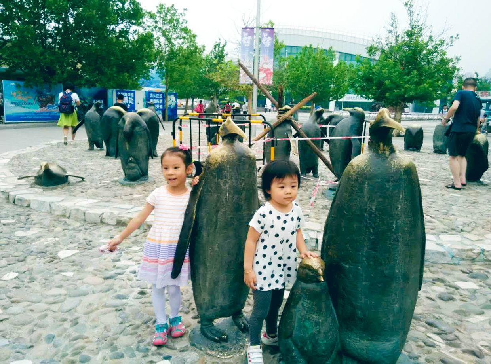
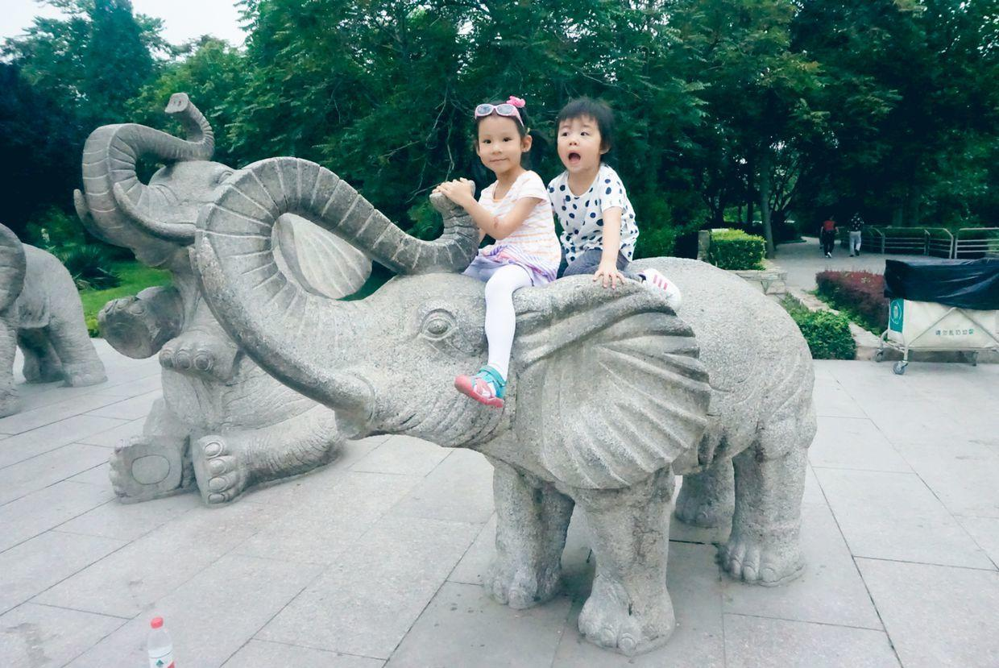
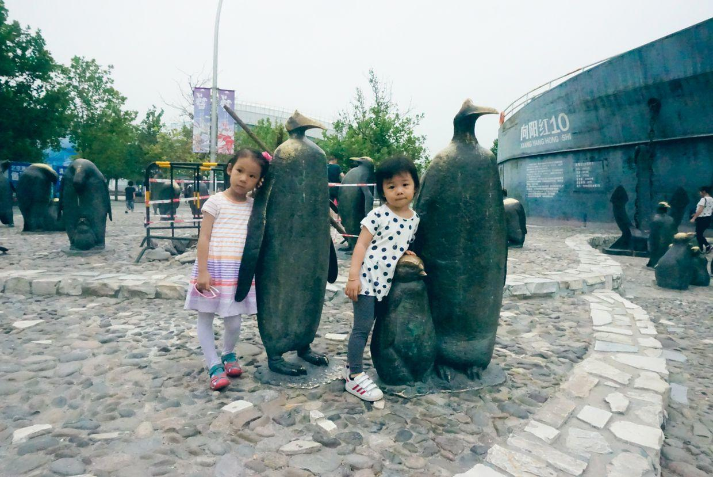
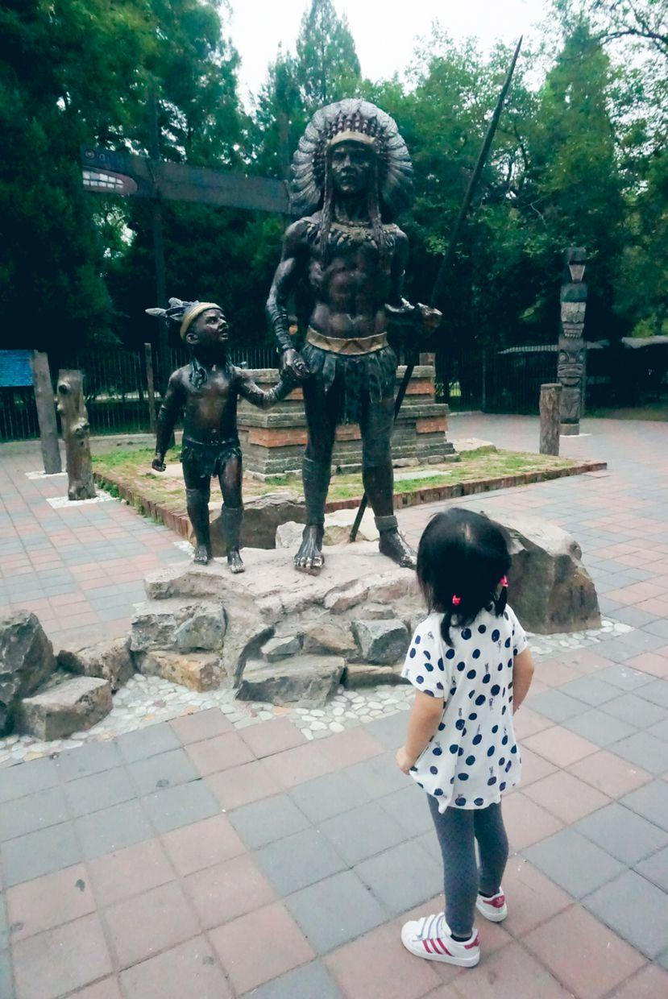
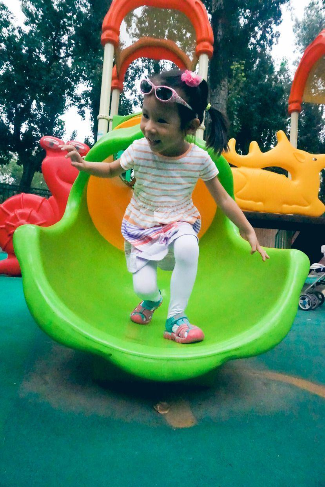
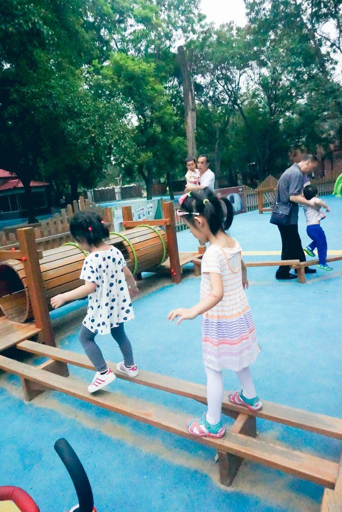
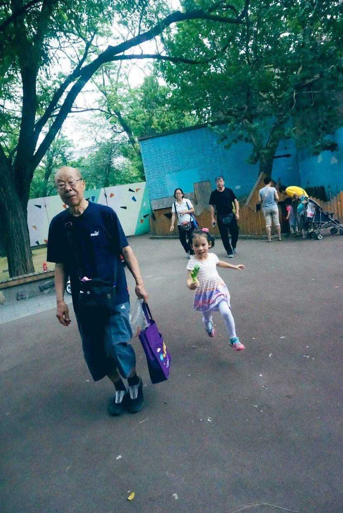

          
            
**2018.01.12**

本篇回顾一下2016年夏天，喵和兜妹一起去动物园的照片。

爷爷奶奶和二爷爷二奶奶一起带着两个小朋友去动物园。

天气很热，荷花茂盛。

狮虎山门前的巨型老虎雕塑。

企鹅馆门前，雕像都被摸秃了。

企鹅站直了可真高啊。

巨型的石鼓，能敲响吗？

小象的大鼻子

两人全爬上了小象。

见到了活的大象。

停车场里。

书包里背了不少东西。

两人滑着滑板冲入动物园。

两只大象。

两人看大象。

母象的牙要短一点。

骑在小象雕塑上。

抱着大鼻子。

真是开心啊。

兜妹也是一样。

还有特别小的象。

两个人敲石鼓。

帝企鹅。

弯腰的企鹅。

抱着可爱的企鹅。

和老虎雕塑合影。

高高举手。

兜妹。

手拉手。

一只白虎。

拿着爷爷手机。

兜妹跟在后面。

几十年没换的马赛克图画。

两人观察草丛。

荷花池。

哈哈大笑。

两人聊天。

搂着脖子。

很亲密。

荷花。

荷叶浮萍。

回头看看。

环廊。

在石头上跳着跑。

抓树叶。

印第安人雕像。

拎着滑板车。

出发。

去儿童乐园。

大滑梯。

往上走。

滑下来。

兜妹也下来。

大眼睛。

等着兜妹。

攀登架。

平衡木。

稳稳地走。

钻出来。

开心地出来。

小兔子。

好多的菜叶子。

争着喂兔子。

喂小鹿。

笑开了花。

双脚飞腾。

一起喂小鹿。

透明的滑梯。

看猴子。

大猩猩雕像。

**个人微信公众号，请搜索：摹喵居士（momiaojushi）**

          
        