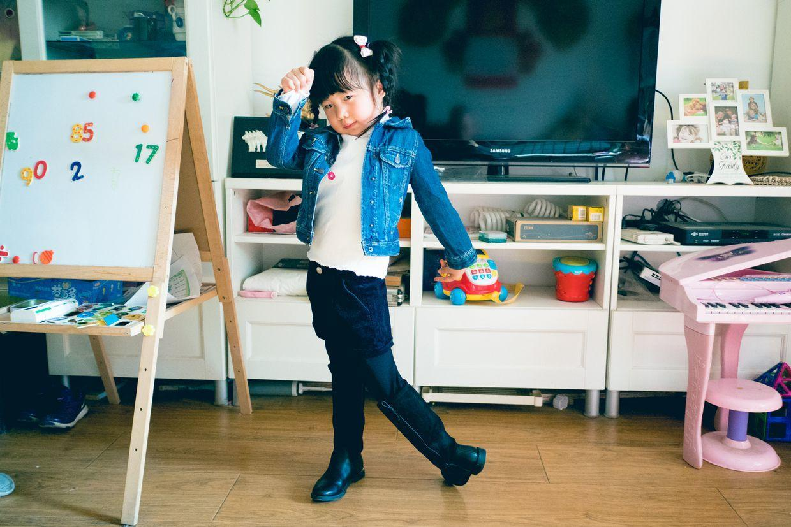
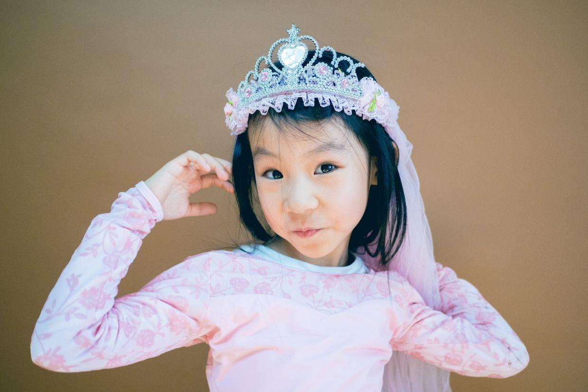

          
            
**2018.01.14**

周日啦，今天是和悦妹、兜妹还有悦妹的小弟弟敦敦一起聚会。

早上吃过早饭，练完琴，直奔奶奶家。

正好是敦敦弟弟的百天，一起拍个百天照。

笑得非常灿烂。

从远处看起来，真是个小宝宝。

靠在大被子上，一脸的懵懂。

趴在褥子上，好大的眼睛啊。

开始舔自己的手了。

趴着趴着，被小姑姑逗哭了。

在大姑姑怀里，真是特别的小。

回到客厅，3个大孩子已经玩儿起来了。

换上了喵带回来的日式浴衣，在地上开始舞蹈动作。

喵开始表演昨天学的芭蕾绷脚。

三姐妹一起和敦敦弟弟合影。

老奶奶抱着敦敦弟弟。

舅舅和敦敦弟弟。

兜妹的马靴时装秀。

开始拉上背景合影。

喵的造型。

三姐妹一起合影。

一起端庄。

一起大笑。

封面

兜妹的造型。

悦妹的舞蹈。

喵的自由造型。

兜妹一家。

中午的一大桌子菜。

三个小姐妹，自己在小桌上，三人自己干杯，祝新年快乐，然后去大桌上跟老同志们碰杯。

兜妹抱着敦敦弟弟。

快乐的童年，又加入了一位新的成员，欢迎敦敦。

**个人微信公众号，请搜索：摹喵居士（momiaojushi）**

          
        