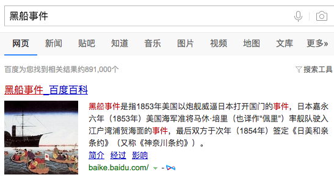

          
            
**2018.01.17**

>1853年7月8日（嘉永六年六月三日）美国海军准将培里率领舰队强行驶入江户湾的浦贺及神奈川（今横滨）。在美国的武力胁迫下，幕府接受了开港要求，于1854年3月31日（嘉永七年三月三日）在神奈川签订了“日美亲善条约”（日美神奈川条约），日本被迫同意开放下田、箱馆（今函馆）两港口，美国船可以在这两个港口加煤上水，并得到粮食等物品的供应。条约还允许美国在上述两港派驻领事，并享有最惠国待遇。不久，英、俄、荷等国援例而至，也和日本政府签订了类似条约。

>1854年（嘉永七年）二月十三日，培里再次率领舰队来到日本，这次一共有七艘军舰，而且舰队一直深入江户湾内，到达横滨附近才停船，面对培里的强硬姿势，幕府只好接受开国的要求了。于是双方在横滨签定了《日美亲善条约》，也是日本与西方列强的第一个不平等条约。其他西方列强跟随著美国，纷纷向日本提出通商的要求，于是英国、俄国、荷兰等西方列强都与日本签定了亲善条约。日本被迫结束锁国时代，幕藩体制也随之瓦解。

>事实上，德川幕府在二百多年之间，从来不准天皇参与政治，但是这次为了减低各藩的反对声音，于是想以天皇的名义缔约，并且破例邀请各大名、藩士、学者、甚至平民，针对开国之事提出意见。于是天皇及其朝臣、大名及其家臣纷纷举起了救国的旗帜，趁机跃上政治舞台。无论如何，“黑船事件”后的日本政局一天比一天混乱，也埋下了幕府灭亡的导火线。

同样是闭关锁国，同样是被洋人坚船利炮敲开国门。

但是，日本总是会自上而下的进行改革。

**个人微信公众号，请搜索：摹喵居士（momiaojushi）**

          
        