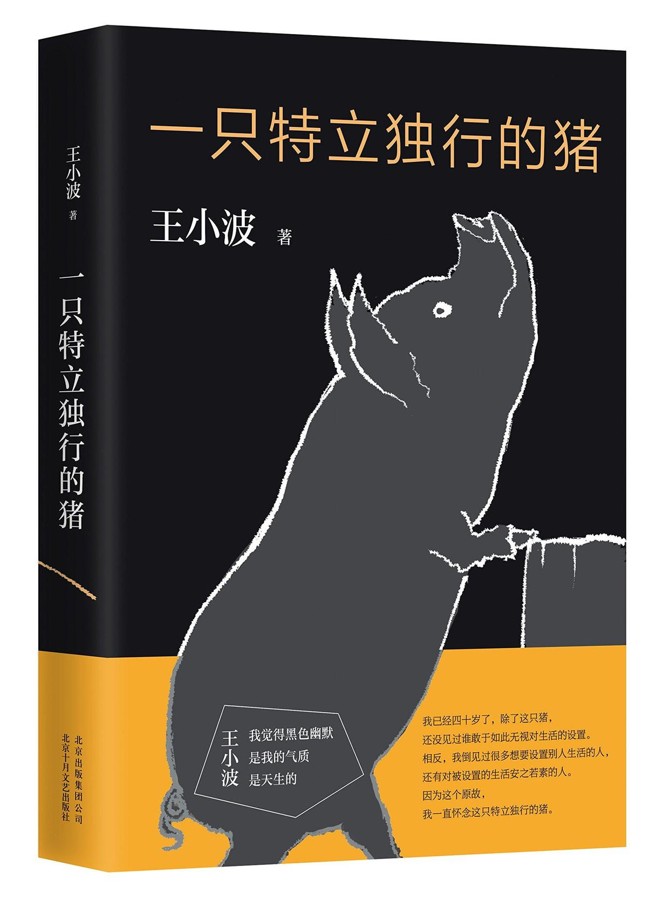

          
            
**2018.01.18**

这本书名气很大，不过内容实在是太散了。最令人震惊的就是当年中关村的内存条价格。
>卡尔维诺与未来的一千年

假如你想听听电脑，我可以说，现在在中关村花250块钱可以买到八兆内存条，便宜死了……

这个价格很魔幻
>关于文体晓康体流行时，大家都在虚声恫吓；而撒娇打痴体之流行，使我感觉到一些年轻的女性正努力使自己可爱一些。

一个漂亮女孩冒点傻气，显得比较可爱——马晓晴就是这么表演的。

马晓晴太过了
>我们还知道西施有心绞痛并因此更加可爱，心绞痛也该可以形成一种文体。以此类推，更可爱的文体应该是：“拿硝酸甘油来！”

熟悉硝酸甘油，最后作者死于心脏病，看来之前有经验。
>关于幽闭型小说

中国有种老女人，面对着年轻的女人，只要后者不是她自己生的，就要想方设法给她罪受：让她干这干那，一刻也不能得闲，干完了又说她干得不好；从早唠叨到晚，说些尖酸刻薄的话——捕风捉影，指桑骂槐。

我在一些描写航海生活的故事里看到过这类事，这个折磨人的家伙不是婆婆，而是水手长。有个故事好像是马克·吐温写的：有这么个千刁万恶的水手长，整天督着手下的水手洗甲板，擦玻璃，洗桅杆。讲卫生虽是好事，但甲板一天洗二十遍也未免过分。有一天，水手们报告说，一切都洗干净了。他老人家爬到甲板上看看，发现所有的地方都一尘不染，挑不出毛病，就说：好吧，让他们把船锚洗洗吧。整天这样洗东西，水手们有多心烦，也就不必再说了，但也无法可想：四周是汪洋大海，就算想辞活不干，也得等到船靠码头。

实际上，中国的旧式家庭，对女人来说也是一条海船，而且永远也靠不了码头。你要是烦得不行，就只有跳海一途。

千年的媳妇熬成婆
>海明威《老人与海》

一副大得不可思议的鱼骨。在海明威的《老人与海》中，我读到了一个英雄的故事。在这本书里，只有一个简单到不能再简单的故事和纯洁到如同两滴清水的人物。然而，它却那么清楚而有力地揭示出人性中强悍的一面。在我看来，再没有什么故事能比这样的故事更动人，再没有什么搏斗能比这样的搏斗更壮丽了。

除了失败，一无所得
>从Internet说起

大约十年前，我就买了一台个人电脑。到现在换到了第五台。花钱不说，还下了很多工夫，现在用的软件都是我自己写的。我用它写文章，做科学工作：算题，做统计——顺便说一句，用电脑来做统计是种幸福，没有电脑，统计工作是种巨大的痛苦。

所有程序都自己写
>海明威在《钟为谁鸣》里说过这个意思：所有的人是一个整体，别人的不幸就是你的不幸。所以，不要以为丧钟是为谁而鸣——它就是为你而鸣。

这诗不是原创，是海明威引用
>有关爱情片

以《庐山恋》为例，不仅爱情的力度不够，而且相当的古怪，虽说是部爱情片，男女主人公一不接吻，二不拥抱，连爱你都不说，只用英文高呼：Ilovemymotherland，吼得地动山摇。

太奇怪了
>明星与癫狂

笔者四十余岁，年轻时和同龄人一样，发过一种癫狂症，既毁东西又伤人，比追星还要有害。所以，有点癫狂不算有病，这种癫狂没了控制才是有病。

四十多了，作者快到尽头了
>十年前我在美国，每天早上都要起来跑步，跑过我住的那条街。

生活习惯真好，回国以后看来没保持
>自然景观和人文景观

有位意大利的朋友告诉我说，除了脏一点、乱一点，北京城很像一座美国的城市。

我的这位意大利朋友是个汉学家。他说，中国人只重写成文字的历史，不重保存环境中的历史。

很中肯
>环境问题

我从书上看到，旧北京所有的死胡同底部、山墙底下都是尿窝子，过往行人就在那里撒尿。日久天长，山墙另一面就会长出白色的晶体，成分是硝酸铵，经加工可以做鞭炮。有些大妈还用这种东西当盐来炖肉，说用硝来炖肉能炖烂——但这种肉我是不肯吃的。

这个太魔幻了，从没听说过，还可以做炸药了

**个人微信公众号，请搜索：摹喵居士（momiaojushi）**

          
        