          
            
**2018.01.20**

昨天晚上一回家，喵就要给我看惊喜。

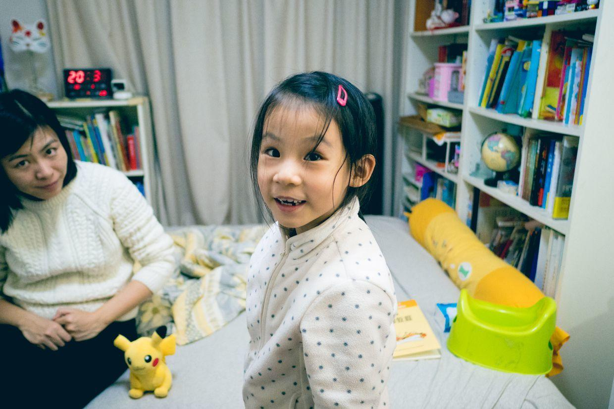

原来是上周看了兜妹玩儿轮滑之后，自己也要尝试一下。

婷婷姐姐以前送的轮滑鞋终于出山了。

自己很容易就站起来了。

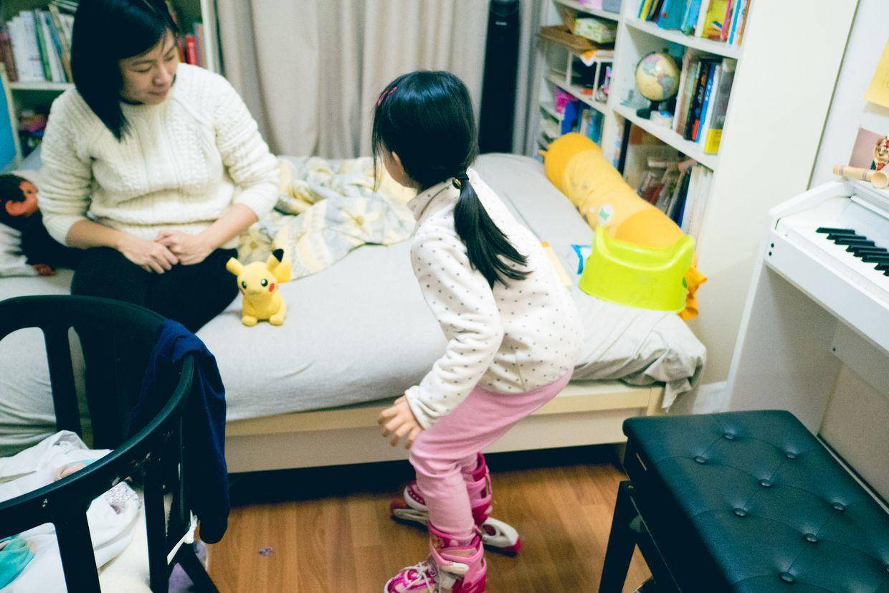

接下来和妈妈一起模仿皮卡丘。

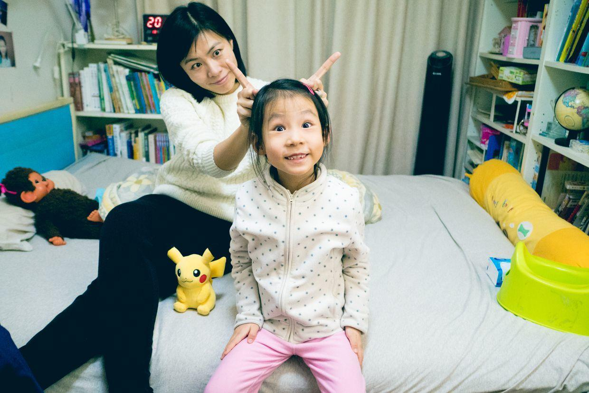

周六啦，一早起床，吃过饭，直奔舞蹈教室。

外面非常明亮。

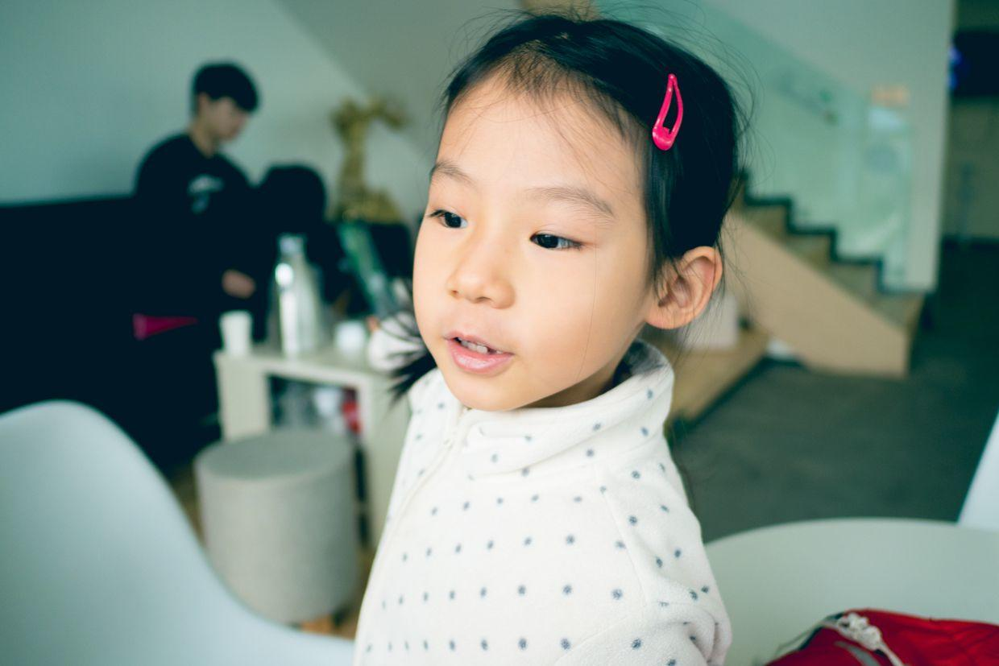

从窗户往外眺望。

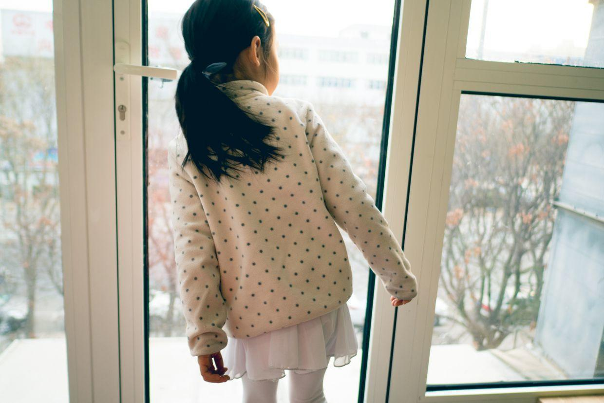

发现桌上的照片是自己的老师。

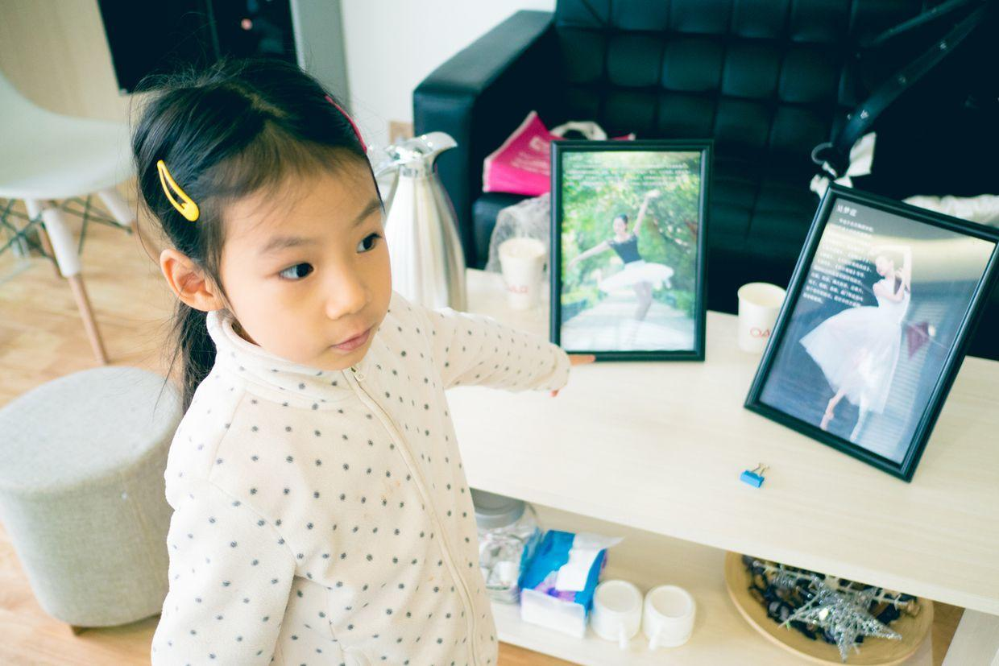

舞蹈教室里面。

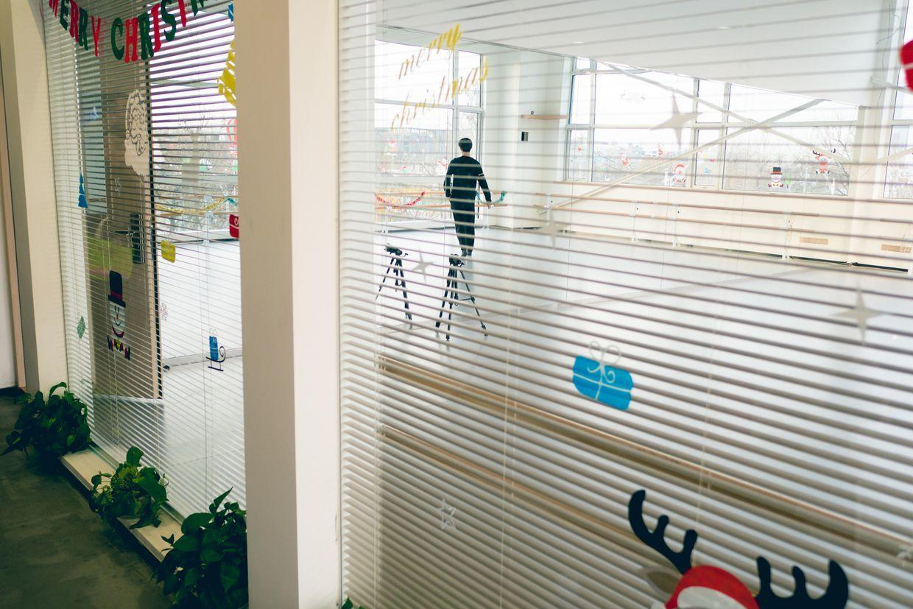

和漂亮的芭蕾舞裙合个影。

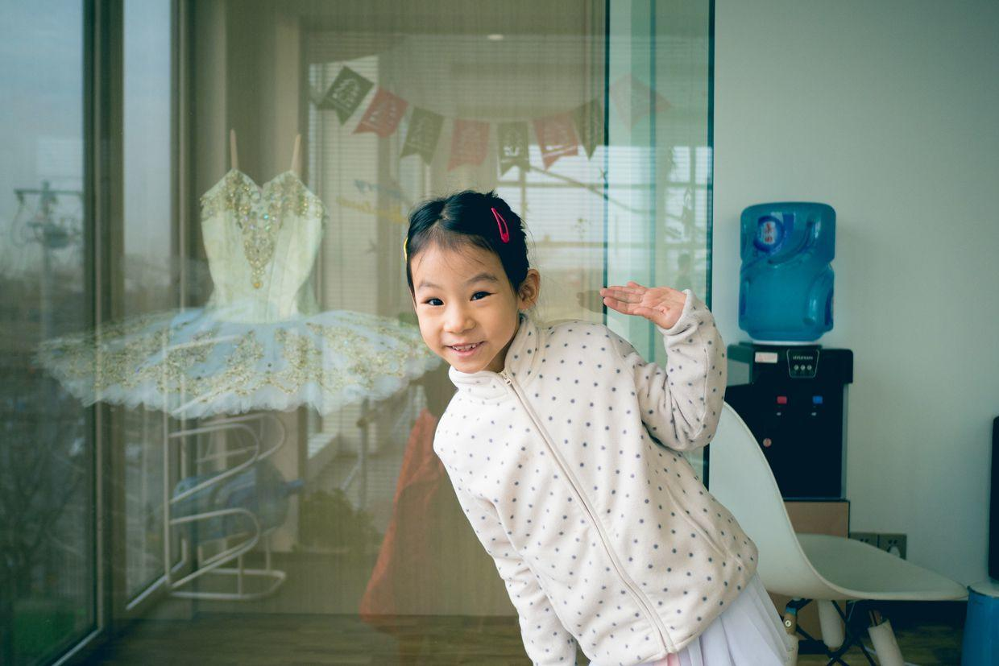

喵妈也参加了舞蹈课，家长们单独开了课，等孩子上课的时候，也可以练舞。

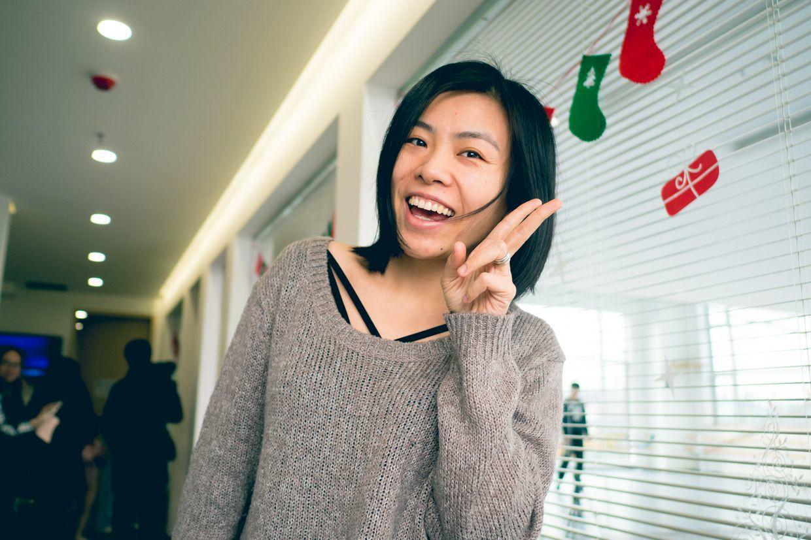

学习芭蕾舞。

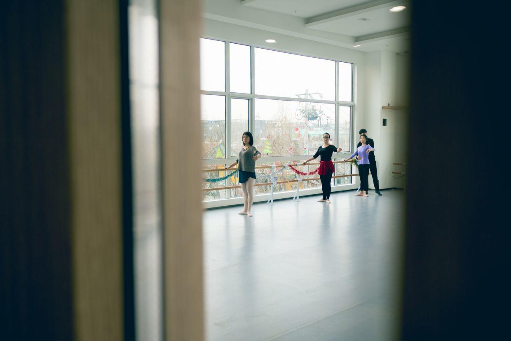

中间休息，喵扒着窗户看喵妈跳舞。

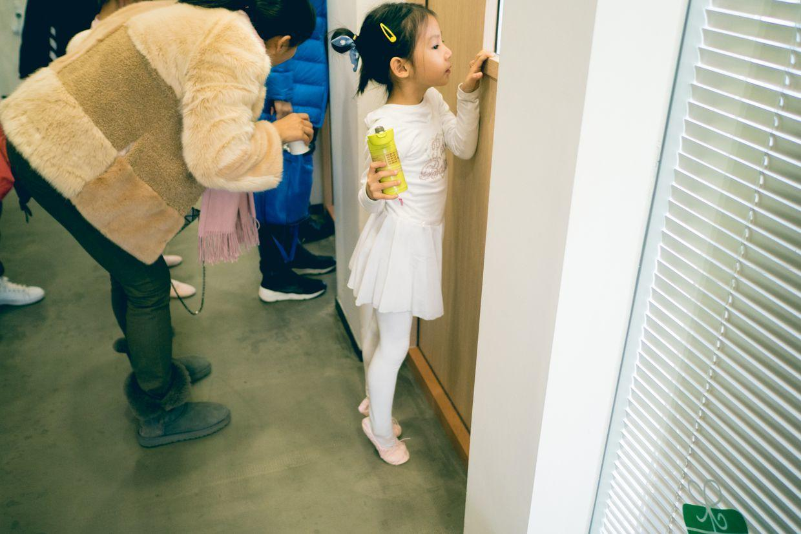

中午去自己做披萨饼。

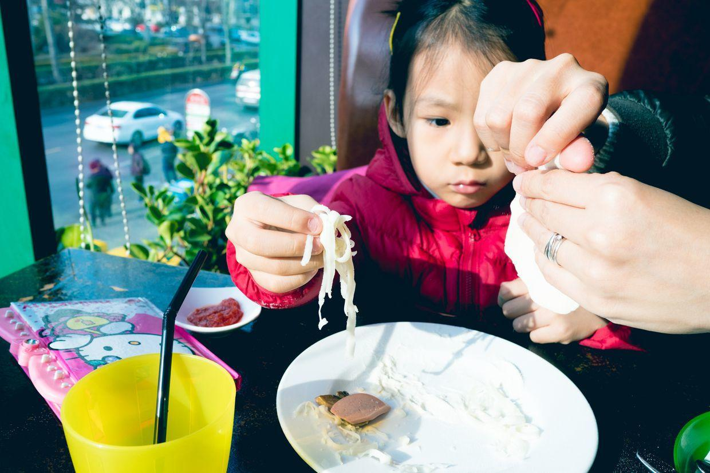

睡了个大觉，下午去上钢琴课。

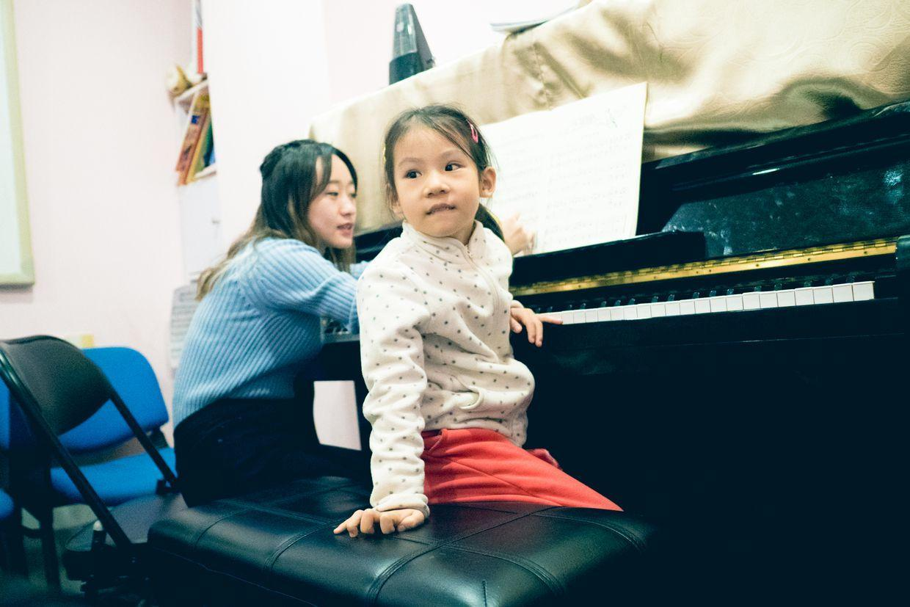

穿着轮滑鞋去上钢琴课，真是非常有趣。

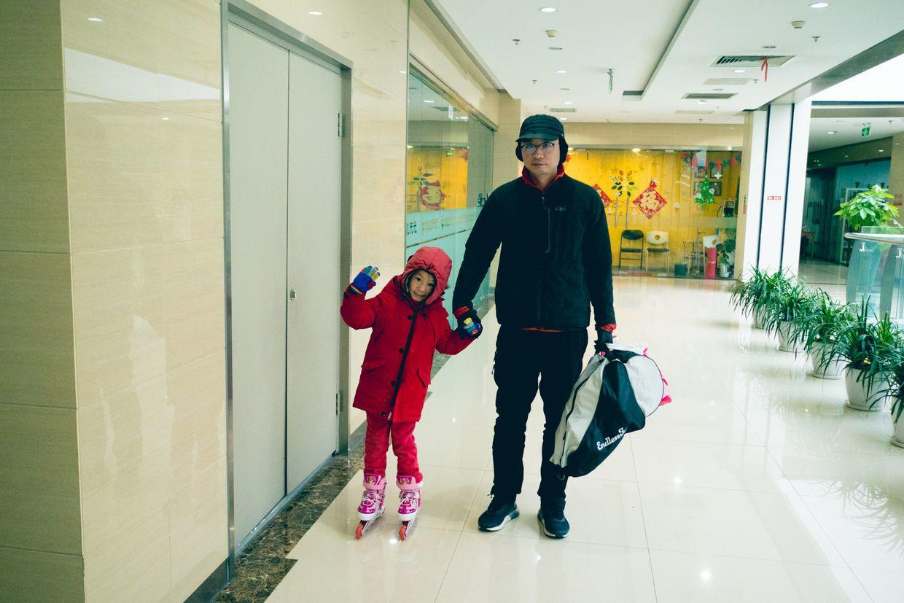

到了教室，一定要给老师看自己的轮滑鞋。

下了课，回到家，跟姥姥姥爷一起视频。

紧张的一天结束啦。

**个人微信公众号，请搜索：摹喵居士（momiaojushi）**

          
        