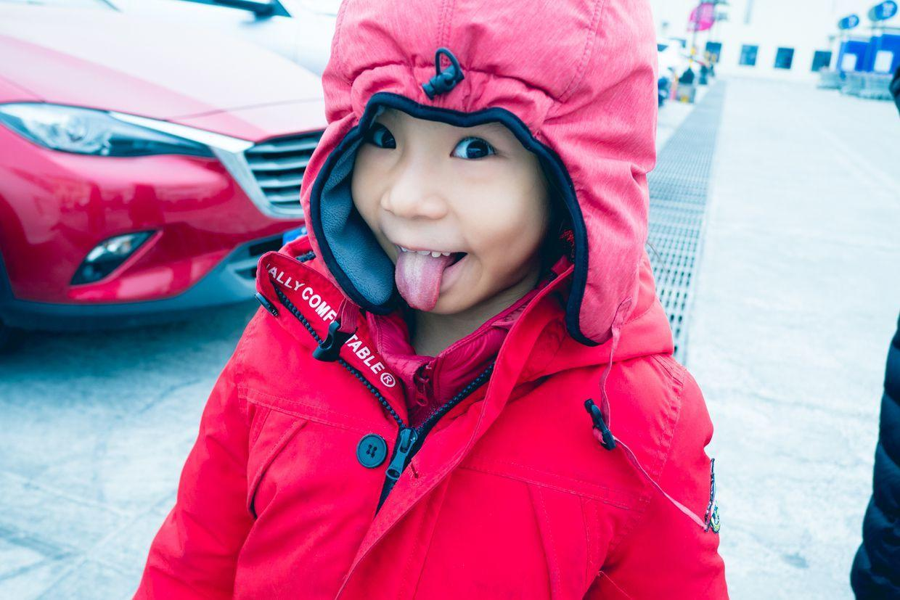

          
            
**2018.01.21**

周日啦，天气非常阴，非常冷。

天气预报说今晚要下雪，下一周会非常冷。

吃过早饭，练过琴，出门去超市买东西。

车停在了楼顶停车场。

吐着舌头就走出来了。

超市里有人写春联，喵围观了好一会儿。

随身带着自己的小本子。

超市里堆满了狗年的毛绒玩具。

摆了一个特别帅气的造型。

整个超市里，都已经装饰起来，充满了过年的气氛。

开心地坐着电梯。

在货架上挑了一大瓶果酱。

和妈妈一起拉着购物篮。

封面

欢喜地捋着自己的大辫子。

又来看现场做麻花，真是相当精彩。

中午大口地吃菜。

领到了一个大气球，发现了静电现象。

吃过午饭，赶紧回家。

停完车，路过菜市场，买了很多蔬菜和水果。

晚上在家做炖菜和照烧鸡肉。

寒冷的日子里，在家里一家人暖暖和和地吃一顿饭，真是件最简单幸福的事。

**个人微信公众号，请搜索：摹喵居士（momiaojushi）**

          
        