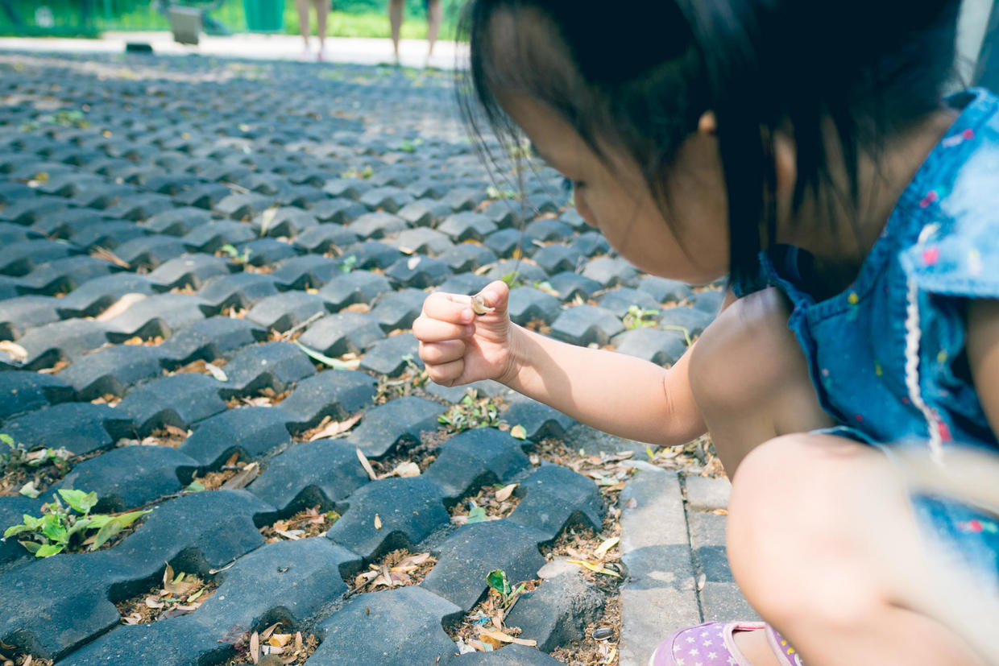

          
            
**2018.01.22**

**拍摄时间：2016.06.10**

**拍摄地点：西土城**

这张照片是2016年夏天拍的，之前在文章里也出现过几次。

夏天的周末，出门很早，在西土城的公园里，看到了蜗牛。

这还是喵第一次和蜗牛亲密接触，她似乎天生对软体动物、两栖动物、爬行动物没有什么恐惧心理。

完全不知恐惧地，捏着蜗牛的壳，拿起来观察了很久。

放回土上，看着蜗牛一点点重新钻出壳，伸出触角，慢慢向前爬。

最后，拿着蜗牛放到了树干上，做了个告别。

平时走在路上，看着周围的环境，感觉非常的普通，甚至千篇一律，一成不变。

但是偶尔蹲下来，却能发现很多特别的，已经很久没有注意过的事物。

这时，各种新鲜感，就是会扑面而来，提醒我们，每一天都是新的一天。

**个人微信公众号，请搜索：摹喵居士（momiaojushi）**

          
        