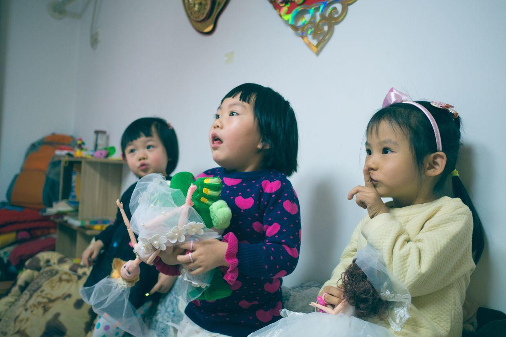
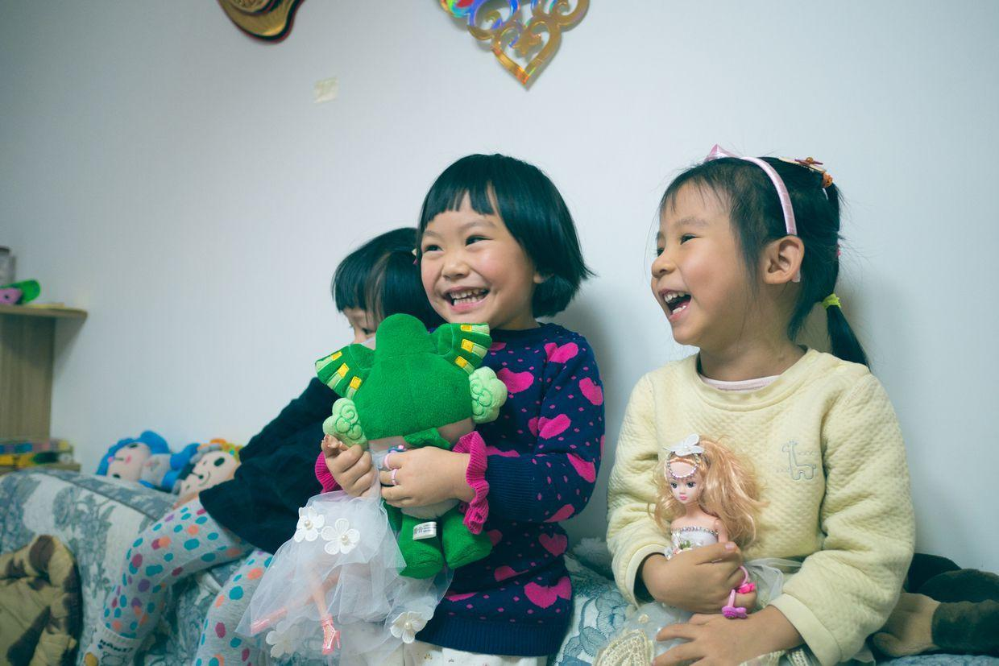

          
            
**2018.01.26**

本篇回顾一下2015年圣诞节的聚会照片。

这次聚会中，大姑父扮演的歪猫角色，正式登场。

大姑父手里拿着一个猫的娃娃，这个猫是一个大歪嘴，于是大姑父给这个猫起名为“歪猫”。

大姑父拿着歪猫，和三个小朋友逗起来。

歪猫扑到脸上了。

悦妹跑着福娃，喵开始要带上自己的发带。

看着歪猫在演讲，兜妹在一边跑着玩具盒子。

笑得都咳嗽了。

喵开始让歪猫安静一下。

两个人开始商量起来，除了福娃，还拿起了芭比娃娃。

继续看歪猫的表演，兜妹也被吸引过来。

歪猫寻找志愿者，喵主动举手。

继续听故事。

被故事逗得哈哈大笑。

一口的牙都看见了。

乐得合不拢嘴。

还在笑。

还在笑。

笑得更厉害。

兜妹这次来到中间，聚精会神。

悦妹冲上去抓歪猫。

要吃了歪猫。

咬住耳朵。

兜妹还有点害怕。

悦妹和喵有笑起来。

兜妹抱着两个福娃，每个人都抱着好多娃娃。

这一次，大姑父的表演才能，发挥得淋漓尽致。

从此之后，歪猫就成为了一个保留节目，经常会出场。

**个人微信公众号，请搜索：摹喵居士（momiaojushi）**

          
        