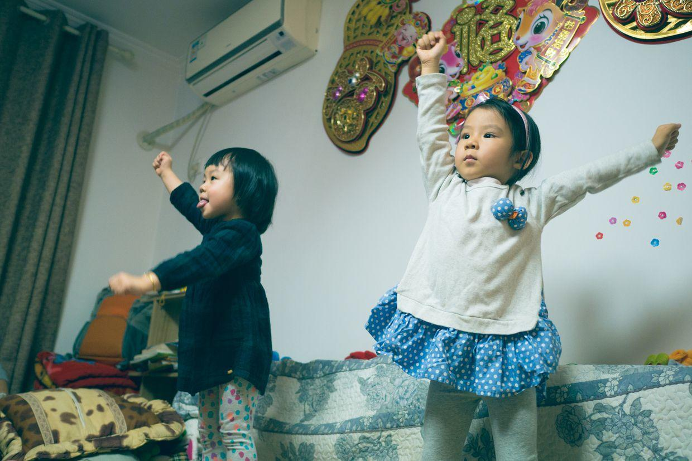

          
            
**2018.02.02**

本篇回顾一下2015年圣诞节时的聚会。

三个小朋友那时的小脸还都圆嘟嘟的。

兜妹忙着抱一堆福娃，悦妹忙着折纸，喵忙着傻笑。

兜妹拿着磁片玩具。

大姑姑也来一起玩儿磁片。

喵坐到了我后背的沙发靠背上。

我也在玩儿着磁片。

悦妹转头看着我玩儿磁片。

兜妹一条起来，鞋就闪光。

喵在沙发上开始跳舞。

是幼儿园学的舞蹈。

兜妹在一边，显得很萌。

很认真地跳舞。

举起双臂。

直吐舌头。

悦妹也加入进来，充满自信。

喵开始摆起新的造型。

兜妹的蘑菇头都蓬起来。

兜妹侧过头来观察。

各有各的造型。

拍起手来。

大家都开心起来。

喵的高难度转身。

墙上贴满了小笑脸。

兜妹真开心啊。

跳起来。

圣诞节的周末，三个小朋友聚在一起，那已经是2年前的事了。

**个人微信公众号，请搜索：摹喵居士（momiaojushi）**

          
        