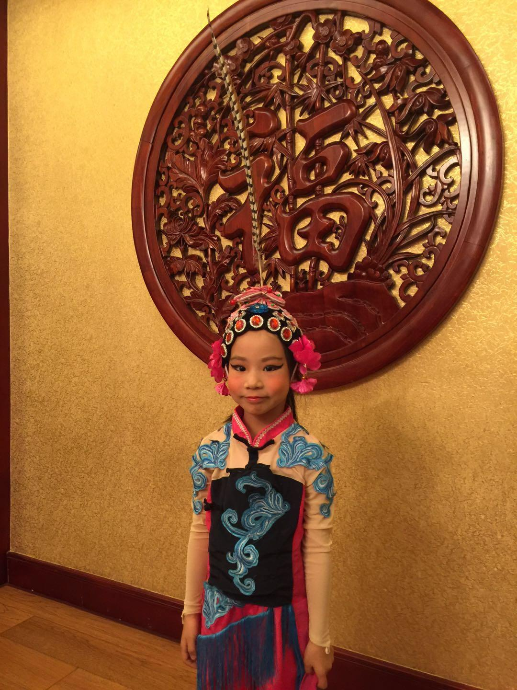
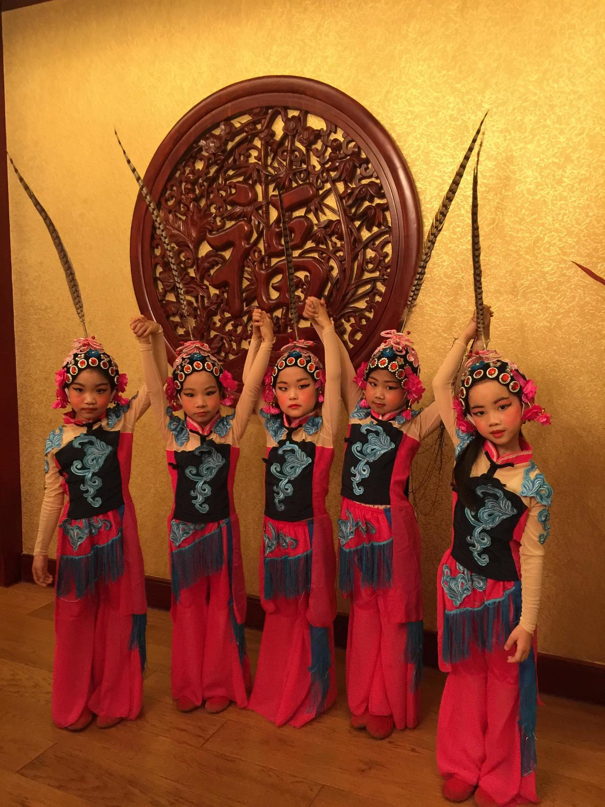
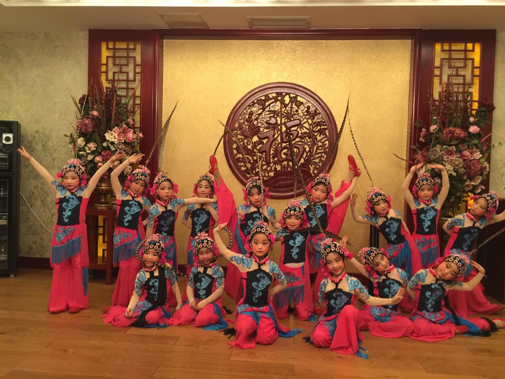

          
            
**2018.02.03**

昨天是幼儿园舞蹈队演出的日子。

这一个学期喵都在刻苦练习《俏花旦》。

11月份因为发烧，一度没法入选舞蹈队。

但是喵没有放弃，在老师们的支持下，还是作为候补队员继续参加排练。

周五，终于有机会商场表演了。

这次终于看到了完整的扮相了，戴着高高的翎子。

几个同学们在一起合影。

整个舞蹈队，大家一起摆起了造型。

封面

平时在家里，只要有时间，就会让我们放着音乐，自己开始完整地跳一遍。

再往后，会跳过熟练的部分，把不熟的部分反复练。

面对着候补的位子，虽然有可能上不了场，但还是会每天去参加排练。

看着她们演出的视频，真是令人震惊，想想换成我自己，是断然无法完成的。

在各个方面，喵已经开始超越我们了。

**个人微信公众号，请搜索：摹喵居士（momiaojushi）**

          
        