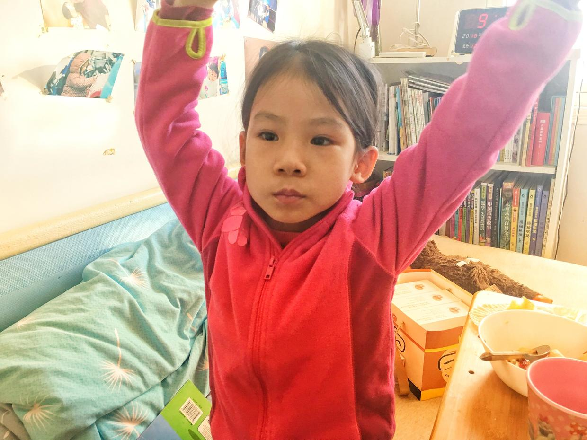
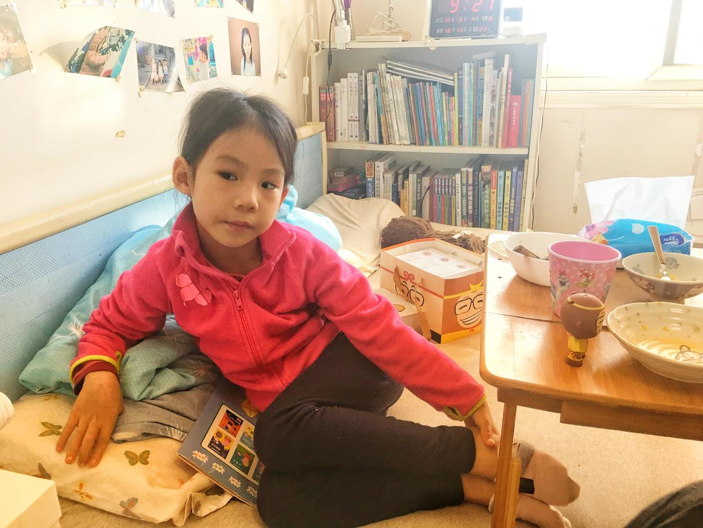

          
            
**2018.02.04**

周五的俏花旦演出回来，喵就开始嗓子不舒服。

演出的时候，演出服很薄，特别冷。

周末这两天就请了假，在家好好休息。

周六开始流鼻涕，嗓子不太疼了。

周日早上起床，精神头明显好多了。

在床上吃面条汤，水果。

吃完饭，在床上听西游记，看书。

阳光开始钻进窗户了，喵又开始舞蹈起来。

靠在大被子上，桌上放着孙悟空。

开始利用这个休息的机会，教我练习芭蕾舞绷脚。

没想到，我竟然完全没有这方面天赋，柔韧性为0，一让我绷脚，就疼得嗷嗷乱叫。

看来这项艺术，我是完全没有机会领略。

在家休息这2天，吃得好，睡得好，玩儿得好。

下个礼拜，就开始放寒假在家啦。

好好调养好身体，下下周姥姥姥爷就要来北京过年啦。

**个人微信公众号，请搜索：摹喵居士（momiaojushi）**

          
        