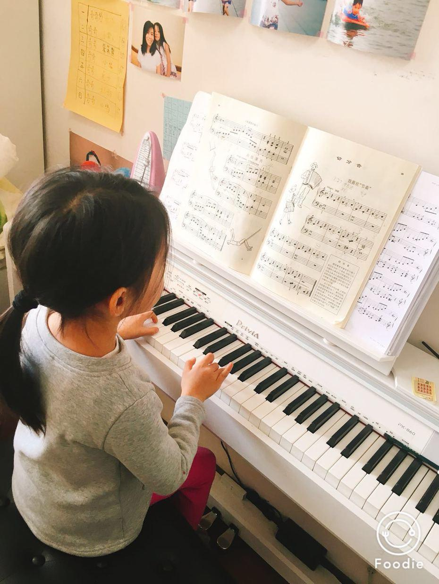
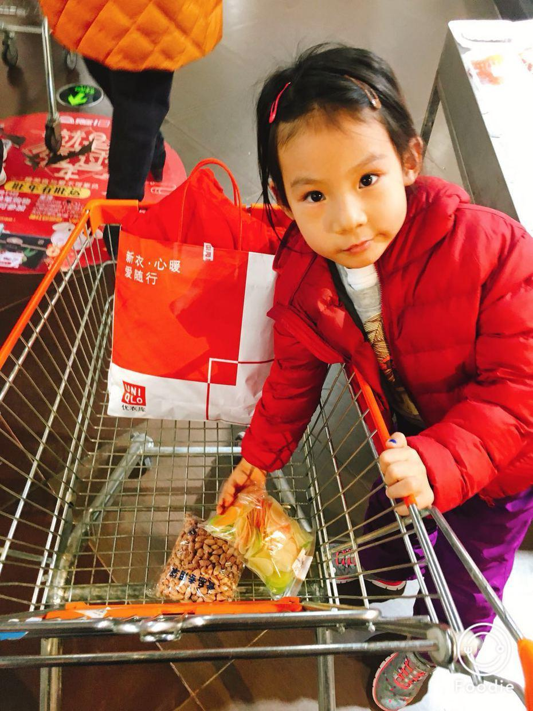
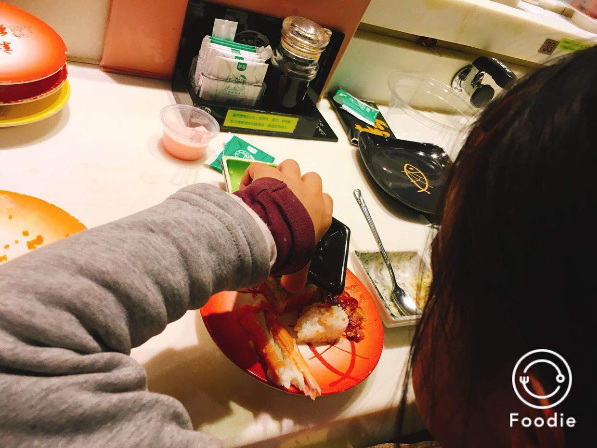
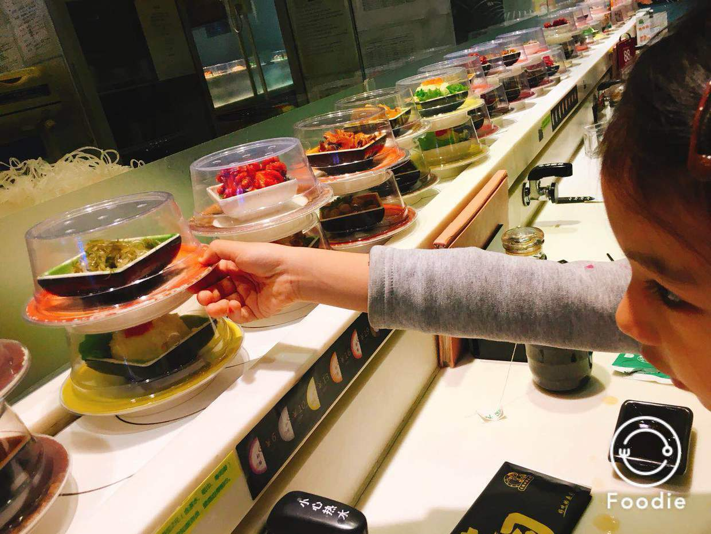

          
            
**2018.02.11**

周日啦，倒休要上班，又赶上了巨风的天气。

喵早上还抓紧时间，自己一个人练了一个小时琴。

上午和妈妈一起去商场买过年的装饰品，顺便把爸爸定的衣服也取回来。

中午和妈妈一起去吃回转寿司。

好久没有吃寿司了，这次是喵自己点名要吃寿司，现在已经知道自己倒酱油，加调料，不过还是不敢吃芥末。

特别爱吃裙带菜，自己拿了一盘，吃了好多，要不是妈妈抢着吃两口，一大盘子都让她干掉了。

虽然风特别大，但是收获更大，各种各样的福字和挂饰，还有妈妈在练习写的新一年的春联。

中午回到家，讲书很快就睡觉了。

睡一个大觉，晚上看看平昌冬奥会的比赛。

收拾一下家里，洗洗衣服。

春节已经越来越近了。

明天姥姥姥爷就要到北京啦。

**个人微信公众号，请搜索：摹喵居士（momiaojushi）**

          
        