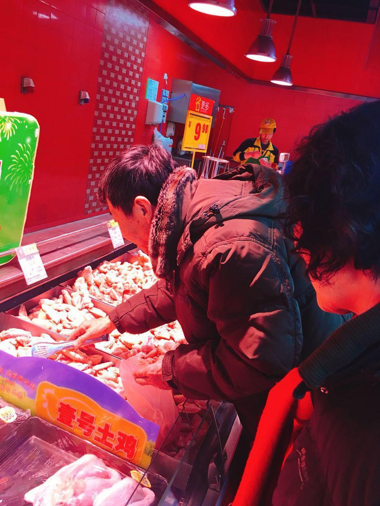

          
            
**2018.02.13**

周二啦，一早起床，和姥姥姥爷一起吃早饭。

今天风明显小了很多，太阳也很暖和，正好出去晒晒太阳。

从天气预报上看，这两天一暖和，马上污染就上来了。

尤其是到了初一一放炮，恐怕更不乐观。

喵和姥姥姥爷一起走去家乐福逛超市。

穿得暖暖和和，一起出门。

拿了一串小灯笼，非常神气。

封面

帮助姥姥系围巾，还真是很体贴。

姥爷买肉的时候，还要帮姥爷捶腿，非常贴心。

姥爷拿着夹子挑肉，看来要做大餐啦。

难得喵能有机会和姥姥姥爷一起逛超市，非常兴奋。

中午奶奶也来了，带来了好吃的，一起吃饭。

下午好好睡个大觉，养好精神，准备过春节。

明天爸爸也开始放假了，可以大家一起逛街啦。

趁着冷空气没来，可以好好地去晒晒太阳。

**个人微信公众号，请搜索：摹喵居士（momiaojushi）**

          
        