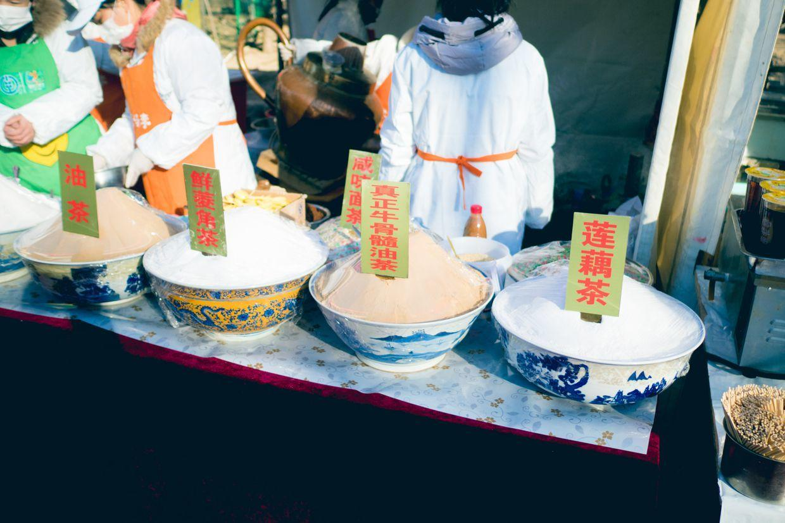
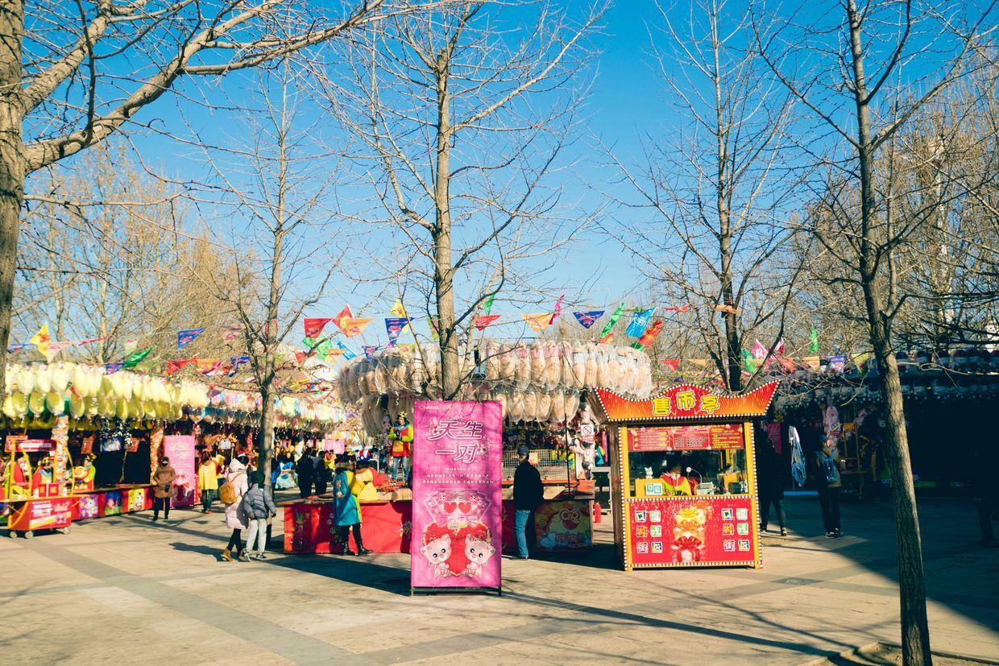
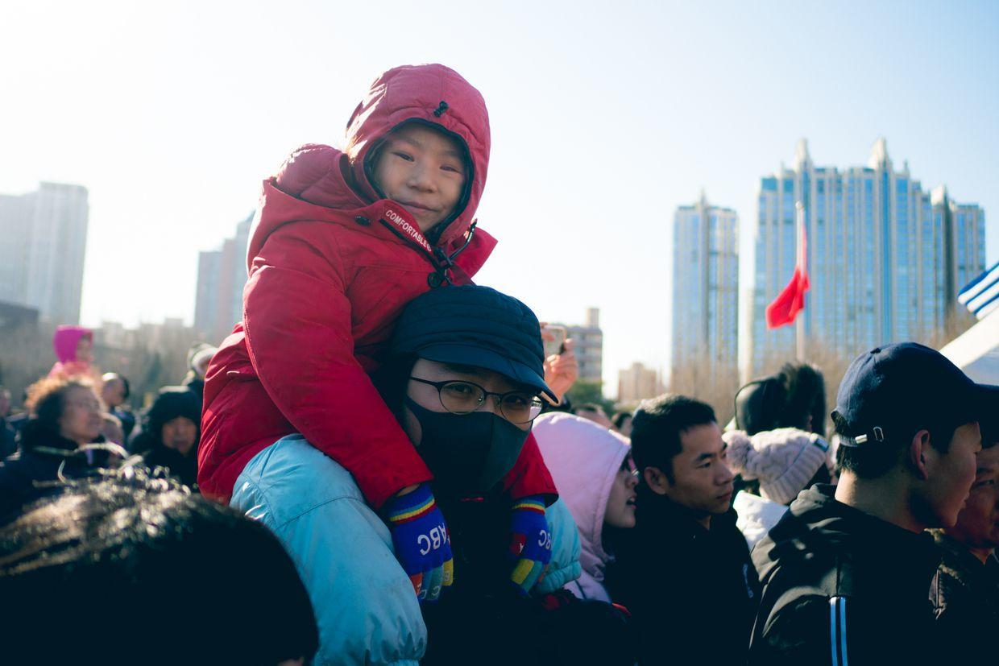

          
            
**2018.02.16**

初一啦，一晚上睡得非常好。

没有听到鞭炮声，真是难得。

一早出门去朝阳公园庙会。

天气非常的棒。

天空非常蓝。

蓝得都刺眼了。

来到了过山车。

庙会摊位都已经摆好了。

各种大肉串。

爆肚。

油茶。

喵买了个大棉花糖。

风一吹，糊在脸上了。

各种游戏项目。

买了个泡泡，玩儿了起来。

有飞机经过。

和姥姥姥爷合影。

扛起来，去看演出。

很精彩的民族舞。

远处的降落伞。

一起合影。

看见了漂亮的娃娃。

买了一个大兔子。

一起合影。

封面

姥姥姥爷。

接下来，喵和我们一起坐了巨大的海盗船，我都有点受不了，喵竟然毫无惧色，下来还要在玩儿一次。

后来喵还要玩儿大摆锤，看着上面写着1.4米一下不能乘坐，真是庆幸，否则我会吐死在上面。

和妈妈一起坐矿山车。

一起玩儿碰碰车。

天际线。

几乎快要盖好了。

领了一个小狗的卡子。

中午一起吃饭。

吃过饭，回家睡午觉。

晚上准备看一下春晚的回放。

明天继续去地坛庙会。

**个人微信公众号，请搜索：摹喵居士（momiaojushi）**

          
        