          
            
**2018.02.21**

昨天下午，小家伙们都没有睡觉，玩儿了一个下午，三个人玩儿得很和谐，基本没哭。

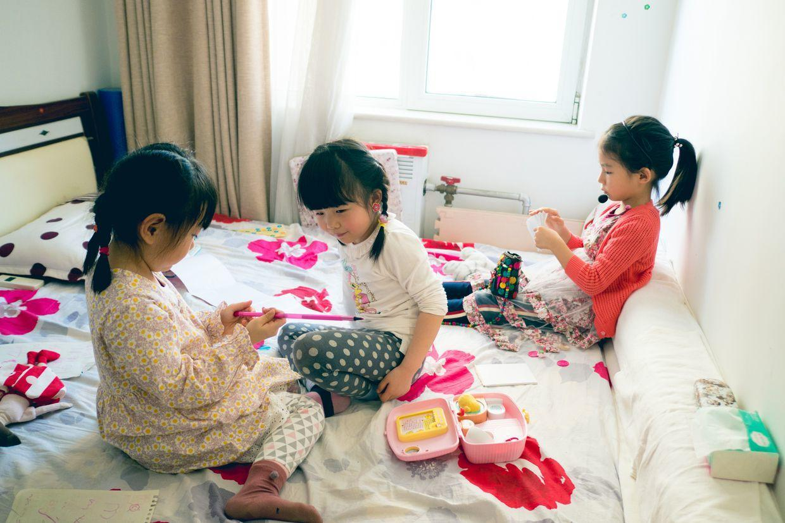

下午天气很暖和，一起出门去给老奶奶买冰棍。

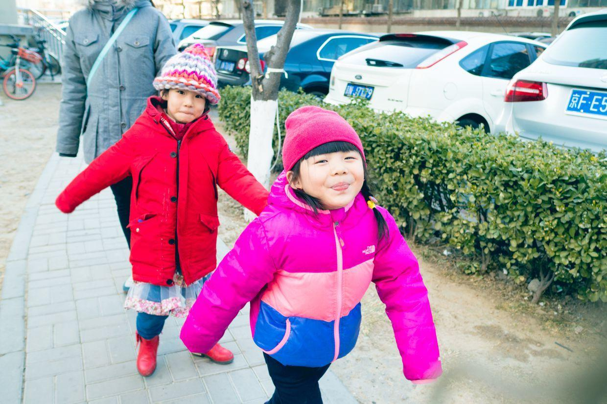

给老奶奶买了好多冰棍，当然也少不了她们自己。

吃着冰棍在大老虎边上合影。

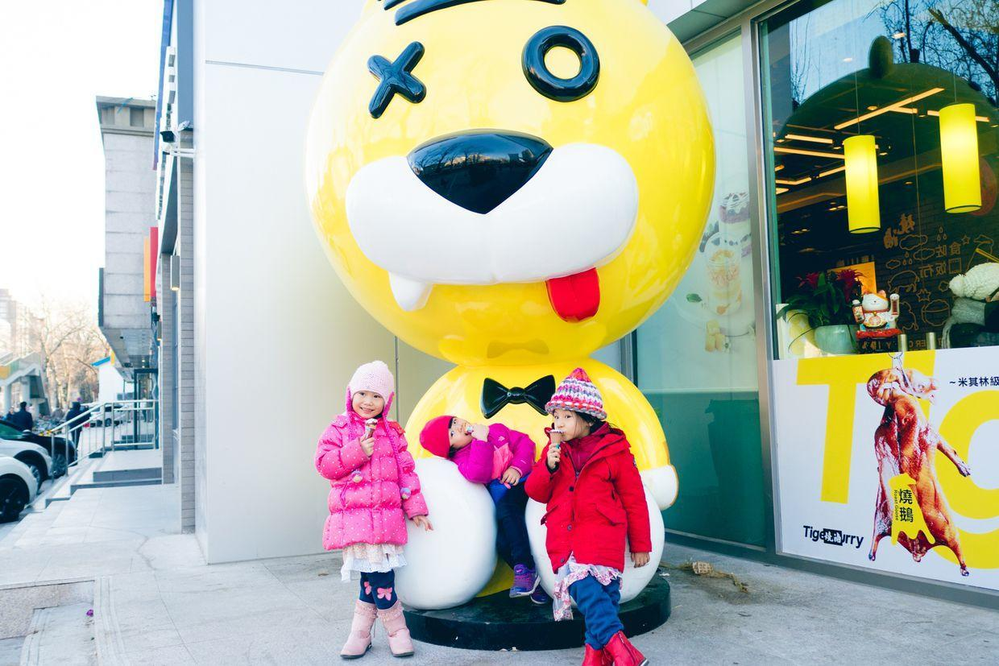

回到家，敦敦弟弟也醒了，瞪着大眼睛，看什么都新奇。

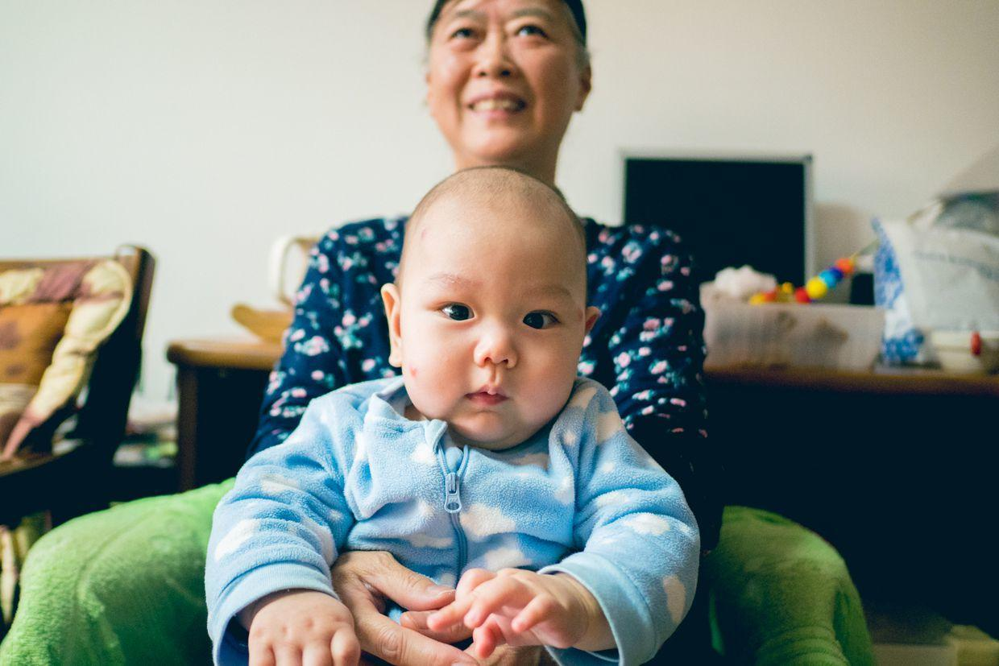

今天是初六啦，春节假期到尾声了，去商场转转。

新鲜的水果，就是太贵。

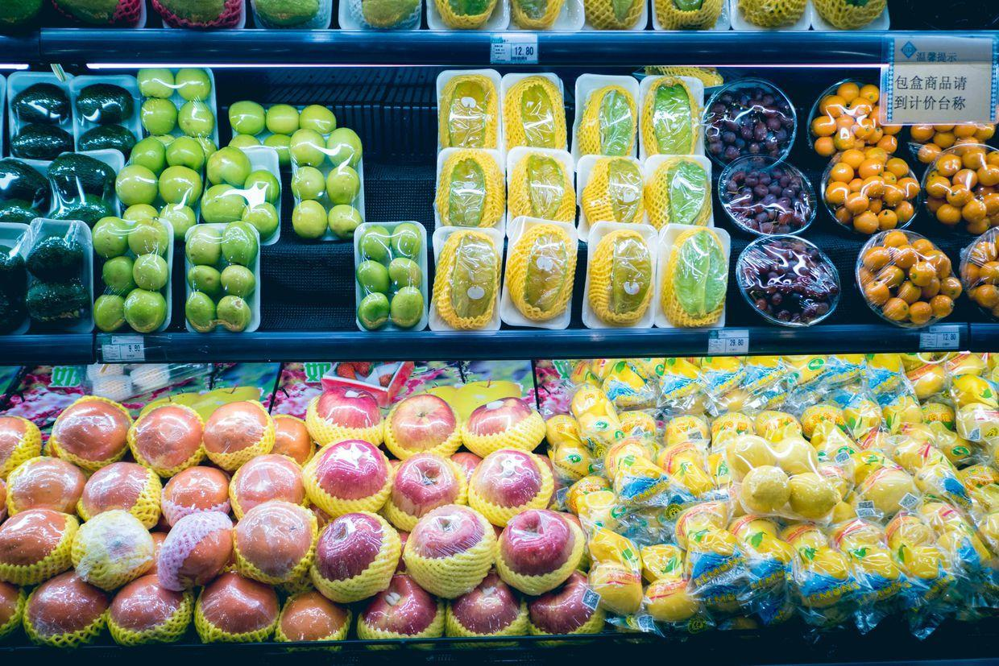

推着购物车去超市。

挑了几个奶酪棒。

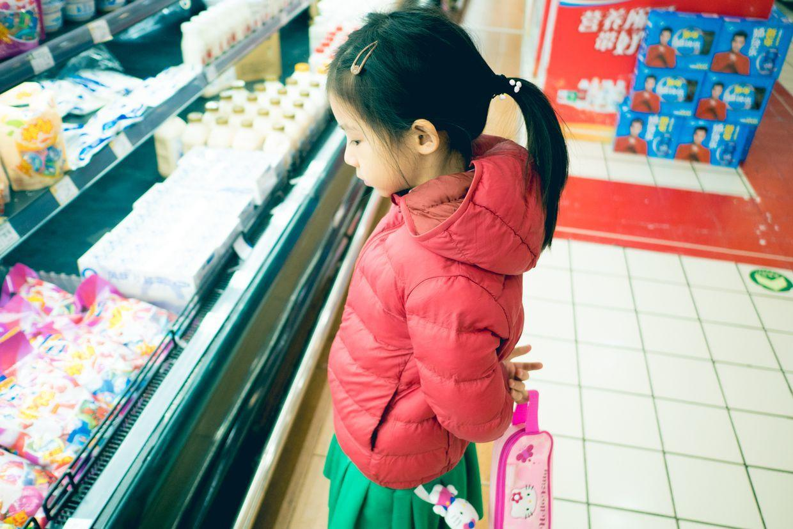

大厅里的春节装饰。

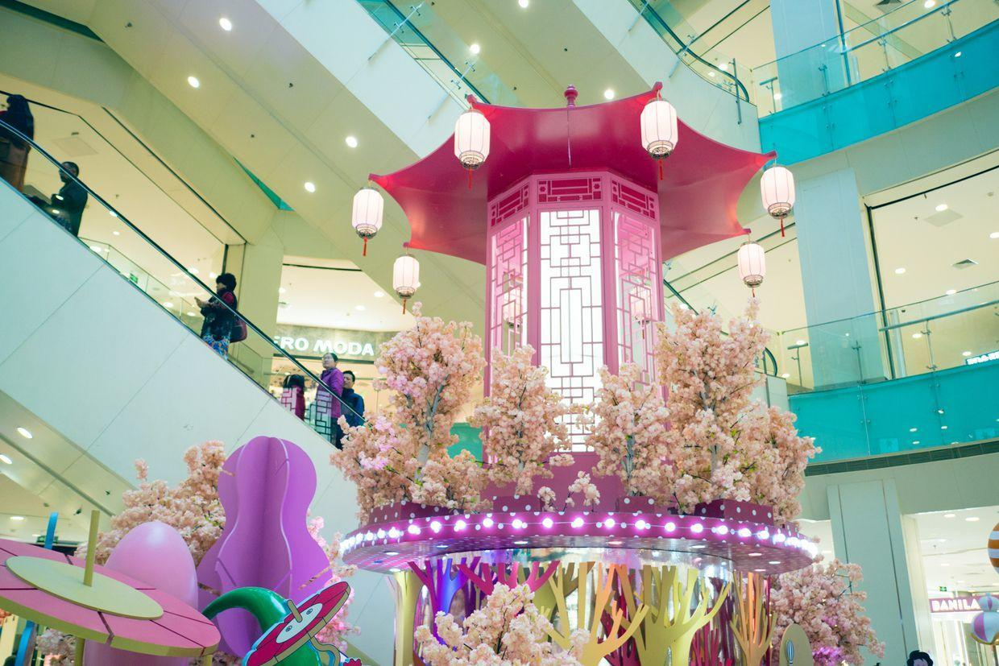

忽然发现了一个别有洞天的地方。

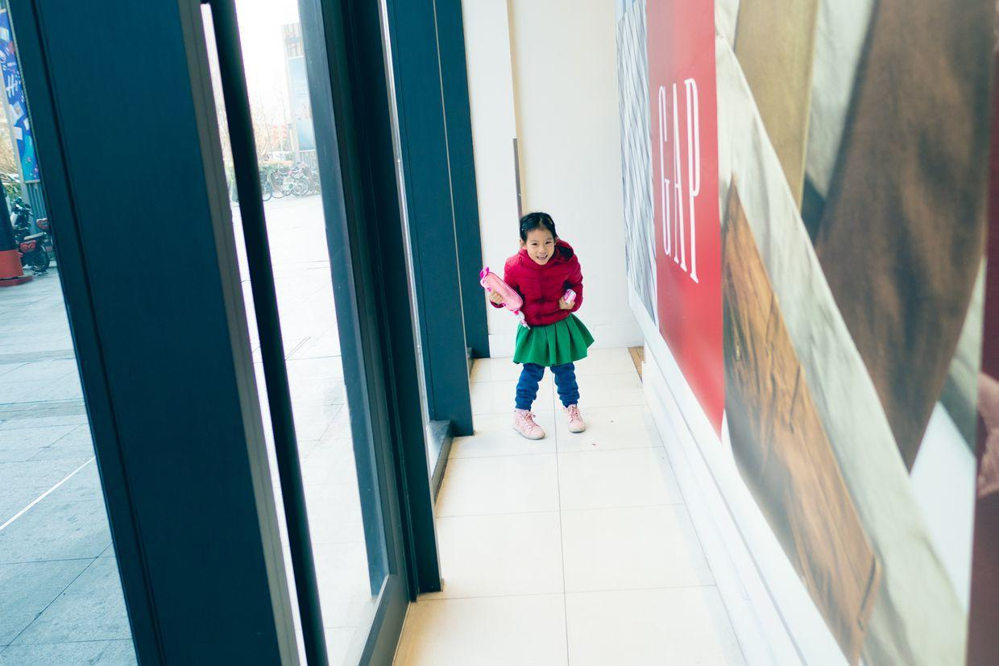

于是一起展开了互相追逐的游戏。

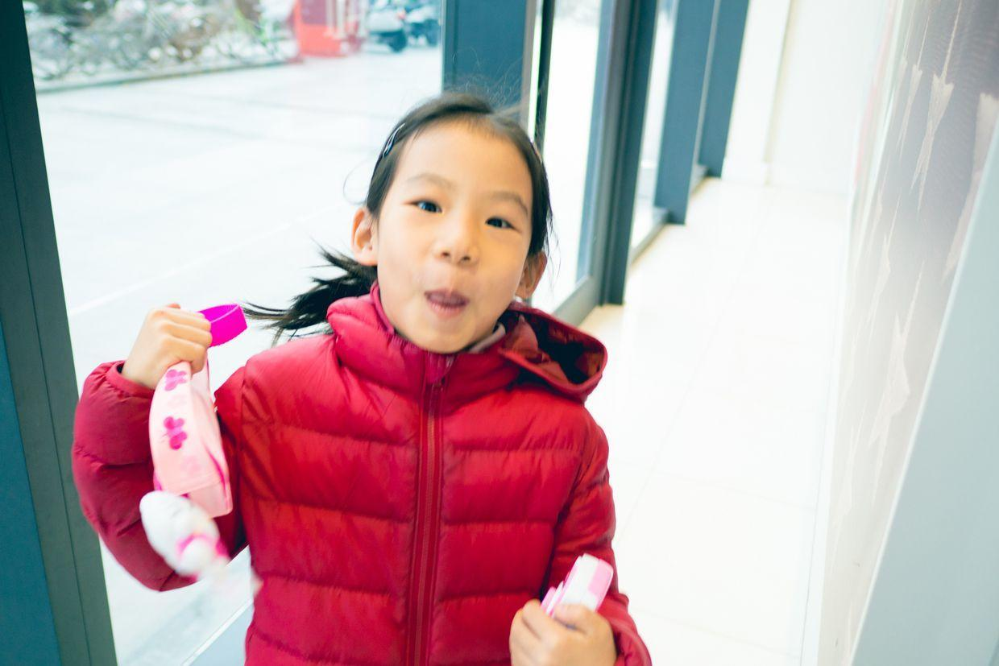

发现了，已经偷偷闪出脑袋了。

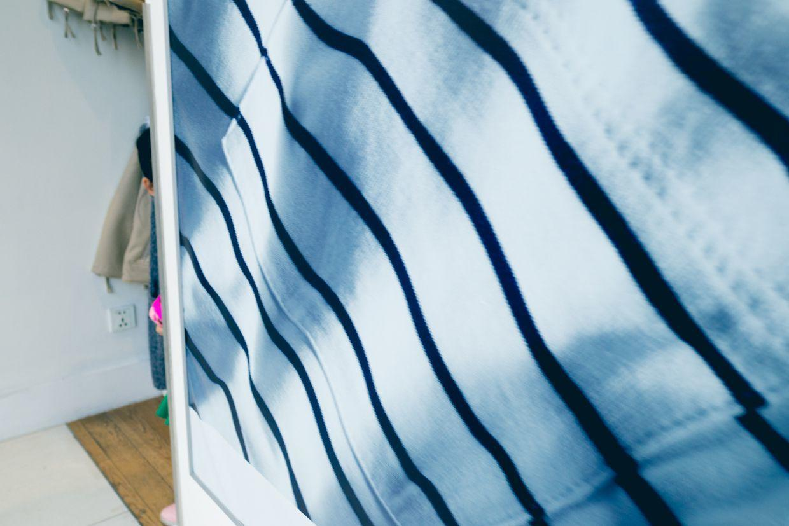

被发现了，哈哈大笑。

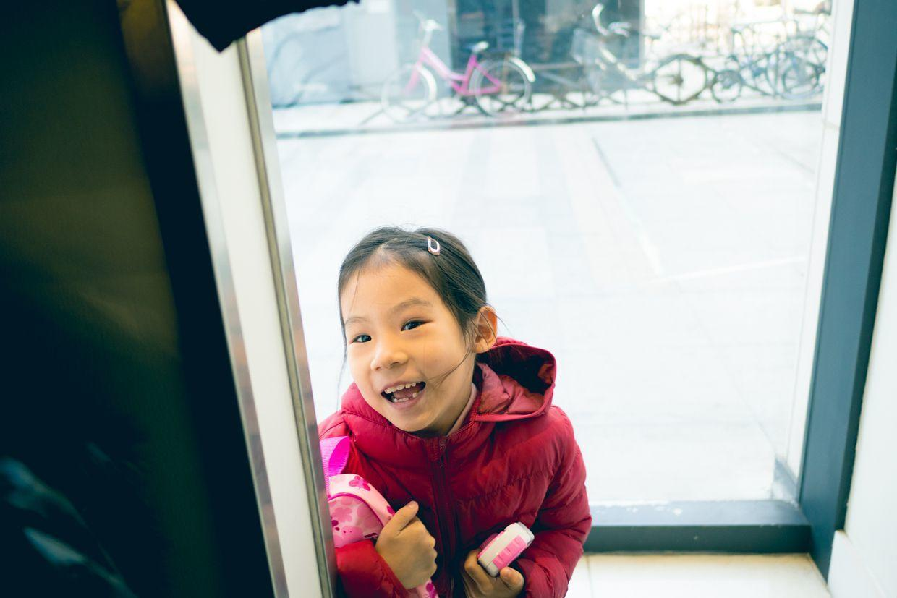

开心地跑出来。

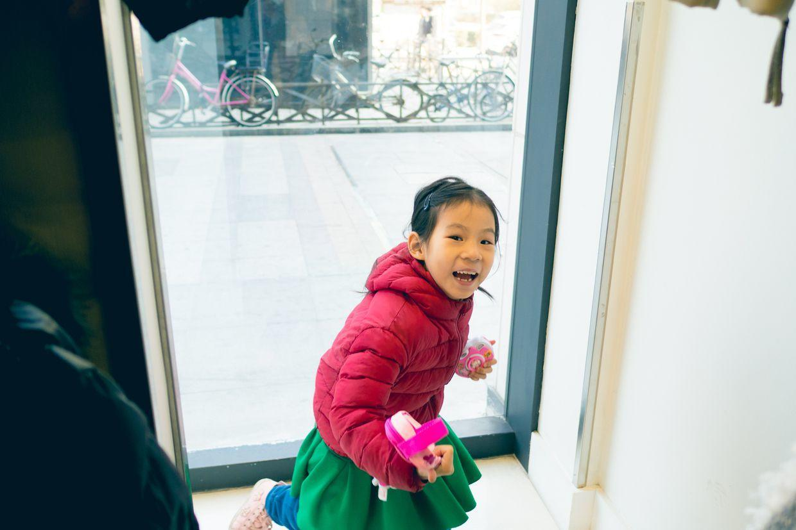

封面

吃过午饭，回家休息。

下午起床，准备接着出去转转。

假期快结束啦，又要开始紧张的工作学习生活啦。

**个人微信公众号，请搜索：摹喵居士（momiaojushi）**

          
        